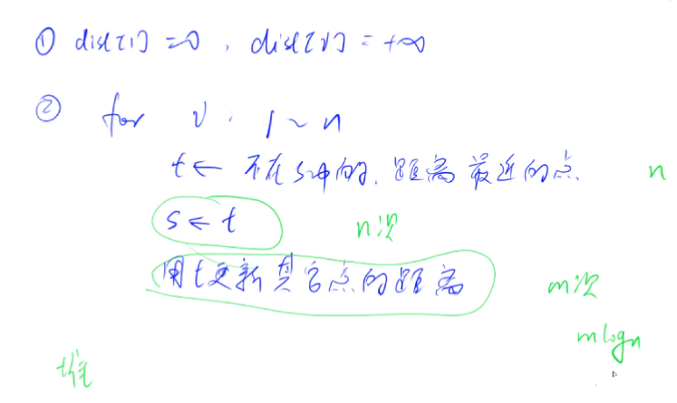
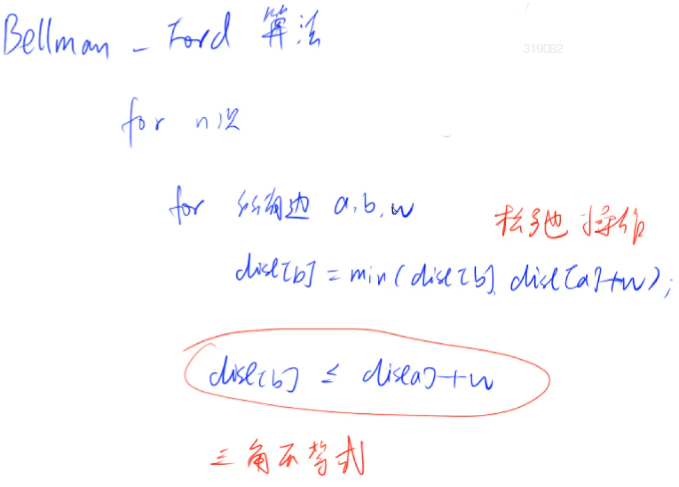
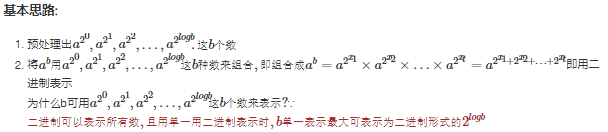
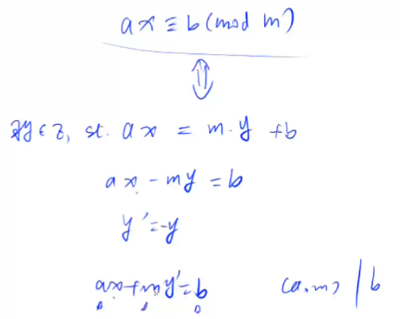

# 算法模板

## 基础算法

### 1. 快排 

Nlog(N)

分治，选一个数，左边都小于等于数，右边都大于等于数，换完之后x不一定在分界点

* 难点是划分
* scanf比流输入快


```java
import java.util.Scanner;
import java.util.stream.IntStream;

public class Main{
    public static void main(String[] args){
        Scanner in = new Scanner(System.in);
        int n = in.nextInt();
        int[] arr = IntStream.range(0, n).map(i -> in.nextInt()).toArray();
        quick_sort(arr, 0, n-1);
        IntStream.range(0, n).mapToObj(i -> arr[i] + " ").forEach(System.out::print);
    }
        public static void quick_sort(int[] arr, int l ,int r){
        if (l >= r){
            return ;
        }
        int i = l -1, j = r +1, x = arr[l + r >> 1];
        while(i < j){
            while (arr[++i] < x){}
            while (arr[--j] > x){}
            if (i < j) {
                int temp = arr[i];
                arr[i] = arr[j];
                arr[j] = temp;
            }
        }
        quick_sort(arr, l, j);
        quick_sort(arr,j+1, r);
        return ;
    }
}
```

```C++
#include <iostream>

using namespace std;

const int N = 1e6 + 10;
int n;
int q[N];

void quick_sort(int q[], int l ,int r)
{
    if (l >= r) return;
    int i = l - 1, j = r + 1, x = q[l + r >> 1];
    while (i < j){
        do i++ ; while (q[i] < x);
        do j-- ; while (q[j] > x);
        if (i < j ) swap (q[i], q[j]);
    }
    
    quick_sort(q, l, j);
    quick_sort(q, j+1, r);
}
```


#### 快选 第k大的数

O(N)

快选借用快排的思想，但是只需要选一边递归，不需要递归两段


```cpp
#include <iostream>
using namespace std;
const int N = 10e5 + 10;
int q[N], n, k;

//划分左边是大于他的数，右边是小于他的数
// 找坐标为k - 1的数
int quick_sort(int l, int r, int k){
    if (l >= r) return q[l];
    int i = l - 1, j = r + 1, x = q[i + j >> 1];
    while(i < j){
        do i++; while(q[i] < x);
        do j--; while(q[j] > x);
        if(i < j) swap(q[i], q[j]);
    }
    // 坐标为k的在左边段
    if (k <= j) return quick_sort(l, j, k);
    // 坐标为k的在右边段
    return quick_sort(j + 1, r, k);
}

int main(){
    scanf("%d%d", &n, &k);
    
    for(int i = 0; i < n; i++) scanf("%d", &q[i]);
    
    printf("%d", quick_sort(0, n - 1, k - 1));
}
```


### 2. 归并

1. [L,R]->[L, mid], [mid + 1, R]
2. 递归排序[L, mid], [mid + 1, R]
3. 归并，将左右两个有序序列合并为一个有序序列

* 重点是合二为一

```cpp
#include <iostream>

using namespace std;
const int N  = 1e6 + 10;
int n;
int p[N], temp[N];

void merge_sort(int p[], int l, int r){
    if (l >= r) return;
    // 先划分
    int mid = l + r >> 1;
    merge_sort(p, l, mid);
    merge_sort(p, mid + 1, r);
    
    //合并
    int i = l, j = mid + 1, k = 0;
    while(i <= mid && j <= r){
        if (p[i] <= p[j]) temp[k++] = p[i++];
        else temp[k++] = p[j++];
    }
    //扫尾
    while (i <= mid) temp[k++] = p[i++];
    while (j <= r) temp[k++] = p[j++];
    //还给p
    for(int i = l, j = 0 ; i<= r; i++, j++) p[i] = temp[j];
}

int main(){
    scanf("%d",&n);
    
    for (int i = 0 ; i < n; i++) scanf("%d", &p[i]);
    
    merge_sort(p, 0, n - 1);
    
    for (int i = 0; i < n; i++) printf("%d ", p[i]);
}
```

#### 2.1 求逆序对


当q[j]加入归并的下一个值时，q[i]之前的数都小于等于q[j],q[i]之后的数都大于q[j]。

所以此时q[j]加入合并消除的逆序对是q[i]到q[mid]之间的所有的数(之间的数都大于q[j])。

注意：我之前写错的方式使用了j - i + 1，但是j到mid + 1之间数本来就在j之前，没有消除逆序对，所以正确的应该是mid - i + 1

```cpp
#include <iostream>
using namespace std;

const int N = 1e6 + 10;
int n;
int p[N],temp[N];

long long  merge_sort(int p[], int l, int r){
    if (l >= r) return 0 ;
    
    int mid = l + r >> 1;
    long long res = merge_sort(p, l, mid) + merge_sort(p, mid + 1, r);
    // 归并过程
    int i = l, j = mid + 1, k = 0;
    while (i <= mid && j <= r){
        if (p[i] <= p[j]) temp[k++] = p[i++];
        else {
            temp[k++] = p[j++];
            res += mid - i + 1; // 消除的逆序对
        }
    }
    // 扫尾
    while (i <= mid)  {
      temp[k++] = p[i++];
      // 扫尾不用加上下面这句，因为之前合并的时候mid - i + 1意思是当前i以后的所有数字都大于j，包含了扫尾的那些数，然后每个j都处理了一次，在扫尾的时候就不用重复处理了
        // 这时候i就是mid-1
      // res += mid - i + 1;
    }
    while (j <= r) temp[k++] = p[j++];
    // 物归原主
    for (int i = l, j = 0; i <= r; i++, j++) p[i] = temp[j];
    
    return res;
}


int main(){
    scanf("%d", &n);
    for (int i = 0; i < n; i++ ) scanf("%d", &p[i]);
    
    cout << merge_sort(p, 0, n-1) << endl;
    
    return 0;
}
```


### 3.整数二分

一般有单调性可以二分，有时候没有单调性也能二分。二分的本质不是单调性，是边界性。

* 分为两个部分，**一半部分满足条件，另一半不满足条件，就能够找到这个边界**

* 按照边界是属于左半边还是右半边的条件，可以分为两个模板。两个模板分别要记熟悉，否则边界条件经常错误。

* 注意这里是求得的边界情况是满足check()函数的最后一个边界，也是就是边界情况考虑<= 或者 >=,因为最后返回的值是l

> 实际做的思路：
>
> 1. 先写一个mid = l + r >> 1，写一个check函数，把结果控制在边界位置;
>
> 2. 想一下如何更新l 和 r ,如果l = mid 那就要补上加一 mid = l + r + 1 >> 1 ，如果 r = mid 就不用补上
> 3. l 和 r 对mid的处理相差 1，这个不变
> 4. 最后返回的结果是r还是l要看if判断条件

```cpp
bool check(int x) {/* ... */} // 检查x是否满足某种性质

// 区间[l, r]被划分成[l, mid]和[mid + 1, r]时使用：
int bsearch_1(int l, int r)
{
    while (l < r)
    {
        int mid = l + r >> 1;
        if (check(mid)) r = mid;    // check()判断mid是否满足性质
        else l = mid + 1;
    }
    return l;
}
// 区间[l, r]被划分成[l, mid - 1]和[mid, r]时使用：
int bsearch_2(int l, int r)
{
    while (l < r)
    {
        int mid = l + r + 1 >> 1;
        if (check(mid)) l = mid;
        else r = mid - 1;
    }
    return l;
}

// 第一个大于等于 x 的数
if (p[mid] >=  x) r = mid;
else l = mid + 1;

// 第一个小于等于x的数
if (p[mid] <= x) l = mid;
else r = mid - 1;


```

#### 3.1 求数占的区间

```cpp
#include <iostream>
using namespace std;

const int N = 1e5 + 10;
int n, q; 
int a[N];

int main(){
    scanf("%d%d", &n, &q);
    for (int i = 0; i < n; i++) scanf("%d", &a[i]);
    
    while (q--){
        int num;
        scanf("%d", &num);
        int l = 0, r = n - 1;
        while (l < r){
            int mid = l + r >> 1;
            if (num <= a[mid]) r = mid; // [l, mid]和[mid + 1, r]
            else l = mid + 1;
        }
        if (a[l] != num) printf("-1 ");
        else printf("%d ",l);
        
         l = 0, r = n - 1;
        while (l < r){
            int mid = l + r + 1 >> 1; 
            if (num >= a[mid]) l = mid; // [l, mid - 1]和[mid, r]
            else r = mid - 1;
        }
        if (a[l] != num) printf("-1\n");
        else printf("%d\n",l);
    }
    return 0;
}
```

### 4.浮点数二分

1. 不用怎么考虑边界问题，小到一定的位数1e-6就可以把边界当做答案
2. 精度问题可以自己调整： 如果题目保留4位小数，精度写1e-6; 5位，1e-7;至少要多2

```cpp
bool check(double x) {/* ... */} // 检查x是否满足某种性质

double bsearch_3(double l, double r)
{
    const double eps = 1e-6;   // eps 表示精度，取决于题目对精度的要求
    while (r - l > eps)
    {
        double mid = (l + r) / 2;
        if (check(mid)) r = mid;
        else l = mid;
    }
    return l;
}
```

### 5.大整数

1. 存储： 大整数存储一般倒着存到数组中，因为加法可能要进位，在数组尾部加一个数更方面，否则正着放需要全部都往后移


#### 5.1 高精度加法

反向存储，输出反向输出 （因为要进位，需要在高位上补数）

```cpp
// C = A + B, A >= 0, B >= 0
vector<int> add(vector<int> &A, vector<int> &B)
{
    if (A.size() < B.size()) return add(B, A);

    vector<int> C;
    int t = 0; // 进位
    for (int i = 0; i < A.size(); i ++ )
    {
        t += A[i];
        if (i < B.size()) t += B[i];
        C.push_back(t % 10);
        t /= 10;
    }
	// 别忘了第一位 可能进位
    if (t) C.push_back(t);
    return C;
}
```

#### 5.2 高精度减法

```cpp
// C = A - B, 满足A >= B, A >= 0, B >= 0
vector<int> sub(vector<int> &A, vector<int> &B)
{
    vector<int> C;
    for (int i = 0, t = 0; i < A.size(); i ++ )
    {
        t = A[i] - t;
        if (i < B.size()) t -= B[i];
        C.push_back((t + 10) % 10);
        if (t < 0) t = 1;
        else t = 0;
    }
	// 去掉前置 0
    while (C.size() > 1 && C.back() == 0) C.pop_back();
    return C;
}

// 判断A>=B
bool cmp(vector<int>& A,vector<int>& B){
    if (A.size() > B.size()) return true;
    else if (A.size() < B.size()) return false;
    for (int i = A.size() -1; i >= 0; i--){
        if (A[i] != B [i]) return A[i] - B[i] > 0;
    }
    return true;
}
```

#### 5.3 高精度乘以低精度

```cpp
// C = A * b, A >= 0, b >= 0
vector<int> mul(vector<int> &A, int b)
{
    vector<int> C;

    int t = 0;
    // 要么A没算完，要么t不等于0
    for (int i = 0; i < A.size() || t; i ++ )
    {
        if (i < A.size()) t += A[i] * b;
        C.push_back(t % 10);
        t /= 10;
    }

    while (C.size() > 1 && C.back() == 0) C.pop_back();

    return C;
}

```

#### 5.4 高精度除以低精度

```cpp
// A / b = C ... r, A >= 0, b > 0
vector<int> div(vector<int> &A, int b, int &r)
{
    vector<int> C;
    r = 0;
    for (int i = A.size() - 1; i >= 0; i -- )
    {
        r = r * 10 + A[i];
        C.push_back(r / b);
        r %= b;
    }
    reverse(C.begin(), C.end());
    while (C.size() > 1 && C.back() == 0) C.pop_back();
    return C;
}

```

### 6. 前缀和

快速求出一段元素的和

* 把边界S[0] = 0,然后从S[1]开始往后存，因为要用S[r] - S[l-1]来计算前缀和，所以把边界0先存进去

#### 6.1 一维前缀和

```cpp
S[i] = a[1] + a[2] + ... a[i]
a[l] + ... + a[r] = S[r] - S[l - 1]
```

#### 6.2 二维前缀和

* 注意是x1 - 1， y1 - 1；这个写的时候要想好，别忘了-1

```cpp
S[i, j] = 第i行j列格子左上部分所有元素的和
以(x1, y1)为左上角，(x2, y2)为右下角的子矩阵的和为：
S[x2, y2] - S[x1 - 1, y2] - S[x2, y1 - 1] + S[x1 - 1, y1 - 1]
```

### 7. 差分

差分和前缀和是逆运算。如果B数组是A数组的前缀和，那么A是B的差分，也就是 a[i] = b[i] - b[i-1];


* 首先是假想一个B数组是差分数组，使得a = f(b)。 b[i] = a[i] - a[i-1]; b[1] = a[1];
* 差分不用考虑差分数组的构造，直接插一遍元素就行insert(i, i, a[i])。因为按照原理，假定a数组最开始全是0，那么一开始b就是a的差分数组，对于每一个a[i]，相当于插入一个数，只不过是插入的范围是 i 到 i。
* 这里insert既做了差分的初始化，又做了插入数据的操作。

#### 7.1 一维差分

```cpp
B是A的差分数组，给区间[l, r]中的A每个数加上c：B[l] += c, B[r + 1] -= c
```

##### 7.1.1 差分例题

向A数组一定区间插入数c，这样的插入有很多组

```cpp
#include <iostream>
using namespace std;

const int N = 1e5 + 10;
int n, m;
int a[N], b[N];

// 把插入的操作从O(N) 转到 O(1)
void insert(int l, int r,int c){
    b[l] += c;
    b[r + 1] -= c;
}

int main(){
    scanf("%d%d", &n, &m);
    
    for(int i = 1; i <= n; i++) {
        scanf("%d", &a[i]);
        // 初始化差分数组
        insert(i, i, a[i]); // b[i] = a[i] - a[i-1]
    }
    
    // 区间插入c
    while (m --) {
        int l, r, c;
        scanf("%d%d%d", &l, &r, &c);
        insert(l, r, c);
    }
    // 还原A
    for (int i = 1; i <= n; i++){
        a[i] = b[i] + a[i - 1];
        printf("%d ",a[i]);
    }
    
    return 0;
}
```

#### 7.2 二维差分

```cpp
给以(x1, y1)为左上角，(x2, y2)为右下角的子矩阵中的所有元素加上c：
S[x1, y1] += c, S[x2 + 1, y1] -= c, S[x1, y2 + 1] -= c, S[x2 + 1, y2 + 1] += c
    
    1.insert()函数 b[x1][y1] += c, [x1][y2 + 1] -= c, b[x2 + 1][y1] -=c, b[x2 + 1][y2 + 1] +=c;
    
    2. 所以还原A矩阵就是a [i][j] = b[i][j]+ a[i-1][j] + a[i][j-1] - a[i-1][j-1];
```

### 8. 双指针

* 从暴力的N2变成O(N),利用单调关系

```cpp
for (int i = 0, j = 0; i < n; i ++ )
{
    // 不满足 j++
    while (j < i && check(i, j)) j ++ ; // 右边是 i，左边是j，也就是对于每个i，j最左能到什么情况。而j具有单调性，只能往右走(因为上一次的j就是移动到不满足check(i,j)函数为止)

    // 具体问题的逻辑
}
常见问题分类：
    (1) 对于一个序列，用两个指针维护一段区间
    (2) 对于两个序列，维护某种次序，比如归并排序中合并两个有序序列的操作
```


### 9. 位运算

```cpp
1.求n的二进制表示中第k位数字: n >> k & 1
    
返回n的最后一位1：lowbit(n) = n & -n // 如果是n是1100，lowbit(n) = 100
    // 原理是 x&-x = x&(~x +1) x取反再加1
    // -x 是 
    
2. 反转第k位二进制数 k = 0, 1, 2...
    i^(1 << k); // 0变1, 1变0.


对于有符号整数：
正数的原码符号位是0， 负数的符号位是1，符号位一般是最高位    
正数的反码等于本身，负数的反码除将其绝对值的原码的每一位取反而得到的：用于表示负数
正数的补码等于本身，负数的补码等于绝对值的原码的符号位改为1，然后加1来表示的：计算机中没有减法，减法看做是加法的补码操作
    （在计算机中负数用原码的补码来表示）
    比如  6是00...0110， -5是 11...1001
```

### 10.离散化

数域跨度很大，实际用到的数个数不大，数很**稀疏**（总不能开个很大的数组求前缀和吧，所以需要用到映射）

* 离散化的本质是建立了一段数列到自然数之间的映射关系（value -> index)，通过建立新索引，来缩小目标区间，使得可以进行一系列连续数组可以进行的操作比如二分，前缀和等…

* 离散化首先需要排序去重：

* ```cpp
  1. 排序：sort(alls.begin(),alls.end())
  2. 去重：alls.earse(unique(alls.begin(),alls.end()),alls.end());
  ```

  

```cpp
// 离散化，映射到数组a[i]中，下标是离散化后对应的自然数，值是原数
vector<int> alls; // 存储所有待离散化的值
sort(alls.begin(), alls.end()); // 将所有值排序
alls.erase(unique(alls.begin(), alls.end()), alls.end());   // 去掉重复元素

// 二分求出x对应的离散化的值
int find(int x) // 找到第一个大于等于x的位置
{
    int l = 0, r = alls.size() - 1;
    while (l < r)
    {
        int mid = l + r >> 1;
        if (alls[mid] >= x) r = mid;
        else l = mid + 1;
    }
    return r + 1; // 映射到1, 2, ...n 之后前缀和好处理边界0
}

```

unique()函数底层实现原理

```cpp
vector<int>::iterator unique(vector<int> &a) {
    int j = 0;
    for (int i = 0; i < a.size(); ++i) {
        if (!i || a[i] != a[i - 1])//如果是第一个元素或者该元素不等于前一个元素，即不重复元素，我们就把它存到数组前j个元素中
            a[j++] = a[i];//每存在一个不同元素，j++
    }
    return a.begin() + j;//返回的是前j个不重复元素的下标
}
```

#### 区间和

把查询左右端点数l,r和之前插入数的下标x都放进去。alls排序、去重

映射后离散的数组成一个连续的数组，找到l和r对于数组中的位置，前缀和相减就是区间和

```cpp
#include <iostream>
#include <vector>
#include <algorithm>

using namespace std;
typedef pair<int, int> PII;

const int N = 3e5 + 10;
int a[N], s[N];
int n, m;
vector<int> alls; //存储下标
vector<PII> add, query;

int find(int x){
    int l = 0, r = alls.size() - 1;
    while (l < r){
        int mid = l + r >>1;
        if (x <= alls[mid]) r = mid;
        else l = mid + 1;
    }
    return l + 1;
}

int main(){
    scanf("%d%d", &n, &m);
    
    // 读取add
    for(int i = 1; i <= n; i++){
        int x, c;
        scanf("%d%d", &x, &c);
        add.push_back({x, c});
        alls.push_back(x);
    }
    
    // 读取 query
    for (int i = 1; i <= m; i++){
        int l, r;
        scanf("%d%d", &l, &r);
        query.push_back({l, r});
        alls.push_back(l);
        alls.push_back(r);
    }
    
    // 去重
    sort(alls.begin(), alls.end());
    alls.erase(unique(alls.begin(), alls.end()), alls.end());
    
    // 处理插入 产生a[i]
    for (auto item : add){
        int x = find(item.first);
        a[x] += item.second;
    }

    // 前缀和
    for (int i = 1; i <= alls.size(); i++){
        s[i] = s[i - 1] + a[i];
    }
    
    // 查询
    for (auto item : query){
        int l = find(item.first), r = find(item.second);
        printf("%d\n",s[r] - s[l - 1]);
    }
    
    return 0;
}

```


### 11. 区间合并

* 记得先排序
* 

```cpp
// 将所有存在交集的区间合并
void merge(vector<PII> &segs)
{
    vector<PII> res;

    sort(segs.begin(), segs.end()); //优先左端点排序，然后右端点排序

    int st = -2e9, ed = -2e9; // 维护一个当前的区间，左端点一定是最小的
    for (auto seg : segs)
        if (ed < seg.first)
        {	// 分散的区间，一种情况
            if (st != -2e9) res.push_back({st, ed});
            st = seg.first, ed = seg.second;
        }
        else ed = max(ed, seg.second); // 包含两种情况

    if (st != -2e9) res.push_back({st, ed});

    segs = res;
}
```


## 数据结构

### 1. 静态单链表

> #### 重要性：
>
> 因为c++中new比较慢，用数组模拟链表，这样的静态链表会比较快。
>
> 而且写出数组写法比较短，之后写邻接表，写图论都用这数组模拟的方法。
>
> 2. cpp的编译器会开O2优化（会进行一系列的优化操作，包括但不限于内联函数、循环展开、常量传播、死代码消除和指令调度等。这些优化操作可以使生成的机器代码更加高效，从而提高程序的性能）
>    但是在算法题的时候没有开优化，所以用数组模拟比STL快一些
>
> #### 注意：
>
> 用数组模拟要提前设置好 head 或者 左右节点，然后别忘了下标变过了，单链表是从0开始，双链表从2开始，题目给出第i个结点时，注意下标写法。


* 静态链表因为有idx，更体现第几次插入的之间的顺序关系

```c++
// head存储链表头，e[]存储节点的值，ne[]存储节点的next指针，idx表示当前用到了哪个节点
// 这里head是一个指针记录的作用，只是存了头结点的下标，区别于dummy节点，那是一个实质节点
int head, e[N], ne[N], idx;

// 初始化
void init()
{
    head = -1;
    idx = 0;
}

// 在链表头插入一个数a
void insert(int a)
{
    e[idx] = a, ne[idx] = head, head = idx ++ ;
}

// 将头结点删除，需要保证头结点存在
void remove_head()
{
    head = ne[head];
}

// 删除下标为k的后面一个点
void remove(int k)
{
    ne[k] = ne[ne[k]];
}

// 将x插到下标是k点后面
// 知道前一个节点的下标后插入才能实现O（1），否则链表需要依次遍历
void add(int k, int x)
{
    e[idx] = x, ne[idx] = ne[k], ne[k] = idx ++;
}
```


### 2. 静态双链表

```cpp
// e[]表示节点的值，l[]表示节点的左指针，r[]表示节点的右指针，idx表示当前用到了哪个节点
int e[N], l[N], r[N], idx;

// 初始化
void init()
{
    //0是左端点，1是右端点
    r[0] = 1, l[1] = 0;
    idx = 2;
}

// 在节点a的右边插入一个数x
void insert(int a, int x)
{
    e[idx] = x;
    l[idx] = a, r[idx] = r[a];
    l[r[a]] = idx, r[a] = idx ++ ;
}

// 删除节点a
void remove(int a)
{
    l[r[a]] = l[a];
    r[l[a]] = r[a];
}

```


### 3. 模拟栈 / 模拟队列

数组模拟栈的实现

```cpp
// tt表示栈顶
int stk[N], tt = 0; 

// 向栈顶插入一个数
stk[ ++ tt] = x;

// 从栈顶弹出一个数
tt -- ;

// 栈顶的值
stk[tt];

// 判断栈是否为空，如果 tt > 0，则表示不为空
if (tt > 0)
{

}
```


4. #### 模拟队列

注意空间的利用 当tt和hh到达N的时候，重新利用之前的数组空间

```cpp
// hh 表示队头，tt表示队尾的后一个位置
int q[N], hh = 0, tt = 0; // y总的模板tt是 -1

// 向队尾插入一个数
q[tt ++ ] = x;
if (tt == N) tt = 0;

// 从队头弹出一个数
hh ++ ;
if (hh == N) hh = 0;

// 队头的值
q[hh];

// 判断队列是否为空，如果hh != tt，则表示不为空
if (hh != tt)
{

}
```

### 4.计算机处理表达式

> 1. 前缀表达式：操作符在操作数的前面，比如 +-543 
>    **计算过程：**从右向左扫描，遇到数字入栈，遇到运算符，对两数做计算，结果入栈，一直到最左端
>
> 2. 中缀表达式：操作符在操作数的中间，这也是人类最容易识别的算术表达式 3+4-5
>
>    **计算过程：**一般是二元运算，还有（）的问题
>
> 3. 后缀表达式：操作符在操作数的后面，比如 34+5-
>    **计算过程：**从左往右扫描，遇到数字入栈，遇到运算符，对两数做计算，结果入栈，一直到最左端
>
> * 后缀表达式是树的后续遍历，不需要括号，中缀是中序遍历，需要括号；树的叶子结点是数字，根节点是表达式


中缀表达式：如何判断某颗子树被遍历完 《==》 **当前的运算符优先级 <= 上一个优先级**

```cpp
#include <iostream>
#include <stack>
#include <unordered_map>
#include <string>
#include <algorithm>

using namespace std;

stack<int> num;
stack<char> op;

// 从后往前计算表达式
void eval()
{
    auto b = num.top(); num.pop();
    auto a = num.top(); num.pop();
    auto c = op.top(); op.pop();
    int x;
    if (c == '+') x = a + b;
    else if (c == '-') x = a - b;
    else if (c == '*') x = a * b;
    else x = a / b;
    num.push(x);
}

int main()
{
    unordered_map<char, int> pr{{'+', 1}, {'-', 1}, {'*', 2}, {'/', 2}};
    
    string str;
    cin >> str;
    
    for (int i = 0; i < str.size(); i++)
    {
        auto c = str[i];
        if (isdigit(c))
        {
            int x = 0, j = i;
            while (j < str.size() && isdigit(str[j]))
                x = x * 10 + str[j ++] - '0';
            i = j - 1; // 别忘了更新i
            num.push(x);
        }
        else if (c == '(') op.push(c);
        else if (c == ')')
        {
             while (op.top() != '(') eval();
             op.pop();
        }
        else 
        {	// 计算时为空 或者 上一步的运算符比这一步等级高 就能进行计算
            while (op.size() && op.top() != '(' && pr[op.top()] >= pr[c]) eval();
            op.push(c);
        }
    }
    
    while (op.size()) eval();
    cout << num.top() << endl;
    return 0;
}
```


### 5. 单调栈

老是忘记写法，多记几次

左边第一个小的数 i从0开始 维护一个递增的栈

右边第一个小的数 i从 n-1开始 维护一个递增的栈

> #### 原理：
>
> 在左边或者右边维护一个栈， 栈是单调递增或者递减的
>
> #### 想法：
>
> 1. 先想暴力的，发现有些没有用的数可以删掉，然后发现单调性
> 2. 维护单调性，如果求极值就维护左右两端点，如果是求其中值就用二分

```cpp
常见模型：找出每个数左边离它最近的比它大/小的数
int tt = 0;
for (int i = 1; i <= n; i ++ )
{
    while (tt && check(stk[tt], i)) tt -- ; // 维护单调栈
    stk[ ++ tt] = i; // 别忘了插入当前的数
}
```

### 6. 单调队列

常见模型：找出滑动窗口中的最大值/最小值

> 单调队列解决滑动窗口，不仅处理尾部来保证单调性，而且要处理窗口滑动导致的极值消失问题

```cpp
int hh = 0, tt = -1;
for (int i = 0; i < n; i ++ )
{
    while (hh <= tt && check_out(q[hh])) hh ++ ;  // 判断队头是否滑出窗口
    while (hh <= tt && check(q[tt], i)) tt -- ;
    q[ ++ tt] = i;
}
```

### 7. KMP

求出模式串 P 在字符串 S 中所有出现的位置的起始下标

> 想一个ne数组，就是前缀和后缀相同的最大长度。这样，当前位置不匹配的时候，就可以直接下移到ne[j]的位置匹配了。
>
> 1. 求得这个ne数组，和以下的kmp类似
> 2. 搜索kmp，不匹配就退到ne[j]，匹配就j++，如果整个子串都匹配完了就输出出来，然后再退到ne[j];

求ne，就是自己和自己匹配。


```cpp
// s[]是长文本，p[]是模式串，n是s的长度，m是p的长度

求!!!模式串(子串)!!!的Next数组：
    // i从2开始 , 因为ne[1] = 0
for (int i = 2, j = 0; i <= m; i ++ )
{	
    // j 没有退回起点，并且当前的s[i]不能和p[j+1]匹配(这个j是从0开始的)
    // j表示的是退回的坐标点， j = 0表示退回到起点，下一个是第一个字符
    while (j && p[i] != p[j + 1]) j = ne[j]; //尝试失败，退一步
    // 如果能匹配了，则更新j到j + 1
    if (p[i] == p[j + 1]) j ++ ;
    // 不管这样，都要设置ne[i]
    ne[i] = j;
}

// 匹配 注意i从1开始读取
for (int i = 1, j = 0; i <= n; i ++ )
{
    // j 没有退回起点，并且当前的s[i]不能和p[j+1]匹配(这个j是从0开始的)
    while (j && s[i] != p[j + 1]) j = ne[j];
    // 字母可以往匹配，往后一个
    if (s[i] == p[j + 1]) j ++ ;
    // 整个p都能匹配,匹配成功一个子串
    if (j == m)
    {
        j = ne[j];
        // 匹配成功后的逻辑
    }
}
```


### 8. Trie树 字典树

高效地存储和查找**字符串集合**的数据结构；

一般字母类型不会很多，把单词存起来成为一棵树，然后可以用于查找

```cpp
// son[][] 存储树的每个结点的子节点 也就是每行是一个节点，列是26个字母
// cnt[] 存储每个节点结尾的单词数量
int son[N][26], cnt[N], idx;
char str[N];

void insert(char str[])
{   
    // 当前节点
    int p = 0;
    for (int i = 0; str[i]; i++)
    {
        int u = str[i] - 'a';
        // 往下找子节点，如果不存在就添加子节点
        if (!son[p][u]) son[p][u] = ++ idx; 
        p = son[p][u];
    }
    
    cnt[p] ++;
}

int query(char str[])
{
    int p = 0;
    for (int i = 0; str[i]; i++)
    {
        int u = str[i] - 'a';
        // 某一结点没找到，返回
        if (!son[p][u]) return 0;
        p = son[p][u];
    }
    return cnt[p];
}
```

### 9. 并查集

> ### 作用： 
>
> 1. 讲两个集合合并
> 2. 询问两个元素是否在一个集合中 （判断是否连通，是否在一个连通子集中）
>
> ### 基本原理： 
>
> 搜索是O(1)很快
>
> 每个集合用一颗树来表示，树根的编号就是整个集合的编号。每个节点存储它的父节点，p[x]表示x的父节点。
>
> ### 问题:
>
> 1. 如何判断树根 if (p[x] == x)
> 2. 如何求x的集合编号 while (p[x] != x) x = p[x];
>
> 3. 如何合并两个集合，p[x]是x的集合编号，p[y]是y的集合编号，p[x] = y
>
> ### 记：
>
> 1. 记find函数写法（初始化）
> 2. 其他额外维护的size[]和distance[]的维护，额外去想

#### 1) 朴素并查集

```cpp
    int p[N]; //存储每个点的祖宗节点

    // 返回x的祖宗节点
    int find(int x)
    {
        // p[x] = find(p[x]);是路径压缩，把非根节点的p[x]都指向祖宗节点
        if (p[x] != x) p[x] = find(p[x]); 
        return p[x];
    }

    // 初始化，假定节点编号是1~n
    for (int i = 1; i <= n; i ++ ) p[i] = i;

    // 合并a和b所在的两个集合：
    p[find(a)] = find(b);
```

#### 2） 维护size的并查集

```cpp
    int p[N], size[N];
    //p[]存储每个点的祖宗节点, size[]只有祖宗节点的有意义，表示祖宗节点所在集合中的点的数量

    // 返回x的祖宗节点
    int find(int x)
    {
        if (p[x] != x) p[x] = find(p[x]);
        return p[x];
    }

    // 初始化，假定节点编号是1~n
    for (int i = 1; i <= n; i ++ )
    {
        p[i] = i;
        size[i] = 1;
    }

    // 合并a和b所在的两个集合： 这里注意必须要判是不是在同一个集合中
	if (find[a] != find[b])
    {
        size[find(b)] += size[find(a)];
    	p[find(a)] = find(b);
    }
```

#### 3） 维护到祖宗节点距离的并查集

```cpp
 int p[N], d[N];
    //p[]存储每个点的祖宗节点, d[x]存储x到p[x]的距离

    // 返回x的祖宗节点 ；顺便做了路径压缩并且得到x到祖宗的距离
    int find(int x)
    {
        if (p[x] != x)
        {
            int u = find(p[x]);
            d[x] += d[p[x]]; // 递归p[x]，最终得到x到根节点的距离
            p[x] = u;
        }
        return p[x];
    }

    // 初始化，假定节点编号是1~n
    for (int i = 1; i <= n; i ++ )
    {
        p[i] = i;
        d[i] = 0;
    }

    // 合并a和b所在的两个集合：
    p[find(a)] = find(b);
    d[find(a)] = distance; // 根据具体问题，初始化find(a)的偏移量

```


### 10. 堆

> ### 手写一个堆:
>
> 
>
> ### 性质：
>
> * 堆是一个完全二叉树，除了最后一层都是满的；
> * （小根）堆的每个节点都小于等于两个子节点，根节点是堆的最小值；
>
> ### 存储：
>
> 一维数组存储堆，左二子是2x，右儿子是2x+1
>
> * 2*0=0，建堆从1开始做
>
> 

```cpp
// h[N]存储堆中的值, h[1]是堆顶，x的左儿子是2x, 右儿子是2x + 1
// ph[k]存储第k个插入的点在堆中的位置 ph[j] = k, hp[k] = j
// hp[k]存储堆中下标是k的点是第几个插入的
int h[N], ph[N], hp[N], size;

// 交换两个点，及其映射关系
void heap_swap(int a, int b)
{
    // 这里a b是堆位置输入的，所以hp[a]才有意义，ph[a]没什么意义
    // 这里把两个数组都swap一下，对应映射交换
    swap(ph[hp[a]],ph[hp[b]]);
    swap(hp[a], hp[b]);
    swap(h[a], h[b]);
}

// 和左节点和右节点更小的点交换，递归down
void down(int u)
{
    int t = u;
    if (u * 2 <= size && h[u * 2] < h[t]) t = u * 2;
    if (u * 2 + 1 <= size && h[u * 2 + 1] < h[t]) t = u * 2 + 1;
    if (u != t)
    {
        heap_swap(u, t);
        down(t);
    }
}

// 和父节点交换
void up(int u)
{
    while (u / 2 && h[u] < h[u / 2])
    {
        heap_swap(u, u / 2);
        u >>= 1;
    }
}

// O(n)建堆
for (int i = n / 2; i; i -- ) down(i);

```

#### 1) 模拟堆操作

```cpp
#include <iostream>
#include <algorithm>
#include <string.h>

using namespace std;

const int N = 100010;

int h[N], cnt, m;
int hp[N], ph[N];

void heap_swap(int a, int b)
{
    // 这里a b是堆位置输入的，所以hp[a]才有意义，ph[a]没什么意义
    // 这里把两个数组都swap一下，对应映射交换
    swap(ph[hp[a]], ph[hp[b]]); 
    swap(hp[a], hp[b]);
    swap(h[a], h[b]);
}

void down(int u)
{
    int t = u;
    if (2 * u <= cnt && h[t] > h[2 * u]) t = 2 * u;
    if (2 * u + 1 <= cnt && h[t] > h[2 * u + 1]) t = 2 * u + 1;
    if (u != t)
    {
        heap_swap(u, t);
        down(t);
    }
}

void up(int u)
{
    while (u/2 && h[u/2] > h[u]) 
    {
        heap_swap(u/2, u);
        u >>= 1;
    }
}

int main()
{
    int n, x, k;
    scanf("%d", &n);
    while (n --)
    {
        char op[3];
        scanf("%s", op);
        if (!strcmp(op, "I"))
        {
            scanf("%d", &x);
            cnt ++;
            m ++;
            ph[m] = cnt, hp[cnt] = m;
            h[cnt] = x;
            up(cnt);
        }
        else if (!strcmp(op, "PM")) 
        {
            printf("%d\n", h[1]);
        }
        else if (!strcmp(op, "DM"))
        {
            heap_swap(1, cnt);
            cnt--;
            down(1);
        }
        else if (!strcmp(op, "D"))
        {
            scanf("%d", &k);
            k = ph[k]; // 执行heap_swap后的ph[k]可能就是不原来的ph[k]了,所以先存一个ph[k]
            heap_swap(k, cnt);
            cnt --;
            up(k);
            down(k);
        }
        else 
        {
            scanf("%d%d", &k, &x);
            k = ph[k];
            h[k] = x;
            up(k);
            down(k);
        }
    }
    return 0;
}
```


### 11. 哈希

#### 1） 拉链法

N取`质数`，减少哈希冲突

初始化记得把主链全部初始化为-1 memset(h, -1, sizeof h)

```cpp
    int h[N], e[N], ne[N], idx;

    // 向哈希表中插入一个数
    void insert(int x)
    {
        int k = (x % N + N) % N;
        e[idx] = x;
        ne[idx] = h[k];
        h[k] = idx ++ ;
    }

    // 在哈希表中查询某个数是否存在
    bool find(int x)
    {
        int k = (x % N + N) % N;
        for (int i = h[k]; i != -1; i = ne[i])
            if (e[i] == x)
                return true;

        return false;
    }
```

#### 2） 开放寻址法

需要提前设置null为不在N范围内的值，作为初始值

```cpp
int h[N];

    // 如果x在哈希表中，返回x的下标；如果x不在哈希表中，返回x应该插入的位置
    int find(int x)
    {
        int t = (x % N + N) % N; //包括负数的处理方式
        while (h[t] != null && h[t] != x)
        {
            t ++ ;
            if (t == N) t = 0;
        }
        return t;
    }
```


### 12. 字符串哈希

用O(1) 快速比较两个字符串相等

这种做法假装忽略哈希冲突

```cpp
核心思想：将字符串看成P进制数，P的经验值是131或13331，取这两个值的冲突概率低
小技巧：取模的数用2^64，这样直接用unsigned long long存储，溢出的结果就是取模的结果
N取2-3倍的量级，质数
    
typedef unsigned long long ULL;
ULL h[N], p[N]; // h[k]存储字符串前k个字母的哈希值, p[k]存储 P^k mod 2^64

// 初始化
p[0] = 1;
for (int i = 1; i <= n; i ++ )
{
    h[i] = h[i - 1] * P + str[i];
    p[i] = p[i - 1] * P;
}

// 计算子串 str[l ~ r] 的哈希值
ULL get(int l, int r)
{
    return h[r] - h[l - 1] * p[r - l + 1];
}
```

### 13. STL技巧

vector, 变长数组，倍增的思想： 系统为某一个程序分配空间时，所需时间与空间大小无关，与申请次数有关
    size()  返回元素个数
    empty()  返回是否为空
    clear()  清空
    front()/back()
    push_back()/pop_back()
    begin()/end()
    []
    支持比较运算，按字典序

pair<int, int>
    first, 第一个元素
    second, 第二个元素
    **支持比较运算**，以first为第一关键字，以second为第二关键字（字典序）

string，字符串
    size()/length()  返回字符串长度
    empty()
    clear()
    substr(起始下标，**(子串长度)**)  返回子串
    c_str()  返回字符串所在字符数组的起始地址

queue, 队列
    size()
    empty()
    push()  向队尾插入一个元素
    front()  返回队头元素
    back()  返回队尾元素
    pop()  弹出队头元素

priority_queue, 优先队列，**默认是大根堆**
    size()
    empty()
    push()  插入一个元素
    top()  返回堆顶元素
    pop()  弹出堆顶元素
    定义成小根堆的方式：priority_queue<int, vector<int>, greater<int>> q;

stack, 栈
    size()
    empty()
    push()  向栈顶插入一个元素
    top()  返回栈顶元素
    pop()  弹出栈顶元素

deque, 双端队列
    size()
    empty()
    clear()
    front()/back()
    push_back()/pop_back()
    push_front()/pop_front()
    begin()/end()
    []

set, map, multiset, multimap, 基于平衡二叉树（红黑树），动态维护有序序列
    size()
    empty()
    clear()
    begin()/end()
    ++, -- 返回前驱和后继，**时间复杂度 O(logn)**

​    set/multiset
​        insert()  插入一个数
​        find()  查找一个数
​        count()  返回某一个数的个数
​        erase()
​            (1) 输入是一个数x，删除所有x   O(k + logn)
​            (2) 输入一个迭代器，删除这个迭代器
​        **lower_bound()/upper_bound()**
​            lower_bound(x)  返回大于等于x的最小的数的迭代器
​            upper_bound(x)  返回大于x的最小的数的迭代器
​    map/multimap
​        insert()  插入的数是一个pair
​        erase()  输入的参数是pair或者迭代器
​        find()
​        []  注意multimap不支持此操作。 时间复杂度是 O(logn)
​        lower_bound()/upper_bound()

unordered_set, unordered_map, unordered_multiset, unordered_multimap, 哈希表
    和上面类似，增删改查的**时间复杂度是 O(1)**
    不支持 lower_bound()/upper_bound()， 迭代器的++，--

`bitset`, 圧位 代替布尔数组，用位判断
    bitset<10000> s;
    ~, &, |, ^
    >>, <<
    ==, !=
    []

​    count()  返回有多少个1

​    any()  判断是否至少有一个1
​    none()  判断是否全为0

​    set()  把所有位置成1
​    set(k, v)  将第k位变成v
​    reset()  把所有位变成0
​    flip()  等价于~
​    flip(k) 把第k位取反


## 搜索与图论

### 1. 树和图的存储

树是无环连通图。树是一种特殊的图，与图的存储方式相同。

对于无向图中的边ab，存储两条有向边a->b, b->a。

因此我们可以只考虑有向图的存储。

(1) 邻接矩阵：g\[a][b] 存储边a->b **一般处理稠密图**

(2) 邻接表： **一般处理稀疏图** 多用邻接表

```cpp
// 对于每个点k，开一个单链表，存储k所有可以走到的点。h[k]存储这个单链表的头结点
// 如果是无向边 需要开M = N * 2；e[M], ne[M], 因为要add两次
int h[N], e[N], ne[N], idx;
// 权重 w[N];

// 添加一条边a->b
void add(int a, int b)
{
    e[idx] = b, ne[idx] = h[a], h[a] = idx ++ ;
    // 权重 w[idx] = c;
}

// 初始化
idx = 0;
memset(h, -1, sizeof h);
```


动态内存开图用 vector<int> obj[N];

### 2. 树与图的遍历

时间复杂度 O(n+m), n 表示点数，m 表示边数

|      | 数据结构 | 空间   | 特点                                             |
| ---- | -------- | ------ | ------------------------------------------------ |
| DFS  | stack    | O(h)   | 思路比较怪或者空间要求高 爆搜                    |
| BFS  | queue    | O(2^h) | 最短路性质，按层搜索所以第一个搜到的结果是最短路 |

* h为深度

#### 1） DFS 

相当于进行递归。 没什么模板，主要的是思路

```cpp
int dfs(int u)
{
    // 当前层 做选择
    st[u] = true; // st[u] 表示点u已经被遍历过

    for (int i = h[u]; i != -1; i = ne[i])
    {
        /*
        这里经常写错。
        首先u是节点编号，h[u]是u节点的下标idx，e[idx]就是idx对应的节点，
        每次要往下找节点的ne[i]，所以需要用到下标i，判断节点是否遍历st[j]到要用到节点编号，所以用到j
        */
        int j = e[i]; 
        if (!st[j]) dfs(j);
    }
    // 撤销当前层
    st[u] = false;
}
```

##### 回溯操作

```
~~~cpp
result = []
def backtrack(路径, 选择列表):
if 满⾜结束条件:
result.add(路径)
return
for 选择 in 选择列表:
做选择
backtrack(路径, 选择列表)
撤销选择
~~~
```

##### 剪枝操作

```
1. 判断有效性 比如N皇后问题中的有效性数组
2. 判断最优性，如果比之前的最优解差就剪枝
```


#### 2) BFS

最短路问题，只有边权都是1时，用BFS

```cpp
// 求最短路还需要定义距离d[N],设置 memset(d, -1, sizeof d) ;d[1] = 0 表示第一个点的距离0 ，其余-1作为未被遍历过条件
queue<int> q;
st[1] = true; // 表示1号点已经被遍历过
q.push(1);

while (q.size())
{
    int t = q.front();
    q.pop();

    for (int i = h[t]; i != -1; i = ne[i])
    {
        int j = e[i];
        if (!st[j]) // 第一次bfs到的作为最短答案
        {
            st[j] = true; // 表示点j已经被遍历过
            // d[j] = d[t] + 1;
            q.push(j);
        }
    }
}
```

* 常常求最短次数，那就用一个数组或者哈希记录次数，只记录bfs第一次得到的数据

* while套for, 可以记录层数，一层层处理

### 3. 拓扑排序

若一个由图中所有点构成的序列 AA 满足：对于图中的每条边 (x,y)(x,y)，xx 在 AA 中都出现在 yy 之前，则称 AA 是该图的一个拓扑序列。也就是有向边都是从前指向后。

**一个有向无环图（拓扑图），存在拓扑序列**

入度：一个点有几条边进来

出度：一个点有几条边出去

证明：一个有向无环图，必定至少有一个入度为 0 的点

**原理：** 

1. 每次轮到入度为0的数作为起点，往后获取后继；后继入度--，当入度 == 0，轮到这个节点
2. 入队q的顺序，恰好是拓扑序
3. 拓扑序的顺序不唯一

```cpp
bool topsort()
{
    int hh = 0, tt = -1;

    // d[i] 存储点i的入度
    for (int i = 1; i <= n; i ++ )
        if (!d[i])
            q[ ++ tt] = i;

    while (hh <= tt)
    {	// 出队只是把指针往后移，没有清除，且恰好是拓扑序。需要拓扑序直接遍历q就行
        int t = q[hh ++ ];

        for (int i = h[t]; i != -1; i = ne[i])
        {
            int j = e[i];
            if (-- d[j] == 0)
                q[ ++ tt] = j;
        }
    }

    // 如果所有点都入队了，说明存在拓扑序列；否则不存在拓扑序列。
    return tt == n - 1;
}
```

### 4.最短路问题

分为：   单源最短路 ：一个起点，到一个终点

​		多源汇最短路 ：多个起点


n 表示点的数量；m 表示边的数量

所以边稀疏的时候用堆优化的Dijkstra算法，稠密图用朴素的Dijkstra算法

**难点：**建图，抽象转化为最短路问题，侧重于实现


#### 1） 朴素Dijkstra算法 

O(N^2)

**用于稠密图**， m比较大的，边多的题


```cpp
int g[N][N];  // 存储每条边
int dist[N];  // 存储1号点到每个点的最短距离
bool st[N];   // 存储每个点的最短路是否已经确定

// 求1号点到n号点的最短路，如果不存在则返回-1
int dijkstra()
{
    memset(dist, 0x3f, sizeof dist);
    dist[1] = 0;
	// 每个循环确定一个点的最小距离
    for (int i = 0; i < n - 1; i ++ ) // 这便是n-1，因为第一个点已经确定最短距离是0
    {	
        /*不在st中的，距离最近的点*/
        int t = -1;     // 在还未确定最短路的点中，寻找距离最小的点
        for (int j = 1; j <= n; j ++ )
            if (!st[j] && (t == -1 || dist[t] > dist[j]))
                t = j;
		/*t加入st中*/
        st[t] = true;
        
        /*用t更新其他点的距离*/
        for (int j = 1; j <= n; j ++ )
            dist[j] = min(dist[j], dist[t] + g[t][j]);
    }

    if (dist[n] == 0x3f3f3f3f) return -1;
    return dist[n];
}
```


#### 2） 堆优化的Dijkstra算法

O(mlogn + m)

用于稀疏图，m比较小的。 

原理： 用堆压缩每次查找不在st中的距离最短的点，压缩到n；但是更新其他点的距离需要维护堆，mlogn





```cpp
typedef pair<int, int> PII;

int n;      // 点的数量
int h[N], w[N], e[N], ne[N], idx;       // 邻接表存储所有边
int dist[N];        // 存储所有点到1号点的距离
bool st[N];     // 存储每个点的最短距离是否已确定

// 求1号点到n号点的最短距离，如果不存在，则返回-1
int dijkstra()
{
    memset(dist, 0x3f, sizeof dist);
    dist[1] = 0;
    priority_queue<PII, vector<PII>, greater<PII>> heap;
    heap.push({0, 1});      // first存储距离，second存储节点编号

    while (heap.size())
    {
        auto t = heap.top();
        heap.pop();

        int ver = t.second, distance = t.first;

        if (st[ver]) continue;
        st[ver] = true;

        for (int i = h[ver]; i != -1; i = ne[i])
        {
            int j = e[i];
            if (dist[j] > distance + w[i])
            {
                dist[j] = distance + w[i];
                heap.push({dist[j], j});
            }
        }
    }

    if (dist[n] == 0x3f3f3f3f) return -1;
    return dist[n];
}

```


#### 3） Bellman-Ford算法

一般只处理k次边，边权是负数的问题。 其他就用spfa

O(mn)

处理有负权边的图中最短路问题；

有负权回路的图，可能没有最短路，因为如果环的总数是负数，那最短路可能是负无穷



```cpp
int n, m;       // n表示点数，m表示边数
int dist[N];        // dist[x]存储1到x的最短路距离
int last[N];

struct Edge     // 边，a表示出点，b表示入点，w表示边的权重
{
    int a, b, w;
}edges[M];

// 求1到n的最短路距离，如果无法从1走到n，则返回-1。
int bellman_ford()
{
    memset(dist, 0x3f, sizeof dist);
    dist[1] = 0;

    // 如果第n次迭代仍然会松弛三角不等式，就说明存在一条长度是n+1的最短路径，由抽屉原理，路径中至少存在两个相同的点，说明图中存在负权回路。
    // 松弛所有边
    for (int i = 0; i < n; i ++ )
    {
         // 每次备份dis数组，使得一条边只松弛一次，避免串联。避免上一条松弛完结果松弛下一条
        memcpy(last, dis, sizeof dis);
        for (int j = 0; j < m; j++)
        {
            auto e = edges[j];
            dis[e.b] = min (dis[e.b], last[e.a] + e.w);
        }
    }
	// 不能用==, 因为负权边存在，导致正无穷被减了
    if (dist[n] > 0x3f3f3f3f / 2) return -1;
    return dist[n];
}
```


#### 4） spfa算法

队列优化的Bellman-Ford算法。 

平均O(m), 最坏O(nm)

> spfa算法还可以都处理正负权边，一般情况比Dijkstra算法还快，但是出题人可能会卡最坏情况，那就需要用堆优化的Dijkstra


长的有点像Dijkstra算法

```cpp
int n;      // 总点数
int h[N], w[N], e[N], ne[N], idx;       // 邻接表存储所有边
int dist[N];        // 存储每个点到1号点的最短距离
bool st[N];     // 存储每个点是否在队列中，重复存队列是无意义的

// 求1号点到n号点的最短路距离，如果从1号点无法走到n号点则返回-1
int spfa()
{
    memset(dist, 0x3f, sizeof dist);
    dist[1] = 0;

    queue<int> q;
    q.push(1);
    st[1] = true;
    
	// 只有dis[j]更短了，才需要加到q中，以接着更新临边的dist[]
    while (q.size())
    {
        auto t = q.front();
        q.pop();

        st[t] = false;

        for (int i = h[t]; i != -1; i = ne[i])
        {
            int j = e[i];
            if (dist[j] > dist[t] + w[i])
            {
                dist[j] = dist[t] + w[i];
                if (!st[j])     // 如果队列中已存在j，则不需要将j重复插入
                {
                    q.push(j);
                    st[j] = true;
                }
            }
        }
    }

    if (dist[n] == 0x3f3f3f3f) return -1;
    return dist[n];
}
```

#### 5)  spfa判断图中是否存在负环

时间复杂度是  O(nm)

```cpp
int n;      // 总点数
int h[N], w[N], e[N], ne[N], idx;       // 邻接表存储所有边
int dist[N], cnt[N];        // dist[x]存储1号点到x的最短距离，cnt[x]存储1到x的最短路中经过的点数
bool st[N];     // 存储每个点是否在队列中

// 如果存在负环，则返回true，否则返回false。
bool spfa()
{
    // 不需要初始化dist数组并且把点全放到q中：dist数组是0，只会更新小于0的权边，也就是负权边，当存在负权环的时候，会不停的更新，此时输出true
    // 原理：如果某条最短路径上有n个点（除了自己），那么加上自己之后一共有n+1个点，由抽屉原理一定有两个点相同，所以存在环。

    queue<int> q;
    for (int i = 1; i <= n; i ++ )
    {
        q.push(i);
        st[i] = true;
    }

    while (q.size())
    {
        auto t = q.front();
        q.pop();

        st[t] = false;

        for (int i = h[t]; i != -1; i = ne[i])
        {
            int j = e[i];
            if (dist[j] > dist[t] + w[i])
            {
                dist[j] = dist[t] + w[i];
                cnt[j] = cnt[t] + 1;
                if (cnt[j] >= n) return true;       // 如果从1号点到x的最短路中包含至少n个点（不包括自己），则说明存在环
                if (!st[j])
                {
                    q.push(j);
                    st[j] = true;
                }
            }
        }
    }

    return false;
}
```

#### 6) floyd算法

O(N^3) 求解多源最短路问题

一般是多次多点查询，查任意d\[a][b]

```cpp
初始化：
    for (int i = 1; i <= n; i ++ )
        for (int j = 1; j <= n; j ++ )
            if (i == j) d[i][j] = 0;
            else d[i][j] = INF;

// 算法结束后，d[a][b]表示a到b的最短距离
void floyd()
{
    for (int k = 1; k <= n; k ++ )
        for (int i = 1; i <= n; i ++ )
            for (int j = 1; j <= n; j ++ )
                d[i][j] = min(d[i][j], d[i][k] + d[k][j]);
}
```

### 5. 最小生成树

最小生成树：连接一个连通无向图的所有顶点和边的树，且权值之和最小的树

稠密图一般用朴素Prim， 稀疏图用Kruskal


#### 1） 朴素Prim算法

朴素 稠密 邻接矩阵

> dist[i]  无穷<-- dist[1] = 0
>
> for （int i = 0；i < n; i++)
>
> 找到集合外距离最近的点t
>
> 用t更新其他点到`集合`的距离
>
> st[t] = true; 

* 和Dijkstra有点像，但是更新的到集合的距离

时间复杂度是 O(n^2+m), nn 表示点数，mm 表示边数

```cpp
int n;      // n表示点数
int g[N][N];        // 邻接矩阵，存储所有边
int dist[N];        // 存储其他点到当前最小生成树的距离
bool st[N];     // 存储每个点是否已经在生成树中


// 如果图不连通，则返回INF(值是0x3f3f3f3f), 否则返回最小生成树的树边权重之和
int prim()
{
    // 初始化
    memset(dist, 0x3f, sizeof dist);
	dist[1] = 0;
    
    int res = 0;
    for (int i = 0; i < n; i ++ )
    {	/*获取集合外最小距离点*/
        int t = -1;
        for (int j = 1; j <= n; j ++ )
            if (!st[j] && (t == -1 || dist[t] > dist[j]))
                t = j;
		/*加入集合*/ 
        if (dist[t] == INF) return INF; // 如果没有连通的点，impossible
        res += dist[t]; // 先更新res，防止之后被更新的了dist[t]
        st[t] = true;
		/*更新其他边*/ 
        for (int j = 1; j <= n; j ++ ) dist[j] = min(dist[j], g[t][j]);
    }

    return res;
}
```


#### 2)  Kruskal算法

堆优化的Prim算法 写起来复杂，且没有Kruskal算法好，一般不用，不记

> 1. 将所有边按权重从小到大排序 O(mlogm)
>
> 2. 枚举每条边a, b, w； 
>
>    if a, b不连通
>
>    ​	将这条边加入到集合中

就是每次加小权重边的贪心思想

时间复杂度是 O(mlogm), nn 表示点数，mm 表示边数时

```cpp
int n, m;       // n是点数，m是边数
int p[N];       // 并查集的父节点数组

struct Edge     // 存储边
{
    int a, b, w;

    bool operator< (const Edge &W)const
    {
        return w < W.w;
    }
}edges[M];

int find(int x)     // 并查集核心操作
{
    if (p[x] != x) p[x] = find(p[x]);
    return p[x];
}

int kruskal()
{
    sort(edges, edges + m);

    for (int i = 1; i <= n; i ++ ) p[i] = i;    // 初始化并查集

    int res = 0, cnt = 0;
    for (int i = 0; i < m; i ++ )
    {
        int a = edges[i].a, b = edges[i].b, w = edges[i].w;

        a = find(a), b = find(b);
        if (a != b)     // 如果两个连通块不连通，则将这两个连通块合并
        {
            p[a] = b;
            res += w;
            cnt ++ ;
        }
    }

    if (cnt < n - 1) return INF;
    return res;
}
```

### 6. 染色法判别二分图

二分图（Bipartite Graph），又称作二部图，是一种图论中的特殊图，可以将图中的顶点分为两个互不相交的集合，使得同一集合内的顶点没有边相连。

二分图 当且仅当 图中不存在奇数环

O(n + m) , n表示点数，m表示边数

原理： dfs对所有点染色，如果下一个点 已经被染色 并且 和上一个同色，false

由于图中不含奇数环，所以染色过程中一定没有矛盾

```cpp
int n;      // n表示点数
int h[N], e[M], ne[M], idx;     // 邻接表存储图
int color[N];       // 表示每个点的颜色，0表示未染色，1表示白色，2表示黑色

// 参数：u表示当前节点，c表示当前点的颜色
// 如果下一个点 已经被染色 并且 和上一个同色，false
bool dfs(int u, int c)
{
    color[u] = c;
    for (int i = h[u]; i != -1; i = ne[i])
    {
        int j = e[i];
        if (!color[j])
        {
            if (!dfs(j, 3 - c)) return false;
        }
        else if (color[j] == c) return false;
    }

    return true;
}
// 染色法
bool check()
{
    bool flag = true;
    // 遍历所有点
    for (int i = 1; i <= n; i ++ )
        if (!color[i])
            // 从这个点出发 染色相连的点
            if (!dfs(i, 1))
            {
                flag = false;
                break;
            }
    return flag;
}
```

### 7. 二分图的最大匹配 匈牙利算法

二分图的匹配：给定一个二分图 G，在 G 的一个子图 M 中，M 的边集 {E} 中的任意两条边都不依附于同一个顶点，则称 M 是一个匹配。

二分图的最大匹配：所有匹配中包含边数最多的一组匹配被称为二分图的最大匹配，其边数即为最大匹配数。

O(nm)，


```cpp
int n1, n2;     // n1表示第一个集合中的点数，n2表示第二个集合中的点数
int h[N], e[M], ne[M], idx;     // 邻接表存储所有边，匈牙利算法中只会用到从第一个集合指向第二个集合的边，所以这里只用存一个方向的边
int match[N];       // 存储第二个集合中的每个点当前匹配的第一个集合中的点是哪个
bool st[N];     // 表示第二个集合中的每个点是否已经被遍历过

bool find(int x)
{
    for (int i = h[x]; i != -1; i = ne[i])
    {
        int j = e[i];
        if (!st[j])
        {
            st[j] = true;
            if (match[j] == 0 || find(match[j])) // 没有匹配男生，或者那个男的可以找到下家
            {
                match[j] = x;
                return true;
            }
        }
    }

    return false;
}

// 求最大匹配数，依次枚举第一个集合中的每个点能否匹配第二个集合中的点
int res = 0;
for (int i = 1; i <= n1; i ++ )
{
    memset(st, false, sizeof st);
    if (find(i)) res ++ ;
}
```


## 数学知识

### 1. 质数

#### 试除法 判断质数

O(sqrt(n))

**原理**：i能整除n，那么n/i也能整除n，都是成对出现的，那只需要枚举小的那个数


只需要枚举到根号n就行

```cpp
bool is_prime(int x)
{
    if (x < 2) return false;
    for (int i = 2; i <= x / i; i ++ ) // 不要写成根号n，比较慢；也不要写i*i < n可能存在int移除
        if (x % i == 0)
            return false;
    return true;
}
```

#### 试除 分解质因数法 

O(sqrt(n))

**原理**：n中最多只包含一个大于sqr(n)的质因子

```cpp
void divide(int x)
{
    for (int i = 2; i <= x / i; i ++ ) // 从小到大分解质因子，修改x
        // i 一定是质数 ： 
        	因为如果i能被2到i-1的数整除，那么n一定能被2到i-1中的数整除，因为n是i的倍数（n能被i整除）
        	因为在枚举到i之前已经把n中2到i-1的质因子除干净了，此时n中不含2到i-1的质因子，由于n为i的倍数，所以i中也不包含2到i-1的质因子
        if (x % i == 0) 
        {
            int s = 0;
            while (x % i == 0) x /= i, s ++ ;
            cout << i << ' ' << s << endl;
        }
    if (x > 1) cout << x << ' ' << 1 << endl; // 最多只有一个大于根号n的质因子
    cout << endl;
}
```

#### 朴素筛法 求范围内所有素数

O(Nlog(N)) 不管是素数还是合数，都筛掉他的倍数

```cpp
int primes[N], cnt;     // primes[]存储所有素数
bool st[N];         // st[x]存储x是否被筛掉

void get_primes(int n)
{
    for (int i = 2; i <= n; i ++ )
    {
        // 把素数存起来
        if (!st[i]) primes[cnt ++ ] = i; // [2, p-1]都没有被筛掉，所以是素数
        // 不管是素数还是合数，都筛掉他的倍数
        for (int j = i + i; j <= n; j += i) 
            st[j] = true;
    }
}
```


#### 诶氏筛法 求范围内所有素数

O(Nlog(log（N)) 只用素数，都筛掉所有的合数

```cpp
int primes[N], cnt;     // primes[]存储所有素数
bool st[N];         // st[x]存储x是否被筛掉

void get_primes(int n)
{
    for (int i = 2; i <= n; i ++ )
    {
        
        if (!st[i]) 
        {	// 把素数存起来
            primes[cnt ++ ] = i; // [2, p-1]都没有被筛掉，所以是素数
            // 只用素数，都筛掉所有的合数
            for (int j = i + i; j <= n; j += i) // 把每个数的倍数删掉 : i 是一个质数， i的倍数都筛掉
                st[j] = true;
        }
    }
}
```


#### 线性筛法 求范围内所有素数

O(N) 

```cpp
int primes[N], cnt;     // primes[]存储所有素数
bool st[N];         // st[x]存储x是否被筛掉

void get_primes(int n)
{
    for (int i = 2; i <= n; i ++ )
    {
        if (!st[i]) primes[cnt ++ ] = i;
        
        for (int j = 0; primes[j] <= n / i; j ++ )
        {
            st[primes[j] * i] = true; // 用最小质因子去筛合数
            
            //1)当i%primes[j]!=0时,说明此时遍历到的primes[j]不是i的质因子，那么只可能是此时的primes[j]一定是小于i的最小质因子,所以primes[j]*i的最小质因子就是primes[j];
            //2)当有i%primes[j]==0时,说明i的最小质因子是primes[j],因此primes[j]*i的最小质因子也就应该是prime[j]，
            
            // 之后接着用st[primes[j+1]*i]=true去筛合数时，就不是用最小质因子去更新了。因为i有最小质因子primes[j]<primes[j+1],此时的primes[j+1]不是primes[j+1]*i的最小质因子，
            // 此时应该退出循环，增加i，然后把primer[j]重新从小开始
            if (i % primes[j] == 0) break;
        }				
    }
}
```


### 2. 约数

和求质因数一样，约数也是成对出现，遍历到根号n，只遍历较小的约数就行，顺便把不同的另一个约数也插入

#### 试除法求所有约数				

```cpp
vector<int> get_divisors(int x)
{
    vector<int> res;
    for (int i = 1; i <= x / i; i ++ )
        if (x % i == 0)
        {
            res.push_back(i);
            if (i != x / i) res.push_back(x / i);
        }
    sort(res.begin(), res.end());
    return res;
}
```

#### 约数个数 和 约数之和

```
如果 N = p1^c1 * p2^c2 * ... *pk^ck // 分解质因子
约数个数： (c1 + 1) * (c2 + 1) * ... * (ck + 1)
约数之和： (p1^0 + p1^1 + ... + p1^c1) * ... * (pk^0 + pk^1 + ... + pk^ck) //可以用while (a--) t = (t*p + 1) % mod;
```

这些p取质数


##### 给定 n 个正整数 ai，请你输出这些数的乘积的约数之和，答案对 1e9+7 取模。

```cpp
#include <iostream>
#include <unordered_map>

using namespace std;
typedef long long LL;
const int mod = 1e9 + 7;

int main()
{
    int n;
    cin >> n;
    unordered_map <int, int> primes;
    // 每个数约数及其次数，总乘数的约束及其次数
    while ( n--)
    {
        int x;
        cin >> x;
        for (int i = 2; i <= x / i; i++)
            while (x % i == 0) x /= i, primes[i] ++;
        if (x > 1) primes[x] ++;
    }
    // 公式
    LL res = 1;
    for (auto prime : primes) 
    {
        int p = prime.first, a = prime.second;
        LL t = 1;
        while (a--) t = (t*p + 1) % mod;
        res =  res * t % mod;  
    }
    
    cout << res << endl;
    return 0;
}
```


#### 辗转相除法 求最大公约数

欧几里得算法 

```cpp
int gcd(int a, int b)
{
    return b ? gcd(b, a % b) : a;
}
```

原理：（）表示最大公约数，

1. 首先(a, b) = (a, ka + b), 那么可以用辗转相减法求（a,b) :基本上思路就是大数减去小数，**一直减到能算出来为止**

2. 由(78，14)到(8，14)完全可以一步到位，因为(78，14)=(14×5+8，14)=(8，14)，由此就诞生出我们的辗转相除法.

​	即：(a， b) = (a % b， b) = （b, a %b）

相当于每一步都把数字进行缩小，等式右边就是每一步对应的缩小结果。

对（a， b）连续使用辗转相除，直到小括号内右边数字为0，小括号内左边的数就是两数最大公约数

### 3. 欧拉函数

#### 求欧拉函数


互质： 公约数只有1的两个数

欧拉函数：1∼N 中与 N 互质的数的个数被称为欧拉函数，记为 ϕ(N)


```cpp
int phi(int x)
{
    int res = x;
    for (int i = 2; i <= x / i; i ++ )
        if (x % i == 0)
        {
            res = res / i * (i - 1);
            while (x % i == 0) x /= i;
        }
    if (x > 1) res = res / x * (x - 1);

    return res;
}
```


#### 筛法求欧拉函数

借用线性筛素数的方法:

```cpp
int primes[N], cnt;     // primes[]存储所有素数
int euler[N];           // 存储每个数的欧拉函数
bool st[N];         // st[x]存储x是否被筛掉


void get_eulers(int n)
{
    euler[1] = 1;
    for (int i = 2; i <= n; i ++ )
    {
        if (!st[i])
        {
            primes[cnt ++ ] = i;
            // 质数的欧拉函数 i-1
            euler[i] = i - 1;
        }
        for (int j = 0; primes[j] <= n / i; j ++ )
        {
            int t = primes[j] * i;
            st[t] = true;
            
             // primes[j]是i的最小质因子, 也是rimes[j] * i的最小质因子，因此1 - 1 / primes[j]这一项在phi[i]中计算过了，只需将基数NN修正为primes[j]倍，最终结果为phi[i] * primes[j]
            if (i % primes[j] == 0)
            {
                euler[t] = euler[i] * primes[j];
                break;
            }
            // primes[j]不是i的质因子，只是primes[j] * i的最小质因子，因此不仅需要将基数NN修正为primes[j]倍，还需要补上1 - 1 / primes[j]这一项，因此最终结果phi[i] * (primes[j] - 1)
            euler[t] = euler[i] * (primes[j] - 1);
        }
    }
}
```


### 4. 快速幂

O(n∗logb)



求 m^k mod p，时间复杂度 O(logk)。

把m^k 转化为 m^（2^0 + 2^1 + 2^2 +...)，

如何预处理 m^（2^b) mod p这些值， 每个数就是前面的数 平方 再mod p

```cpp
求 m^k mod p，时间复杂度 O(logk)。

int qmi(int m, int k, int p)
{
    int res = 1 % p;
    while (k)
    {
        if (k&1) res = res * m % p;
        // 下一个底数和次数 m^（2^b) , 下一个 k
        a = a * a % p;
        k >>= 1;
    }
    return res;
}
```


#### 快速幂求逆元

**逆元：**a / b ≡ a * x (mod n)，则x是b的逆元。 数b与逆元x的关系 1 ≡ b * x (mod n)

**费马小定理：**当n为质数时b ^ (n - 1) ≡ 1 (mod n)

拆一个b出来可得 b * b ^ (n - 2) ≡ 1 (mod n)
故当n为质数时，b n 互质，b的乘法逆元 `b的乘法逆元 = b ^ (n - 2) mod n`


```cpp
#include <iostream>

using namespace std;
using LL = long long;

LL qmi(int a, int b, int c)
{
    LL res = 1 % c;
    while (b)
    {
        if (b & 1) res = res * a % c;
        b >>= 1;
        a = (LL)a * a % c;
    }
    return res;
}

int main()
{
    int n;
    scanf("%d", &n);
    while (n -- )
    {
        int a, p;
        scanf("%d%d", &a, &p);
        // 题目中限定了 p 一定是质数，所以如果ab不互质，即 a 和 p 有公因子，那么 a 就一定是 p 的倍数
        if (a % p == 0) puts("impossible");
        else printf("%lld\n", qmi(a, p-2, p));
    }
    return 0;
}
```

### 5.扩展欧几里得算法

#### 裴蜀定理：

有一对任意正整数a, b, 那么一定存在整数系数x, y, 使得ax + by = (a, b) 。()表示最大公约数

而且这个（a,b）是a和b能凑出来的最小的数

证明： 

1. 因为a b能凑出来的数一定是（a,b）的倍数，所以最小的数是(a,b)

2. 求出系数 x y

#### 扩展欧几里得算法求 系数x, y 

```cpp
// 求x, y，使得ax + by = gcd(a, b)
int exgcd(int a, int b, int &x, int &y)
{
    if (!b)
    {
        x = 1; y = 0;
        return a;
    }
    int d = exgcd(b, a % b, y, x);
    y -= (a/b) * x;
    return d;
}
```


#### exgcd 解线性同余方程



```cpp
#include <iostream>

using namespace std;

int exgcd(int a, int b, int& x, int& y)
{
    if (!b)
    {
        x= 1, y = 0;
        return a;
    }
    int d = exgcd(b, a % b, y, x);
    y -= a / b *x; 
    return d;
}

int main()
{
    int n;
    scanf("%d", &n);
    while (n -- )
    {
        int a, b, m;
        scanf("%d%d%d", &a, &b, &m);
        int x, y;
        
        int d = exgcd(a, m, x, y);
        // b 是(a, m)的倍数 才有解
        if (b % d) puts("impossible");
        // 结果需要扩大 b/d 倍
        else printf("%lld\n", (long long) x * (b/d) % m);    
    }
    return 0;
}
```


### 6. 高斯消元 求解线性方程组

O(N^3)

划成上三角矩阵，然后判断解的情况：唯一解、 无解、 去穷多解


```cpp
// a[N][N]是增广矩阵
int gauss()
{
    int c, r;
    // 按照每列遍历
    for (c = 0, r = 0; c < n; c ++)
    {
        // 找到该列最大值的行
        int t = r;
        for (int i = r; i < n; i++)
            if (fabs(a[i][c]) > fabs(a[t][c]))
                t = i;
        // 如果最大是0，已经完成变换        
        if (fabs(a[t][c]) < eps) continue;
        // 把绝对值最大的行换到最顶端
        for (int i = c; i <= n; i++) swap(a[t][i], a[r][i]);
        // 把当前行的首位变成1
        for (int i = n; i >= c; i--) a[r][i] /= a[r][c];
        // 用当前行将下面所有列消0
        for (int i = r + 1; i < n; i++)
            if (fabs(a[i][c]) > eps)
                for (int j = n; j >= c; j-- )
                    a[i][j] -= a[r][j] * a[i][c];
        r ++;
    }
    
    if (r < n)
    {
        for (int i = r; i < n; i ++)
            // 如果存在0 = 非0 无解 
            if (fabs(a[i][n]) > eps)
                return 2;
        // 无穷多解
        return 1;
    }
    
    // 唯一解
    for (int i = n - 1; i >= 0; i --)
        for (int j = i + 1; j < n; j++)
            // 消掉除了对角线的项，最后化成 xi = 常数项
            a[i][n] -= a[i][j] * a[j][n];
    return 0;
}
```


### 7. 组合数

#### 递推法求组合数

组合数的递推式：


```cpp
// c[a][b] 表示从a个苹果中选b个的方案数
for (int i = 0; i < N; i ++ )
    for (int j = 0; j <= i; j ++ )
        if (!j) c[i][j] = 1;
        else c[i][j] = (c[i - 1][j] + c[i - 1][j - 1]) % mod;
    /* 考虑边界情况：
        1.c[0][j] = 0 
        2.c[i][0] = 1
        3. i < j 时，0 不存在
        4. i = j 是，1 
    */ 
```


#### 通过预处理逆元的方式求组合数

```cpp
首先预处理出所有阶乘取模的余数fact[N]，以及所有阶乘取模的逆元infact[N]
如果取模的数是质数，可以用费马小定理求逆元
int qmi(int a, int k, int p)    // 快速幂模板
{
    int res = 1;
    while (k)
    {
        if (k & 1) res = (LL)res * a % p;
        a = (LL)a * a % p;
        k >>= 1;
    }
    return res;
}

// 预处理阶乘的余数和阶乘逆元的余数
fact[0] = infact[0] = 1;
for (int i = 1; i < N; i ++ )
{
    fact[i] = (LL)fact[i - 1] * i % mod;
    infact[i] = (LL)infact[i - 1] * qmi(i, mod - 2, mod) % mod;
}
```


### 8. NIM游戏

给定N堆物品，第i堆物品有Ai个。两名玩家轮流行动，每次可以任选一堆，取走任意多个物品，可把一堆取光，但不能不取。取走最后一件物品者获胜。两人都采取最优策略，问先手是否必胜。

我们把这种游戏称为NIM博弈。把游戏过程中面临的状态称为局面。整局游戏第一个行动的称为先手，第二个行动的称为后手。若在某一局面下无论采取何种行动，都会输掉游戏，则称该局面必败。
所谓采取最优策略是指，若在某一局面下存在某种行动，使得行动后对面面临必败局面，则优先采取该行动。同时，这样的局面被称为必胜。我们讨论的博弈问题一般都只考虑理想情况，即两人均无失误，都采取最优策略行动时游戏的结果。
NIM博弈不存在平局，只有先手必胜和先手必败两种情况。


定理： NIM博弈先手必胜，当且仅当 A1 ^ A2 ^ … ^ An != 0

异或： 结果是0 ，则每个位上的1数量是偶数

先手必败态：走不到任何一个必败状态，

先手必胜状态： 可以走到某个必败状态

扩展：k-NIM游戏，每次最多拿k个


#### 公平组合游戏ICG

若一个游戏满足：

1. 由两名玩家交替行动；
2. 在游戏进程的任意时刻，可以执行的合法行动与轮到哪名玩家无关；
3. 不能行动的玩家判负；

则称该游戏为一个公平组合游戏。
NIM博弈属于公平组合游戏，但城建的棋类游戏，比如围棋，就不是公平组合游戏。因为围棋交战双方分别只能落黑子和白子，胜负判定也比较复杂，不满足条件2和条件3。


```cpp
#include <iostream>

using namespace std;

int main()
{
    int n;
    cin >> n;
    int res = 0;
    while (n--)
    {
        int x;
        cin >> x;
        res ^= x;
    }
    if (res) cout << "Yes"<< endl;
    else cout << "No"<< endl;
    
    return 0;
}
```


#### 有向图游戏

给定一个有向无环图，图中有一个唯一的起点，在起点上放有一枚棋子。两名玩家交替地把这枚棋子沿有向边进行移动，每次可以移动一步，无法移动者判负。该游戏被称为有向图游戏。
任何一个公平组合游戏都可以转化为有向图游戏。具体方法是，把每个局面看成图中的一个节点，并且从每个局面向沿着合法行动能够到达的下一个局面连有向边。


#### Mex运算

设S表示一个非负整数集合.定义mex(S)为求出不属于集合S的最小非负整数运算,即:
mes(S)=min{x};
例如:S={0,1,2,4},那么mes(S)=3;

#### SG函数

在有向图游戏中，对于每个节点x，设从x出发共有k条有向边，分别到达节点y1, y2, …, yk，定义SG(x)为x的后继节点y1, y2, …, yk 的SG函数值构成的集合再执行mex(S)运算的结果，即：
SG(x) = mex({SG(y1), SG(y2), …, SG(yk)})
特别地，整个有向图游戏G的SG函数值被定义为有向图游戏起点s的SG函数值，即SG(G) = SG(s)。


#### 有向图游戏的和 

设G1, G2, …, Gm 是m个有向图游戏。定义有向图游戏G，它的行动规则是任选某个有向图游戏Gi，并在Gi上行动一步。G被称为有向图游戏G1, G2, …, Gm的和。
**有向图游戏的和的SG函数值等于它包含的各个子游戏SG函数值的异或和，即：**
**SG(G) = SG(G1) ^ SG(G2) ^ … ^ SG(Gm)**

#### 定理

**有向图游戏的某个局面必胜，当且仅当该局面对应节点的SG函数值大于0。**
有向图游戏的某个局面必败，当且仅当该局面对应节点的SG函数值等于0。


终点定义为0，其他的SG(x)定义为，不能走到的最小的整数


 集合-Nim游戏 只能取 集合s[N]中任意值的数量石子

```cpp
#include <cstring>
#include <iostream>
#include <algorithm>
#include <unordered_set>

using namespace std;
const int N = 110, M = 10010;
int n, m;
int s[N], f[M];

// 求出每一堆的sg
int sg(int x)
{
    if (f[x] !=  -1) return f[x];
    unordered_set<int> S;
    // 每个节点的往下子节点的值存在set中
    for (int i = 0; i < m; i++)
    {
        // 要用递归的话，最好定义局部变量，防止改变原值
        int sum = s[i];
        if (x >= sum) S.insert(sg(x - sum));
        // 延伸到终点的sg值后，再从后往前排查出所有数的sg值
    }
    //最小的没有出现的自然数的操作
    for(int i = 0; ;i ++)
        if (!S.count(i))
            return f[x] = i;
}

int main()
{
    cin >> m;
    for (int i = 0; i < m; i ++ ) cin >> s[i];
    cin >> n;

    memset(f, -1, sizeof f);
    
    int res = 0;
    for (int i = 0; i < n; i ++ )
    {
        int x;
        cin >> x;
        res ^= sg(x); // 所有堆的sg异或起来
    }
    
    if (res) puts("Yes");
    else puts("No");
    
    return 0;
}
```


## 动态规划

#### 考虑Dp问题角度：

1. 状态表示 f(i,j) ,如何表示当前状态。
   1）表示的集合是什么  2）f(i,j)这个值 表示集合的属性是什么（最大值、最小值、数量等

2. 状态计算，如何一步步计算到需要的结果

   主要是把集合划分

化零为整，化整为零

#### Dp优化：

一般是对DP的代码或者方程做一个等价变形；

需要先把基本的方程写出来，


#### 一维优化：

背包问题中，如果状态转移用到的是上一层的则是由大到小遍历，如果用的是本层的，就是由小到大遍历

### 1. 01背包问题

有 N 件物品和一个容量是 V 的背包。每件物品只能使用一次。第 i 件物品的体积是 vi，价值是 wi。

求解将哪些物品装入背包，可使这些物品的总体积不超过背包容量，且总价值最大。


dp\[i][w] 表示对于前i个物品，容量为w的背包的最大价值


1.  按照状态找：
    dp\[i\]\[w\] 表示对于前i个物品，容量为w的背包的最大价值
	dp[i][w] = max(dp[i-1][w],  dp[i-1][w-wt[i-1]] + val[i-1]);
2.  到达当前dp\[i\]\[w\]状态的情况综合，放入第i个物品，或者不放第i物品
3.  先凑答案就是dp\[N\]\[W\]的情况，这时候dp的下标是比单个val和wt的下标大一个的，因为前者是size,后者是下标

```cpp
    int n, m;
    cin >> n >> m;
    for (int i = 1; i <= n; i++) cin >> v[i] >> w[i];

    for (int i = 1; i <= n; i++)
    {
        for (int j = 0; j <= m; j++)
        {
            1. y总
            //f[i][j] = f[i -1][j];
            //if (j >= v[i]) f[i][j] = max(f[i - 1][j], f[i - 1][j - v[i]] + w[i]);
			2. 我的分类讨论，集合划分为装第i件和不装第i件。
                // 前置条件 j-v[i]不能小于0，也就是存不下第i个,那只能选不存第i个的情况
            if (j < v[i])
            {
                f[i][j] = f[i - 1][j];
            }else
            {
                f[i][j] = max(f[i - 1][j], f[i - 1][j- v[i]] + w[i]);
            }
        }

    }
    cout << f[n][m] << endl;
```


4. 一维优化： 因为每次更新f\[i][] 只用到了 f\[i-1][]这两层， 可以用滚动数组优化。

```cpp
const int N = 1010;
int n, m;
int v[N], w[N], f[N];

int main()
{
   cin >> n >> m;
   
   for (int i = 1; i <= n; i++)   cin >> v[i] >> w[i];
   
   for (int i = 1; i <= n; i++)  
         // 这里更新使用的是f[i -1][j - v[i]]，所以要在f[j - v[i]]还表示f[i -1][j - v[i]]时，还没有更新到f[i][j - v[i]]。j从大到小遍历，求解 f[j] 的时候，还没有更新f[j - v[i]],也就是 f[j - v[i]]是上一层 i -1的原值
       	 // 这里 j >= v[i]保证了更新条件
       for (int j = m; j >= v[i]; j--)
            f[j] = max(f[j], f[j - v[i]] + w[i]);
  cout << f[m] << endl;
  return 0;
}
```


### 2. 完全背包问题

每种物品都有无限件可用


1. 状态计算： `f[i,j] = max (f[i - 1][j - v[i]*k] + w[i] * k)`

10^9 TLE 

```cpp
const int N = 1010;
int n, m;
int v[N], w[N];
int f[N][N];

int main()
{
    cin >> n >> m;
    for (int i = 1; i <= n; i ++) cin >> v[i] >> w[i];
    
    for (int i = 1; i <= n; i++)
        for (int j = 0; j <= m; j++)
            for (int k = 0; k * v[i] <= j; k++)
                f[i][j] = max (f[i][j], f[i -1][j - v[i] * k] + w[i] * k);
    cout << f[n][m] << endl;
    return 0;
}
```

2. 两重for之后，要存第i类物品，是需要看还剩下多少空间的，要看之前缺 i 元的情况数

   或者用数学推导

   ```
   // f[i][j] = f[i-1][j] + f[i-1][j-v[i]] + f[i-1][j-v[i]*2] + ...+f[i-1][j-v[i]*s];
   // f[i][j-v[i]] =        f[i-1][j-v[i]] + f[i-1][j-v[i]*2] + ...+f[i-1][j-v[i]*s];
   
   所以f[i][j] = f[i-1][j] + f[i][j-v[i]];
   ```

   

```cpp
const int N = 1010;
int n, m;
int v[N], w[N];
int f[N][N];

int main()
{
    cin >> n >> m;
    for (int i = 1; i <= n; i ++) cin >> v[i] >> w[i];
    
    for (int i = 1; i <= n; i++)
    {
        for (int j = 0; j <= m ; j++)
        {
            f[i][j] = f[i - 1][j];
            if (j >= v[i]) f[i][j] = max (f[i][j], f[i][j - v[i]] + w[i]);
        }
    }   
    cout << f[n][m] << endl;
    
    return 0;
}
```

3. 一维优化

>  最终发现 完全背包问题和01背包问题的差别就是j层遍历的顺序不一样。

```cpp
const int N = 1010;
int n, m;
int v[N], w[N];
int f[N];

int main()
{
    cin >> n >> m;
    for (int i = 1; i <= n; i ++) cin >> v[i] >> w[i];
    
    for (int i = 1; i <= n; i++)
        for (int j = v[i]; j <= m ; j++)
        // 这里从小到大遍历，和原先的f[i][j] = max (f[i][j], f[i][j - v[i]] + w[i]);一致
            f[j] = max (f[j], f[j - v[i]] + w[i]);
    cout << f[n][m] << endl;
    
    return 0;
}
```


这里记录一下，如果要返回所有的方案，那完全背包没用了，只能用dfs


### 3. 多重背包问题

第 i 种物品最多有 si 件，每件体积是 vi，价值是 wi。

1. 朴素做法还是 `f[i,j] = max (f[i - 1][j - v[i]*k] + w[i] * k)`

```cpp
#include <iostream>
using namespace std;

const int N = 1010;
int n, m;
int v[N], w[N], s[N];
int f[N][N];

int main()
{
    cin >> n >> m;
    for (int i = 1; i <= n; i ++) cin >> v[i] >> w[i] >> s[i];
    
    for (int i = 1; i <= n; i++)
        for (int j = 0; j <= m; j++)
            for (int k = 0; k <= s[i] && k * v[i] <= j; k ++ ).
                f[i][j] = max (f[i][j], f[i -1][j - v[i] * k] + w[i] * k);
    cout << f[n][m] << endl;
    return 0;
}
```

2. 二进制优化

把NVS转化为NVlogS复杂度。

把一种物体按照2进制打包，成为2不同次数量的包，加上一个余数c

```cpp
const int N = 12000, M = 2010; // N = 1000 * (log(2000)/log(2))
int n, m;
int v[N], w[N];
int f[M];

int main()
{
    cin >> n >> m;
    
    int cnt = 0;
    for (int i = 1; i <= n; i++)
    {
        int a, b, s;
        cin >> a >> b >> s;
        // 二进制优化，从1开始分（1,2,4,8.16.....比s小的2倍数，c（余数））
        int k = 1;
        while (k <= s)
        {
            cnt ++;
            v[cnt] = a * k;
            w[cnt] = b * k;
            s -= k;
            k *= 2;
        }
        if (s > 0)
        {
            cnt ++;
            v[cnt] = a * s;
            w[cnt] = b * s;
        }
    }
    n = cnt;
    
    for (int i = 1; i <= n; i++)
        for (int j = m; j >= v[i]; j--)
                f[j]= max (f[j], f[j - v[i]] + w[i]);
    cout << f[m] << endl;
    
    return 0;
}
```

### 4. 分组背包问题

每组物品有若干个，同一组内的物品最多只能选一个。
每件物品的体积是 vij，价值是 wij，其中 i是组号，j是组内编号。

- 每组数据第一行有一个整数 Si，表示第 i 个物品组的物品数量；
- 每组数据接下来有 Si 行，每行有两个整数 vij,wij，用空格隔开，分别表示第 i 个物品组的第 j 个物品的体积和价值；

```
3 5
2
1 2
2 4
1
3 4
1
4 5
```

```cpp
const int N = 110;
int n, m;
int v[N][N], w[N][N], s[N];
int f[N];

int main()
{
    cin >> n >> m;
    // 按组读取
    for (int i = 1; i <= n; i++)
    {
        cin >> s[i];
        for (int j = 1; j <= s[i]; j ++) cin >> v[i][j] >> w[i][j];
    }
    // 按组更新，分组01背包，大到小遍历
    for (int i = 1; i <= n; i++)
        for (int j = m; j >= 0; j--)
            for (int k = 1; k <= s[i]; k++)
                if (j  >= v[i][k]) f[j] = max (f[j], f[j - v[i][k]] + w[i][k]);
    cout << f[m] << endl;
    return 0;
}
```


### 5. 线性dp

一维 二维 状态表示 

### 6. 区间dp

状态用区间表示

### 7. 计数类dp 数位统计dp


### 8. 状态压缩dp

用一个数来表示一个状态，减少复杂度


#### 蒙德里安的梦想


状态压缩dp： 把状态用二进制数表示: 

f[i, j]是前面i-1列已经摆好，且从第i-1列伸到i列的所有方案的状态是j(二进制表示) ，属性是个数	

```cpp
// 先放横着的，再放竖着的。
// 总方案数就是脂肪横着的小方块的方案数
// f[i, j]是前面i-1列已经摆好，且从第i-1列伸到i列的所有方案的状态是j(二进制表示) ，属性是个数
// 判断合法： 所有连续空着的位置的长度必须是偶数

// 状态压缩dp： 把状态用二进制表示

#include <iostream>
#include <vector>
#include <cstring>

using namespace std;
typedef long long LL;
const int N = 12, M = 1 << N;
int n, m;
LL f[N][M];
vector<int> state[M];
bool st[N];

int main()
{
    while (cin >> n >> m, n || m)
    {
        // 预处理，状态不能有奇数个连续的0
        // i < 1 << n ，比如行数是3，则000 - 111 也就是0 - (1 << n - 1)
        for (int i = 0; i < 1 << n; i++) 
        {
            bool is_valid = true;
            int cnt = 0;
            for (int j = 0; j < n; j++)
            {
                // 如果这个位的值是1，那查看之前0的数目是多少
                if ((i >> j) & 1)
                {
                    // 奇数个0 转态不合法
                    if (cnt & 1)
                    {
                        is_valid = false;
                        break;
                    }
                    cnt = 0;
                }
                else cnt ++;
            }
            // 最后几个0
            if (cnt & 1) is_valid = false;
            st[i] = is_valid;
        }
        
        // 预处理，i-1到i伸出来 的 和i-2到i-1伸出来的 不能有冲突, 不在同一行存在i-1和i-2两次伸出
        for (int i = 0; i < 1 << n; i++)
        {
            // 1. 伸出来部分不能有冲突，位置上不能有两个1
            // 2. 状态不能有奇数个连续的0,两个都填充了一个列后，列的状态也需要是合法的
            // 初始化 因为while
            state[i].clear();
            for (int j = 0; j < 1 << n; j++)
                if ((i & j) == 0 && st[i | j])
                    state[i].push_back(j);
        }
        // 初始化 因为while
        memset(f, 0, sizeof f);
        f[0][0] = 1;
        
        for (int i = 1; i <= m; i++)
        {
            for (int j = 0; j < (1 << n); j++)
                for (auto k : state[j])
                    f[i][j] += f[i - 1][k];
        }
        
        cout << f[m][0] << endl;
    }
}
```


#### 哈密顿距离


二进制数表示状态，经过的点1，没经过的点0。

```cpp
// f[i][j] 表示0到j点，经过状态i的路径，属性是路径最小值

#include <iostream>
#include <cstring>

using namespace std;
const int N = 21, M = 1 << N;
int w[N][N];
int f[M][N];

int main()
{
    int n;
    cin >> n;
    for (int i = 0; i < n; i++)
        for (int j = 0; j < n; j++)
            cin >> w[i][j];

    memset(f, 0x3f, sizeof f);
    // 从0走到0
    f[1][0] = 0;

    for (int i = 0; i < 1 << n; i++)
        for (int j = 0; j < n; j++)
            if (i >> j & 1) // 到达j点
                for (int k = 0; k < n; k++)
                    if ((i >> k) & 1) // 需要包含k点
                        f[i][j] = min(f[i][j], f[i-(1 << j)][k]+ w[k][j]);// 使用不经过j点后到达的k点的方案

    cout << f[(1 << n) - 1][n - 1] << endl;

    return 0;
}
```

### 9. 树形dp

dfs结合

#### 没有上司的舞会

f\[i][0] 不选择节点i的子树的happy值和， f\[i][1] 选择节点i的子树happy值的和

```cpp
#include <iostream>
#include <cstring>

using namespace std;
const int N = 6010;

int n;
int h[N], e[N], ne[N],idx;
// f[i][0] 不选择节点i的子树的happy值和， f[i][1] 选择节点i的子树happy值的和
int f[N][2]; 
int happy[N];
bool has_father[N];

void add(int a, int b)
{
    e[idx] = b, ne[idx] = h[a], h[a] = idx ++;
}

void dfs (int u)
{
    f[u][1] = happy[u];
    
    for (int i = h[u]; i != -1; i = ne[i])
    {
        int j = e[i];
        dfs(j);
        f[u][0] += max (f[j][0], f[j][1]);
        f[u][1] += f[j][0];
    }
}

int main()
{
    cin >> n;
    for (int i = 1; i <= n; i++) cin >> happy[i];
    
    memset(h, -1, sizeof h);
    for (int i = 1; i < n; i++)
    {
        int a, b;
        cin >> a >> b;
        has_father[a] = true;
        add(b, a);
    }
    
    // 找到根节点
    int root = 1;
    while (has_father[root]) root ++;
    
    dfs(root);
    
    cout << max(f[root][0], f[root][1]) << endl;
    return 0;
}
```


### 10. 记忆化搜索


#### 滑雪

单纯用暴搜，因为每个格子作为起点的往后能走几步是一定的，所以dfs有很多重复。
```cpp
#include <iostream>
using namespace std;
const int N = 310;
int a[N][N];
int len = 0;
int r, c;
int dir[4][2] = {{0, -1}, {0, 1}, {1, 0}, {-1, 0}};

int dfs(int x, int y)
{   
    int num = 1;
    int res = 1;
    for (int i = 0; i < 4; i++)
    {
        int nx = x + dir[i][0], ny = y + dir[i][1];
        if (nx > 0 && nx <= r && ny > 0 && ny <= c && a[nx][ny] < a[x][y])
        {
            int t = dfs(nx, ny);
            num += t ;
            res = max(res, num);
            num -= t;
        }
    }
    return res;
}

int main()
{
    
    cin >> r >> c;
    for (int i = 1; i <= r; i++)
        for (int j = 1; j <= c; j++)
            cin >> a[i][j];
            

    for (int i = 1; i <= r; i++)
        for (int j = 1; j <= c; j++)
            len = max(len, dfs(i, j));
            
    cout << len << endl;
    return 0;
}
```
##### dp 记忆化搜索 

用dp记录了每个格子作为起点的往后能走几步。减少了复杂度

```cpp
#include <iostream>
#include <cstring>

using namespace std;
const int N = 310;
int a[N][N], f[N][N];
int len = 0;
int r, c;
int dir[4][2] = {{0, -1}, {0, 1}, {1, 0}, {-1, 0}};

// 学一下这种写法，dp(x, y)递归的写法
// 此时不知道dp[x][y]有没有求过，初始化为-1作为判断

int dp(int x, int y)
{   
    int &v = f[x][y];
    if (v != -1) return v;
    
    v = 1;
    
    for (int i = 0; i < 4; i++)
    {
        int nx = x + dir[i][0], ny = y + dir[i][1];
        if (nx > 0 && nx <= r && ny > 0 && ny <= c && a[nx][ny] < a[x][y])
        {
            int t = dp(nx, ny);
            v = max(v, t + 1);
        }
    }
    return v;
}

int main()
{
    
    cin >> r >> c;
    for (int i = 1; i <= r; i++)
        for (int j = 1; j <= c; j++)
            cin >> a[i][j];
            
    memset (f, -1, sizeof f);
    
    for (int i = 1; i <= r; i++)
        for (int j = 1; j <= c; j++)
            len = max(len, dp(i, j));
            
    cout << len << endl;
    return 0;
}
```


## 贪心

没有固定的模板，按步骤贪心，选择当前最好的情况，举一些例子试试贪心想法对不对，证明比较难


### 区间问题

#### 区间选点

给定 N 个闭区间 [ai,bi][ai,bi]，请你在数轴上选择尽量少的点，使得每个区间内至少包含一个选出的点。

右端点排序


证明： AnS <= cnt && Ans >=cnt

```cpp
// 按照右端点进行排序，左端点比上一个右端点大，就说明需要新增点

#include <iostream>
#include <algorithm>

using namespace std;
const int N = 100010;
int n;
struct Range
{
    int l, r;
    bool operator < (const Range &w) const
    {
        return r < w.r;
    }
} range[N];

int main()
{
    scanf("%d", &n);
    for (int i = 0; i < n; i++)
    {
        int l, r;
        scanf("%d%d", &l, &r);
        range[i] = {l, r};
    }
    
    sort(range, range + n);
    
    // 先定一个无限小的ed，这种把第一个区间res+1的技巧
    int res = 0, ed = -2e9;
    for (int i = 0; i < n; i++)
    {
        if (range[i].l > ed)
        {
            res ++;
            ed = range[i].r;
        }
    }
    
    printf("%d", res);
    return 0 ;
}
```

#### 最大不相交区间

给定 N 个闭区间 [ai,bi][ai,bi]，在数轴上选择若干区间，使得选中的区间之间互不相交

这题也是证明难，按照前一题的证明思路

证明： AnS <= cnt && Ans >=cnt

```cpp
#include <iostream>
#include <algorithm>

using namespace std;

const int N = 100010;
int n;
struct Range
{
    int l, r;
    bool operator< (const Range& w) const
    {
        return r < w.r;
    }
}range[N];

int main()
{
    scanf("%d", &n);
    for (int i = 0; i < n; i++)
    {
        int l, r;
        scanf("%d%d", &l, &r);
        range[i] = {l, r};
    }
    
    sort(range, range + n);
    
    int res = 0, ed = -2e9;
    
    for (int i = 0; i < n; i++)
    {
        if (ed < range[i].l)
        {
            res ++;
            ed = range[i].r;
        }
    }
    printf("%d\n", res);
    
    return 0;
}
```


#### 区间分组

给定 N 个闭区间 [ai,bi][ai,bi]，请你将这些区间分成若干组，使得每组内部的区间两两之间（包括端点）没有交集，并使得组数尽可能小


1. 枚举到一个区间，和前面所有组都有交集，只能新开一个组； 这次以**左端点**排序

2。 判断满足所有组的Max_r是不是小于新添加区间的L[i],可以用小根堆维护，只要最小的Max_r小于L[i]，则可以放，不需要开新组，就放到最小组中


```cpp
#include <iostream>
#include <algorithm>
#include <queue>

using namespace std;

const int N = 100030;

int n;
struct Range
{
    int l,r ;
    bool operator< (const Range &w) const
    {
        return l < w.l;
    }
}range[N];

int main()
{
    scanf("%d", &n);
    for (int i = 0;  i < n; i++)
    {
        int l, r;
        scanf("%d%d", &l, &r);
        range[i] = {l, r};
    }
    
    sort(range, range + n);
    
    priority_queue<int, vector<int>, greater<int>> heap;
    for (int i = 0; i < n; i++)
    {
        auto r = range[i];
        if (heap.empty() || heap.top() >= r.l) heap.push(r.r); // 连最小的组都不能加入
        else // 把区间加入最小的组
        {
            heap.pop();
            heap.push(r.r);
        }
    }
    
    printf("%d", heap.size());
    
    return 0;
}
```


#### 区间覆盖

给定 N 个闭区间 [ai,bi][ai,bi] 以及一个线段区间 [s,t][s,t]，请你选择尽量少的区间，将指定线段区间完全覆盖。


```cpp
#include <iostream>
#include <algorithm>

using namespace std;
const int N = 100010;

struct Range
{
    int l, r;
    bool operator< (const Range &w)
    {
        return l < w.l;
    }
}range[N];

int n;

int main()
{
    int st, ed;
    scanf("%d%d", &st, &ed);
    scanf("%d", &n);
    for (int i = 0; i < n; i++)
    {
        int l, r;
        scanf("%d%d", &l, &r);
        range[i] = {l, r};
    }
    
    sort (range, range + n);
    
    int res = 0;
    bool success = false;
    for (int i = 0; i < n; i ++)
    {
        int j = i, r = -2e9;
        while (j < n && range[j].l <= st)
        {
            r = max(r, range[j].r);
            j++;
        }
        res ++;
        // 找不到覆盖
        if (r < st)
        {
            res = -1;
            break;
        }
        // 找完全覆盖
        if (r >= ed)
        {
            success = true;
            break;
        }
        st = r;
        i = j - 1;
    }
    
    if (!success) res = -1;
    printf("%d", res);
    
    return 0;
}
```


### Huffam树

#### 合并果园

核心思想是让权值大的叶子离根最近

经典哈夫曼树的模型，每次合并重量最小的两堆果子即可。


 

1. 最小的两个点，深度一定是最深，且可以互为兄弟
2. 最小的两个点合并能得到最优解， 再往后求n-1哈夫曼树的问题，继续合并最小两个点


```cpp
// 每次合并权值最小的两个点
#include <iostream>
#include <algorithm>
#include <queue>

using namespace std;
int n;

int main()
{
    scanf("%d", &n);
    priority_queue<int, vector<int>, greater<int>> heap;
    while (n--)
    {
        int x;
        scanf("%d", &x);
// 每次合并权值最小的两个点
#include <iostream>
#include <algorithm>
#include <queue>

using namespace std;
int n;

int main()
{
    scanf("%d", &n);
    priority_queue<int, vector<int>, greater<int>> heap;
    while (n--)
    {
        int x;
        scanf("%d", &x);
        heap.push(x);
    }

    int res = 0;
    while (heap.size() > 1)
    {
        int a = heap.top(); heap.pop();
        int b = heap.top(); heap.pop();
        res += b + a;
        heap.push(a + b);
    }
    printf("%d\n", res);
    
    return 0;
}    }

    int res = 0;
    while (heap.size() > 1)
    {
        int a = heap.top(); heap.pop();
        int b = heap.top(); heap.pop();
        res += b + a;
        heap.push(a + b);
    }
    printf("%d\n", res);
    
    return 0;
}
```


### 排序不等式

#### 排队打水

```cpp
// 从小到大排队
#include <iostream>
#include <algorithm>

using namespace std;
const int N = 100010;
int n;
int t[N];

int main()
{
    long long res = 0;
    scanf("%d", &n);
    for (int i = 0; i < n; i++)
        scanf("%d", &t[i]);
    
    sort(t, t + n);
    
    for (int i = 0; i < n; i++)
        res += t[i] * (n - i - 1);
        
    printf("%lld", res);
    
    return 0;
}
```


### 绝对值不等式

#### 货仓选址

在一条数轴上有 N 家商店，它们的坐标分别为 A1∼AN

现在需要在数轴上建立一家货仓，每天清晨，从货仓到每家商店都要运送一车商品。

为了提高效率，求把货仓建在何处，可以使得货仓到每家商店的距离之和最小。


一维的选址问题就是求中间点，二维的选址问题求曼哈顿距离的话就是分别求xy，如果是欧几里得问题就是求费马点没有高效的算法用一些随机方法试试

```cpp
#include <iostream>
#include <algorithm>

using namespace std;
const int N = 100010;

int n;
int a[N];

int main()
{
    long long res = 0;
    scanf("%d", &n);
    for (int i = 0; i < n; ++i) scanf("%d", &a[i]);
    sort(a, a + n);
    for (int i = 0; i < n; ++i) res += abs(a[i] - a[n/2]);
    printf("%lld", res);
    return 0;
}
```


### 推公式

#### 耍杂技的牛

这 NN 头奶牛中的每一头都有着自己的重量 WiWi 以及自己的强壮程度 SiSi。

一头牛支撑不住的可能性取决于它头上所有牛的总重量（不包括它自己）减去它的身体强壮程度的值，现在称该数值为风险值，风险值越大，这只牛撑不住的可能性越高。

您的任务是确定奶牛的排序，使得所有奶牛的风险值中的最大值尽可能的小。


```cpp
#include <iostream>
#include <algorithm>

using namespace std;
const int N = 500010;

typedef pair<int , int> PII;
int n;
PII cow[N];
int main()
{
    scanf("%d", &n);
    for (int i = 0; i < n; i++)
    {
        int w, s;
        scanf("%d%d", &w, &s);
        cow[i] = {w + s, w};
    }
    
    sort(cow, cow + n);
    
    int res = -2e9, sum = 0;
    for (int i = 0; i < n; i++)
    {
        int w = cow[i].second, s = cow[i].first - cow[i].second;
        res = max (res, sum - s);
        sum += w;
    }
    printf ("%d\n", res);
    
    return 0;
}
```


## 面试常用题


### 1. 面试读取字符串

1、 单行的输入，直接用getline读取一整行

This is a boy

```cpp
getline(cin,sLine);
```

2、 多行输入，用while getline读取整个

abc def gh n
n gh def gh

```cpp
string str;
string line;
while (getline(cin, line)){
    str += line;
    str += '\n';
}
```

3、 只读取元素，把空格和回车去掉

1 5

5 6

7 9

8 11

```cpp
char a, b;
while (cin >> x >> y){
	// TODO 
}
```


### 2. LCA问题，树中节点的最近公共祖先

树的问题首先考虑递归解决。公共祖先三种情况，都在左子树;都在右子树;一个在左子树一个在右子树; 所以找第一个出现在左右子树的节点就行了。


如果是二叉搜索树，利用特性比较值大小就可以

复杂度是树的高度O(h)

```cpp
    TreeNode* lowestCommonAncestor(TreeNode* root, TreeNode* p, TreeNode* q) {
        // p 作为小的值，放在左子树
        if (p-> val > q->val) swap(q, p);
        if(p->val <= root->val && q->val >= root->val) return root;
        if(p->val < root->val && p->val < root->val) return lowestCommonAncestor(root->left, p, q);
        if(p->val > root->val && p->val > root->val) return lowestCommonAncestor(root->right, p, q);
        return nullptr;
    }
```


如果是任意二叉树，就得判断节点分别在左右子树（或本身

复杂度是节点数O(N)

```cpp

```


### 3. 实现非递归方式遍历二叉树的前序、中序和后序遍历

实际就是用栈 模拟 程序的栈

#### 前序遍历

用节点操作

```cpp
// 前序遍历：根 - 左 - 右 先输出节点值，然后右节点、左节点以此入栈
vector<int> preorderTraversal(TreeNode* root) {
        if(!root) return {};
        vector<int> res;
        stack<TreeNode*> stk;
        stk.push(root);
        while(!stk.empty()){
            auto k = stk.top();
            stk.pop();
            res.push_back(k->val);
            // 注意压栈时先压右子节点，再压左子节点，这样出栈时才是左子节点先出
            if(k->right) stk.push(k->right);
            if(k->left) stk.push(k->left);
        }
        return res;
    }
```


为了和中序更统一的写法  用指针操作 

* 先找到输出节点，然后一直找左节点，找不到就退到原节点的右节点继续
* while这个判断还是有点难想，必须要全想清楚

```cpp
// 前序遍历  
vector<int> preorderTraversal(TreeNode* root) {
        if(!root) return {};
        vector<int> res;
        stack<TreeNode*> stk;
        // 头、 左、 右
        while(root || !stk.empty()){
            while(root){
                res.push_back(root->val);
                stk.push(root);
                root = root->left;
            }
            root = stk.top()->right;
            stk.pop();

        }
        return res;
    }
```


#### 中序遍历

* 先找左节点找到底，如果没有输出原节点的值，然后到右节点重复

```cpp
vector<int> inorderTraversal(TreeNode* root) {
        vector<int> res;
        stack<TreeNode*> stk;
        auto cur = root;
        while(cur || !stk.empty()){
            while(cur){
                stk.push(cur);
                cur = cur -> left;
            }
            cur = stk.top();
            stk.pop();
            res.push_back(cur->val);
            cur = cur->right;
        }
        return res;
    }
```


#### 后序遍历

* 简单的方式是前序遍历修改后倒过来。后序的左右根，用前序的根右左，然后翻转过来就是答案

```cpp
    vector<int> postorderTraversal(TreeNode* root) {
        vector<int> res;
        stack<TreeNode*> stk;
        auto cur = root;
        while(cur || !stk.empty()){
            while(cur){
                res.push_back(cur->val);
                stk.push(cur);
                cur = cur->right;
            }
            cur = stk.top()->left;
            stk.pop();
        }
        reverse(res.begin(), res.end());
        return res;
    }
```


之前记录的写法: 比较麻烦不用

```cpp
#include <iostream>
#include <stack>
using namespace std;

// 定义树节点结构体
struct TreeNode {
    int val;
    TreeNode* left;
    TreeNode* right;
    TreeNode(int x) : val(x), left(nullptr), right(nullptr) {}
};

// 前序遍历：根 - 左 - 右 先输出节点值，然后右节点、左节点以此入栈
void preorderTraversal(TreeNode* root) {
    if (root == nullptr) return;
    stack<TreeNode*> nodeStack;
    nodeStack.push(root);
    while (!nodeStack.empty()) {
        TreeNode* node = nodeStack.top();
        nodeStack.pop();
        cout << node->val << " ";
        // 注意压栈时先压右子节点，再压左子节点，这样出栈时才是左子节点先出
        if (node->right != nullptr) {
            nodeStack.push(node->right);
        }
        if (node->left != nullptr) {
            nodeStack.push(node->left);
        }
    }
}

// 中序遍历：左 - 根 - 右  一致保存左节点先入栈，直到没有左节点就输出当前节点，然后看看右节点有没有左节点
void inorderTraversal(TreeNode* root) {
    if (root == nullptr) return;
    stack<TreeNode*> nodeStack;
    TreeNode* curr = root;
    while (curr != nullptr || !nodeStack.empty()) {
        while (curr != nullptr) {
            nodeStack.push(curr);
            curr = curr->left;
        }
        curr = nodeStack.top();
        nodeStack.pop();
        cout << curr->val << " ";
        curr = curr->right;
    }
}

// 后序遍历：左 - 右 - 根 
void postorderTraversal(TreeNode* root) {
    if (root == nullptr) return;
    stack<TreeNode*> nodeStack; // 辅助站，按照后序遍历的反顺序插入节点，也就是头-右-左
    nodeStack.push(root);
    stack<int> valueStack;  // 用于保存节点值，实现逆序输出
    while (!nodeStack.empty()) {
        TreeNode* node = nodeStack.top();
        nodeStack.pop();
        valueStack.push(node->val);
        if (node->left != nullptr) {
            nodeStack.push(node->left);
        }
        if (node->right != nullptr) {
            nodeStack.push(node->right);
        }
    }
    while (!valueStack.empty()) {
        cout << valueStack.top() << " ";
        valueStack.pop();
    }
}

int main() {
    // 创建二叉树
    TreeNode* root = new TreeNode(1);
    root->left = new TreeNode(2);
    root->right = new TreeNode(3);
    root->left->left = new TreeNode(4);
    root->left->right = new TreeNode(5);
    root->right->left = new TreeNode(6);
    root->right->right = new TreeNode(7);

    cout << "前序遍历：";
    preorderTraversal(root);
    cout << endl;

    cout << "中序遍历：";
    inorderTraversal(root);
    cout << endl;

    cout << "后序遍历：";
    postorderTraversal(root);
    cout << endl;

    return 0;

```


重要：单例 LRU/LFU 线程安全的shared_ptr 双线程交替打印1-100 生产者消费者模型 快排 桶排 手写哈希 

少见： 观察者模式（）

TCP怎么优化


## 刷题笔记


### 括号序列问题

合理的括号序列的条件：

1. 左右括号数量相等；
2. 所有前缀中，左括号的数量大于等于右括号序列数字

可以继续往下的条件：

1. 左括号的数量少于整个串的一半，
2. 右括号数量小于左括号数量

可以用栈模拟整个过程


#### 字符串矩阵旋转问题

整个字符串矩阵转90度，等价于对角线对称互换+竖中轴对称互换


## 一些技巧

### 1. cin和scanf比较

一般scanf会比cin快一倍，数据比较多(大于一百万)建议用scanf, 否则用cin。

默认情况下，C++ 的输入输出流是同步的。也就是说，在进行输入或输出操作时，程序会等待该操作完成后再继续执行

* 使用 `std::ios_base::sync_with_stdio(false)` 可以关闭 C++ 的标准输入输出流与 C 语言的标准输入输出流的同步，从而提高程序的执行效率。但是缺点是不能在用scanf了，也就是不能混合使用标准输入输出流和 C++ 输入输出流。否则可能导致未定义的行为。

```cpp
ios::sync_with_studio(false);
```

### 2. 读取输入输出

```c++
std::string line;
std::getline(std::cin, line);
```

### 3.用scanf printf时，处理回车

```cpp
put("");
```

### 4. cin读取整个char数组

```cpp
char p[N];
cin >> p;
```

### 5. 由数据范围反推算法复杂度以及算法内容

一般ACM或者笔试题的时间限制是1秒或2秒。
在这种情况下，C++代码中的操作次数控制在 10^7∼10^8 为最佳。

下面给出在不同数据范围下，代码的时间复杂度和算法该如何选择：

n≤30, 指数级别, dfs+剪枝，状态压缩dp
n≤100 => O(n3)，floyd，dp，高斯消元
n≤1000n≤1000 => O(n2)O(n2)，O(n2logn)O(n2logn)，dp，二分，朴素版Dijkstra、朴素版Prim、Bellman-Ford
n≤10000 => O(n∗n√)O(n∗n)，块状链表、分块、莫队
n≤100000 => O(nlogn)O(nlogn) => 各种sort，线段树、树状数组、set/map、heap、拓扑排序、dijkstra+heap、prim+heap、Kruskal、spfa、求凸包、求半平面交、二分、CDQ分治、整体二分、后缀数组、树链剖分、动态树
n≤1000000 => O(n)O(n), 以及常数较小的 O(nlogn)O(nlogn) 算法 => 单调队列、 hash、双指针扫描、并查集，kmp、AC自动机，常数比较小的 O(nlogn)O(nlogn) 的做法：sort、树状数组、heap、dijkstra、spfa
n≤10000000 => O(n)O(n)，双指针扫描、kmp、AC自动机、线性筛素数
n≤109 => O(n√)O(n)，判断质数
n≤1018 => O(logn)O(logn)，最大公约数，快速幂，数位DP
n≤101000 => O((logn)2)O((logn)2)，高精度加减乘除
n≤10100000 => O(logk×loglogk)，k表示位数O(logk×loglogk)，k表示位数，高精度加减、FFT/NTT

### 6. i >= 0 

i >= 0 简写为 ~i，因为-1 是 111111111


### 7. scanf读取字符的时候最好读取字符串

因为读取字符串会自动忽略一些空格回车制表符

```cpp
char op[2];

scanf("%d", op);
```

### 8. 余数变成正数

额外的+N % N，可以把余数变为正数

```cpp
int k = (x % N + N) % N;
```

在数学上，正负数模上一个数都是正数，但是C++中负数模上一个数会是负数，所以用以上方法作为正数

### 9. memset

memse是按字节来初始化数组的，int中有四个字节，初始化成0x3f就是将每个字节都初始化成0x3f，所以每个int就是 0x3f3f3f3f。

```
h[N];
memset(-1, h, sizeof h);
```

* -1的二进制是全是1，所以memset每个字节是-1，所有位都是1，就是-1
* 0 的memset是 0
*  初始化成0x3f就是将每个字节都初始化成0x3f，所以每个int就是 0x3f3f3f3f

### 10. 无穷大的设置

常采用0x3f3f3f3f来作为无穷大，最小就*-1。0x3f3f3f3f主要有如下好处：

00111111111111111111111111111 （30个二进制位的值为1）

0x3f3f3f3f的十进制为1061109567，和INT_MAX一个数量级，即10^9数量级，而一般场合下的数据都是小于10^9的。
0x3f3f3f3f * 2 = 2122219134，无穷大相加依然不会溢出。
可以使用memset(array, 0x3f, sizeof(array))来为数组设初值为0x3f3f3f3f，因为这个数的每个字节都是0x3f。


INT_MIN 和 INT_MAX 需要头文件 \#include <climits>

### 11. 棋盘类

#### 1）

斜对角线表示方法 用数轴表示

截距表示法（y = x + b 和 y = -x + b)，则正方形棋盘的对角线可以用数组表示dg[x + y] 和 fdg[ y - x + n]，下表不能为负所以+n，n是边长

#### 2） 

展平法，按行读，读到尾部 x = 0, y++;


### 12. 运算时间

c++ 1s可以算10^7到10^8次，所以计算复杂度的时候尽量按照10^7每秒，卡算法题的时间


单例 LRU/LFU 线程安全的shared_ptr 双线程交替打印1-100 生产者消费者模型 快排 桶排 手写哈希 

观察者模式（）
