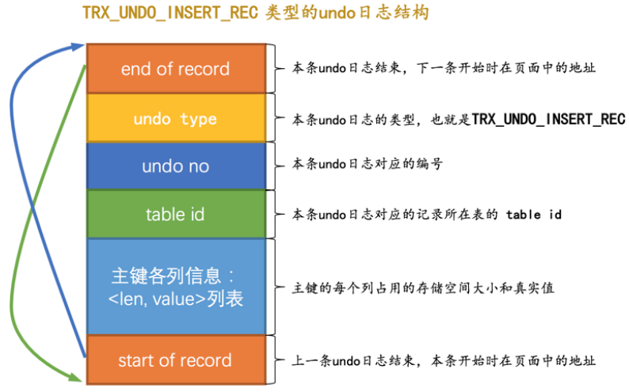
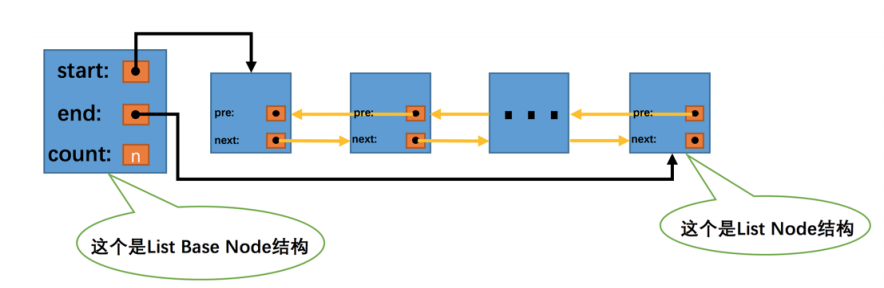

MySQl是怎么运行的

## 1.初始部分

mysqld 可执行文件 服务器程序
服务器相关的mysqld mysqld_safe客户端相关mysql mysqladmin

默认InnoDB  外键支持的功能的事务存储引擎

MyISAM      主要的非事务处理存储引擎

Memory      至于内存的表

###  CS进程间通信方式

* TCP/IP方式： mysql -h127.0.0.1 -uroot -P3306 -p
* windowOS 的一台主机：命名管道和共享内存
* 类Unix的一台主机：套接字

### 服务器处理客户端的查询请求流程

mysql内部构造结构图如下


#### 连接管理：

S端创建线程处理交互； 

* 1.限制连接C端数量；2.断开后线程不销毁，另一个C端连接时分配；3，携带主机各类信息发起连接 ，用SSL通信保证数据传输安全性

#### 解析与优化
1. 查询缓存：MySQL8.0删除，因为维护缓存开销
2. 语法解析：编译过程：词法解析 语法解析 语义分析（编译原理）
3. 查询优化：优化语句，提高效率（类似以扁平化）

#### 存储引擎

功能：物理上如何存储、读取、写入、表示记录；

向上提供存储引擎API

* 默认的存储引擎InnoDB，主要还有MyISAM、Memory等

## 2. 启动选项和系统变量

### 命令行上使用选项（当次启动生效）

* 在选项名前加上 --前缀

* 短形式简化启动选项，短选项名与值之间可以没有间隙

### 配置文件中使用选项（本机修改）

### 系统变量 VARIABLES

作用范围：全局GLOBAL启动选项、会话SESSION;

SET GLOBAL default_storage_engine = MyISAM;

SET SESSION default_storage_engine = MyISAM;

* 默认的作用范围是SESSION

### 状态变量 STATUS

SHOW [GLOBAL|SESSION] STATUS [LIKE 匹配的模式];

## 3.字符集和比较规则

#### 字符集

* ASCII字符集128 1字节；

* GB2312/GBK字符集 对ASCII字符集采用1字节，否则2字节

* Unicode也是一种字符编码方法，容纳全世界所有语言文字的编码方,UCS只是规定如何编码，并没有规定如何传输、保存这个编码。而我们熟悉的**UTF-8 UTF-16 UTF-32是Unicode的具体实现**(怎么存储在计算机)

  UTF8变长编码方式，1-4字节，MySQL中utf8为1-3，utf8mb4为1-4字节；

  **用途**：

  1. 可以用来确定数据的存储空间

  2. 编码和解码方式不一致导致乱码；常见的有UTF-8书写的用GBK解码，导致中文乱码

  3. 解码后，可以字符集转换；
  
     * 类 Unix系统使用的是 utf8
     * Windows使用的是 gbk
     * CS通信采用的系统变量规定
  
     character_set_clientS收到后解码方式；
     character_set_connectionS转换类型；
      character_set_resultsS返回数据编码方式
  
     

#### 比较规则

SHOW COLLATION [LIKE 匹配的模式]

* 服务器级别 数据库基本 表级别 列级别
* 排序时比较 SELECT * FROM t ORDER BY s; 

## 4.InnoDB记录结构 

将数据划分若干页，页作为磁盘和内存交换的基本单位，InnoDB页的大小一般为16KB

### 四种行格式ROW_FORMAT ：

Compact、Redundant、Dynamic、Compressed，之后可能还会再加其他的但是原理相同；

### Compact示例

```mysql
mysql> CREATE TABLE record_format_demo (
 -> c1 VARCHAR(10),
 -> c2 VARCHAR(10) NOT NULL,
 -> c3 CHAR(10),
 -> c4 VARCHAR(10)
 -> ) CHARSET=ascii ROW_FORMAT=COMPACT;
Query OK, 0 rows affected (0.03 sec)
```


#### 1. 变长字段部分

VARCHAR(M) 、 VARBINARY(M) 、各种 TEXT 类型，各种 BLOB 类型等存储字节数据不固定，称为**变长字段**；

变长字段占用包括（真正数据内容+占用字节数），这个占用的字节数就放在这部分中。

* 逆序存放
* 只存非NULL
* 按照W*M和L比较，选择1或2字节
* 高位补0


#### 2. NULL值列表

（去掉强制非NULL）二进制位逆序排列，高位补0

#### 3. 记录头信息

* 5固定是5字节，40个二进制位表示

* 不同的位表示不同的意思（当前记录的位置信息、是否被使用、删除等）

* 类似表头信息

#### 4. 还有一些隐藏列 

1. InnoDB自动添加transaction_id事务ID、roll_pointer回滚指针

2. InnoDB默认添加row_id作为主键，但是用户自定义了就不添加

#### 5. 真实数据

按照列号顺序存入，字符集相关


### Redundant行格式


* 把记录中所有列的长度信息都按照逆序存储，按照偏移存储

* 一种比较简单粗暴的格式，所以现在不常用

### 行溢出：一条记录占用的最大存储空间超出

* 溢出页+指针
* 一个页一般是**16KB** 记录太多或者记录太大， 当前页存不下，多于数据存储到其他页，叫行溢出；MySql规定一个页至少存放两行数据
* 要记住一行中所有列占用的字节长度记起来不超过65535字节
* 对于占用存储空间非常大的列，在记录真实数据处只会存储该列的一部分数据，把剩余的数据分散存储在其他几个页中，然后记录的真实数据处用20个字节存储指向这些页的地址
* MySQL规定一个页中至少存放两行数据

### Dynamic和Compressed行格式

和Compact像，但是处理行溢出的时候，把所有的数据都放在溢出页

## 5.InnoDB数据页结构

数据页：存放表中记录的那种类型的页


* 数据插入过程就是从Free Space划分空间，写入记录，放到User Records的部分。
* 当Free Space用完了，就是本页使用完了

#### 记录的位置

* heap_no表示记录在本页中的位置，但是0 Infimum和 1 Supermum是伪记录，由页给出
* 用next_record指向下一条记录。所以一个页中的记录用单链表表示连接起来

如何查找一个记录：

1. 将页中记录分为几个组，**每组的最后一条记录地址偏移量存在Page Directory页目录**（槽）
2. n_owned表示以此结尾的组的记录数。InnoDB规定最小记录结尾分组只有1条，最大记录结尾分组有1-8条，剩下分组时4-8条之间。

##### 添加记录条的过程：

初始情况下一个数据页里只有最小记录和最大记录两条记录，它们分属于两个分组。
之后每插入一条记录，都会从 页目录 中找到主键值比本记录的主键值大并且差值最小的槽，然后把该槽对应的记录的 n_owned 值加1，表示本组内又添加了一条记录，直到该组中的记录数等于8个。
在一个组中的记录数等于8个后再插入一条记录时，会将组中的记录拆分成两个组，一个组中4条记录，另一个5条记录。这个过程会在 页目录 中**新增一个 槽** 来记录这个新增分组中最大的那条记录的偏移量。

##### 一个数据页中查找指定主键值的记录过程：

1. 二分查找所在的槽，找到槽中最小记录
2. next_record属性遍历槽所在的组中的各个记录

## 6. B+数索引

前提保证：下一个数据页中记录的主键值必须大于上一个页中用户记录的主键值（页分裂）。

把每个页的最小主键值和页号合在一起，列一个目录，成为索引。这样的页是**索引页**，其中记录是索引record_type = 1。索引页信息提取后放大更高级的目录项，依次层级递推，就是一个B+树。一般不超过4层

#### 聚簇索引：

1. 使用记录的主键值的大小进行记录和页的排序：
   页内记录组成单向链表；存放用户记录的页也组成双向链表；
   存放目录项记录的页分为不同层次，在同一层次中的页根据页中目录项记录的主键大小排序组成双向链表。
2. B+树叶子结点是完整的用户记录

InnoDB自动创建的结构，索引即数据

#### 二级索引：

根据非主键查找，就需要建立另一棵树，键是查找列，值是主键。

1. 同样的方法查找叶子结点的记录，找到主键值
2. 按照主键再索引一遍，找到完整记录（回表）

回表是为了减少建第二颗树存完整数据的所占的空间。

#### 联合索引：

先把各个记录和页按照 c2 列进行排序；
在记录的 c2 列相同的情况下，采用 c3 列进行排序

### 注意事项：

1. 根页面一直不动，先创建B+树索引，然后添加记录、多了分页作为索引页，但是根节点不会移动
2. 页节点中记录项记录的唯一性，在目录项记录的内容是主键+索引列+页号，来保证唯一性
3. 一个页面至少存两条记录

### MyISAM中索引方案

* 记住MySIAM和InnoDB区别是他把**索引和数据分开存储**

1. 数据文件：按照插入的顺序把记录单独存储在一个文件。
2. B+树，根节点是行号而非完整数据。

* 建立的索引，相当于全是二级索引，因为要**回表找完整的数据**

### 创建和删除索引

InnoDB和MyISAM会`自动`为**主键或UNIQUE列**生成B+树索引。

其他需求，声明建立B+树

```mysql
CREATE TALBE 表名 (
 各种列的信息 ··· , 
 [KEY|INDEX] 索引名 (需要被索引的单个列或多个列)
)
```

```mysql
ADD [INDEX|KEY] 索引名 (需要被索引的单个列或多个列)
```

```mysql
INDEX idx_c2_c3 (c2, c3)                    //创建联合声明
```

```mysql
ALTER TABLE index_demo DROP INDEX idx_c2_c3       //删除索引
```

## 7. B+树索引的使用

### 索引代价

1. 空间上建树，数据页代价
2. 时间上CRUD需要修改索引，为了维护排序需要移位操作

### B+树索引适用的条件

建立了联合索引后，可以适用以下情况：

1. 全值匹配

2. 匹配左边的列

3. 列前缀 （英文前缀n个字符
4. 匹配范围值
5. 精确匹配某一列，范围匹配另一列
6. 用于排序，用联合索引必须**按照几个列的顺序**，因为有比较的优先级；但是几个变量选择ASC、DESC混用的情况不能，也就是联合索引的各个排序列的**排序顺序必须一致**；不能用修饰过的表达式（无法比较）
7. 用于分组，要求和排序差不多

### 回表的代价

联合索引中：二级索引查找读取主键，因为是顺序IO快；但是由二级索引得到主键后，这些记录是分散的，按主键聚簇索引是随机IO慢。

如果需要回表的记录数很多，倾向于全表扫描：

1. 一般加LIMIT多少就倾向于二级索引+回表
2. 有排序需求也是满足这类讨论

* 为了去掉回表的性能损耗，建议**只查索引列**，这样告别了回表，称为`覆盖索引`

只查询 name , birthday , phone_number 这三个索引列的值，所以在通过idx_name_birthday_phone_number 索引得到结果后就不必到 聚簇索引 中再查找记录的剩余列，也就是country 列的值了，这样就省去了 回表 操作带来的性能损耗

### 如何挑选索引

#### 1. 只为搜索、排序、分组的列创建

只是查询就没必要，只需要为出现在WHERE句子中的列、连接子句中的连接列，或者ORDER BY、GROUP BY子句中列创建索引。

#### 2. 列的基数越大越好

基数就是去掉重复数后实际不同值的数量，重复太多不好排序

#### 3. 索引列的类型尽量小

类型表示的数据范围小，CPU查询快，存储空间小，页可以放更多的记录

#### 4.索引字符串值的前缀

只对字符串的前几个字符进行索引，这样节约空间、比较时间、解决排序问题

#### 5.索引列在比较表达式单独出现

如果是表达式的形式，而不是单独列出现，不能用到索引（引擎没有前处理优化）

#### 6.主键插入顺序

最好是从小到大插入，如果是随机等，插入过程需要性能损耗

#### 7.不要冗余或者重复索引

#### 8.尽量使用覆盖索引避免回表

## 8.MySQL的数据目录

InnoDB和MyISAM是把表存在文件系统上的，然后读写页

### 数据目录

数据库程序启动的时候在目录下加载文件，在运行时产生的数据存储到目录的文件中。区别于安装目录

#### 数据库在文件中的表示

* 每个数据库对应数据目录下一个子目录，或者说文件夹，其下还有db.opt文件，包含数据库的各种数学，比如字符集和比较规则

InnoDB的索引即数据：其包含的表空间：系统表空间、独立表空间、其他类型的

> 对于系统表空间来说，对应着文件系统中一个或多个实际文件；对于每个独立表空间来说，对应着文件系统中一个名为 表名.ibd 的实际文件。

MyISAM分开存储：.MYD是数据 .MYI是索引文件

#### 其他文件

**视图**是虚拟的表，在其数据库下，也需要存储起来，视图名.frm

数据库进程文件

数据库日志文件：查询日志、错误日志、二进制日志、redo日志

默认/自动生成的SSL和RSA证书和秘钥文件

### 系统数据库

**mysql**
核心，它存储了MySQL的用户账户和权限信息，一些存储过程、事件的定义信息，一些运行过程中产生的日志信息，一些帮助信息以及时区信息等

**information_schema**
MySQL服务器维护的**所有其他数据库的信息**，比如有哪些表、哪些视图、哪些触发器、哪些列。这些信息并不是真实的用户数据，而是一些描述性信息，有时候也称之为元数据。

**performance_schema**
存MySQL服务器**运行过程中的一些状态信息**，算是对MySQL服务器的一个性能监控。
包括统计最近执行了哪些语句，在执行过程的每个阶段都花费了多长时间，内存的使用情况等等信息。

**sys**
这个数据库主要是通过视图的形式把 information_schema 和 performance_schema 结合起来，让程序员可以更方便的了解MySQL服务器的一些性能信息。

## 9.InnoDB的表空间 不太熟再看看

### 页面类型

ALLOCATED 分配还未使用

INDEX 索引页，数据页


一些常用的页面类型


### 页面通用部分


FileHeader 包含页号、检验和、类型、next、prev

主体

FileTrailer 校验页面是否完整，保证内存到磁盘刷新时内容一致性

### 独立表空间结构

独立表空间和系统表空间中，64页是一个区，256区是一个组；

每个组的最开始几个页面类型固定，表示一些属性信息；

#### 区、段的概念：

因为随机访问内存损耗，且磁盘读取很慢，所以数据量大的时候如果建立索引，可以用**区**为分配单位。

区的集合称为**段**，叶子结点有独有的区 组成了一个段，非叶子节点也组成了一个段。

但是数据量小的表用整个区浪费存储空间，会设置**碎片区**，碎片区直属于表空间

* 首先插入数据，段式从碎片区以页面为单位分配存储空间
* 段已经占了32个碎片区页面后，单独以完整的为范围分配存储空间

**目的：提高表插入数据的效率，又不至于数据量少的表浪费空间**


#### 区的分类：

**FREE、 FREE_FRAG、 FULL_FRAG**、**FSEC**（附属于某个段了）：前三个直属于表空间

1. 表空间由若干区组成，每个区有一个**XDES Entry**结构，直属于表空间的区对应XDES Entry结构分为FREE、 FREE_FRAG、 FULL_FRAG三个链表；

2. 每个段附属于若干区，每个段中的区对应的XDES Entry结构分为**FREE、NOT_FULL、FULL 3个链表**。每个链表对应一个List Base Node的结构，和这个机构记录俩表的头、尾节点，以及节点数。来管理这些区。

举例：一个表有两个索引，聚簇和二级索引，那就有4个段，12个上述段相关区的链表，加上3个直属于表空间的三个链表，共15个链表。

#### 段的分类： 

**段是一个逻辑上的概念，不是一段连续物理区域，由若干零散的页面和一些完整的区组成。**

也有一个**INODE Entry**结构记录段中的属性

也有List Base Node记录三个链表的信息

#### 各类页面的详细情况

表空间的第一个组的第一个页面FSP_HDR描述了区的信息，也就是包含很多XDES Entry

第二个页面是IBUF_BITMAP信息，记录关于Change Buffer东西

第三个页面是INODE，为了存储 INODE Entry 结构而存在的

#### Segment Header

把段和INDOE Entry对应起来的方法：在**数据页**的PageHeader中有两个Segment Header结构，记录着叶子结点和非叶子结点的头部信息（两个段），去定位INODE Entry：哪个表空间的哪个页面的哪个偏移量


### 系统表空间结构

表空间ID是0，开头有许多记录整个系统属性的页面。


每次向表插入记录的时候，MySQL先要校验一下插入语句对应的表存不存在，插入的列和表中的列是否符合，如果语法没有问题的话，还需要知道该表的聚簇索引和所有二级索引对应的根页面是哪个表空间的哪个页面，然后把记录插入对应索引的 B+ 树中。

所以需要些额外的信息，叫做**元数据**，InnoDB定义了一些列的**内部系统表**（数据字典）记录。

**基本系统表：**

SYS_TABLES 整个InnoDB存储引擎中所有的表的信息
SYS_COLUMNS 整个InnoDB存储引擎中所有的列的信息
SYS_INDEXES 整个InnoDB存储引擎中所有的索引的信息
SYS_FIELDS 整个InnoDB存储引擎中所有的索引对应的列的信息

* 有了上述4个基本系统表，也就意味着可以获取其他系统表以及用户定义的表的所有元数据。

* Data Dictionary Header页面是页号为7的SYS类型页面，记录了这4个表的5个索引的根页面信息和一些全局信息

### 总结：

区、段、记录区entry的表、记录段entry的表，段到分配区的链表，把数据页和段联系起来的segment header；

记录系统的表，表的索引页Data dictionary header；

## 10. 单表查询的方法

数据库的**查询优化器**的自动查询方式：全表扫描、索引查询。具体类型分为以下

> 注：UNIQUE唯一索引可以用于确保表中某一列或列组的数值唯一性约束，以便在查询和筛选数据时提高性能和准确性。当你尝试在已存在的唯一索引中插入重复值时，数据库会返回错误。

### const常数级别

通过主键或者**唯一**二级索引列（多列的话，每一列都要与常数等值比较）定位一条记录的方法。

### ref

普通的二级索引列与常数`等值`比较。

因为可能找到**多条**对应记录，如果记录少选择索引，而不是全表扫描时

* NULL值二级索引，NULL可能有多个所以是ref

### ref_or_null

不仅想找出某个二级索引列的值等于某个常数的记录，还想把该列的值为 NULL 的记录也找出
来

使用二级索引而不是全表扫描的方式执行该查询时，称为ref_or_null

### range

索引列需要匹配某个或某些范围的值，利用**索引**进行**范围匹配**

### index

SELECT key_part1, key_part2, key_part3 FROM single_table WHERE key_part2 = 'abc';

key_part1, key_part2, key_part3都是联合索引的索引，列但是key_part2不是联合索引中最左索引列

直接**遍历二级索引记录**

### all

全表扫描

### 注意事项

1. 重温 二级索引+回表：
   多个条件的情况下， `一般情况`下只能用**单个二级索引执行查询**，查询优化器识别多个搜索条件，先判断哪个条件用二级索引行数更少，就用二级索引+回表，再筛选处理其他的条件。

2. 明确range访问方法使用的范围区间
   有的搜索条件无法使用索引的情况

3. 索引合并

   特殊情况可能在一个查询中使用多个二级索引，index merge算法：

   1） Intersection交集：多次二级索引，求出的主键求交集，再回表聚簇索引（因为二级索引是顺序搜索，回表是随机搜索开销大）

   2）Union并集，适用于OR连接，必须保证二级索引列等值匹配，或者主键范围匹配

   3）Sort-Union合并，多次二级索引，然后按主键分别排序，然后合并

4. 注意用联合索引代替Intersection合并比较快


`剩余的访问方式：` 15节补

### system

当表中只有一条记录并且该表使用的存储引擎的统计数据是精确的，比如MyISAM、Memory

### eq_ref

连接查询时，被驱动表是通过主键或唯一二级索引等值匹配进行访问

### fulltext

全文索引

### index_merge

在某些场景下可以使用 Intersection 、 Union 、 Sort-Union 这三种索引合并的方式来执行查询

### unique_subquery

包含 IN 子查询的查询语句中，如果查询优化器决定将 IN 子查询转换为 EXISTS 子查询，而且子查询可以使用到主键进行等值匹配的话，那么该子查询执行计划的 type 列的值就是 unique_subquery

### index_subquery

访问子查询中的表时使用的是普通的索引


## 11.连接（联结）的原理

单纯连接，连接查询的结果表包含两个表（可以多个表）的记录的笛卡尔积

#### 连接过程：

1. 涉及单表的条件；常规
2. 涉及两表查询的条件；
   * 第一个表是驱动表，首先选取与驱动表相关的过滤条件，对驱动表单表查询，只查询一次；
   * 然后第二个表是被驱动表，按照上步的结果，对每条记录都在被驱动表查询并筛选匹配的结果，访问多次；
   * 有其他表连接，那么结果集就是新的驱动表，第三个表就成了被驱动表重复上述过程

#### 内连接和外连接

1. INNER JOIN或WHERE语句，对于 内连接 的两个表，驱动表中的记录在被驱动表中找不到匹配的记录，该记录不会加入到最后的结果集，我们上边提到的连接都是所谓的 内连接 。
2. （LEFT 或 RIGHT）OUTER JOIN 对于 外连接 的两个表，**驱动表中的记录**即使在**被驱动表中没有匹配的记录，也仍然需要加入到结果集**， 对于的被驱动表的各字段用NULL表示

```mysql
SELECT * FROM t1 LEFT [OUTER] JOIN t2 ON 连接条件 [WHERE 普通过滤条件];
```

* 推荐内连接用INNER JOIN，外连接用LEFT/RIGHT JOIN （指明驱动表）
* 内连接的驱动表和被驱动表可以换，外连接不行。

#### 嵌套循环连接

就是上述双表查询的过程

#### 使用索引加快连接速度

在连接查询中对被驱动表使用**主键值或者唯一二级索引列的值**进行**等值查找**的查询执行方式称之为： eq_ref 。

* 当然建立索引不一定用，只有二级索引+回表的代价比all代价低才会用
* 还有不要用select * 这样方式，最好是需要什么列列出来，这样可以用index方式

#### 基于块的嵌套循环连接

申请一块内存，把若干驱动表结果集中记录到join buffer中，被驱动表的记录一次性和其中多条驱动表记录做匹配

## 12.MySQL基于成本的优化

MySQL执行查找的成本：

​	1.0的I/O成本（读取一个页面），0.2的CPU成本（检测一个记录是否符合搜索条件）

### 单表查询的成本

#### 基于成本计算的优化

1. 根据搜索条件，找出所有可能使用的索引
2. 计算全表扫描的代价
3. 计算使用不同索引执行查询的代价
4. 对比各种执行方案的代价，找出成本最低的那一个

#### 计算all的成本

Rows 表中的记录条数

Data_length 表占用的存储空间字节数 /16/1024就是页面数量被（16K一个页面）

1.0的I/O成本，0.2的CPU成本=1.0 \*页面数 + 0.2\*记录数

#### 计算索引的成本

1. 二级索引：

范围区间数量：顺序IO基本就是1；

得到需要回表的记录数，范围搜索（不是UNIQUE），得到最左页面和最右页面，读取；

所在页面\*1.0 + 搜的记录\*0.2

2. 回表

回表后得到完整用户记录：需要完整记录的IO + 读取二级索引记录CPU + 回表聚簇索引CPU

### 连接查询的成本

驱动表查询得到的结果条数：扇出值

condition filtering计算扇出值需要查询优化去猜,实际用了启发式规则：

1. 全表扫描的单表查询，猜搜索条件的记录有多少条
2. 索引执行单表扫描，才满足除使用到对应索引的搜索条件外的搜索条件的记录有多少

#### 两表连接的成本

连接查询总成本 = 单次访问驱动表的成本 + 驱动表扇出数 x 单次访问被驱动表的成本

* 内连接要考虑哪个作为驱动表，能用到索引 或者 减少驱动表的扇出

#### 多表连接的成本分析

减少一些连接方法的考虑

## 13. InnoDB统计数据如何收集

之前成本估计的一些统计信息如何收集

永久性的统计数据，非永久性的统计数据（用的少），STATS_PERSISTENT = 0|1

* InnoDB 默认是以**表**为单位来收集和存储统计数据的

### 永久性数据

#### innodb_table_stats 

存储了关于表的统计数据，每一条记录对应着一个表的统计数据。

|database_name |数据库名|
|table_name| 表名|
|last_update| 本条记录最后更新时间|
|n_rows |表中记录的条数|  `页面采样法统计的`
|clustered_index_size |表的聚簇索引占用的页面数量|
|sum_of_other_index_sizes |表的其他索引占用的页面数量|

#### innodb_index_stats

 存储了关于索引的统计数据，每一条记录对应着一个索引的一个统计项的统计数据。

database_name 数据库名
table_name 表名
index_name 索引名
last_update 本条记录最后更新时间
stat_name 统计项的名称
stat_value 对应的统计项的值
sample_size 为生成统计数据而采样的页面数量
stat_description 对应的统计项的描述

#### 自动更新和手动更新表

```mysql
 UPDATE innodb_table_stats 
 SET n_rows = 1
 WHERE table_name = 'single_table';
 
 FLUSH TABLE single_table;
```

### innodb_stats_method

nulls_equal ：认为所有 NULL 值都是相等的。这个值也是 innodb_stats_method 的默认值。
nulls_unequal ：认为所有 NULL 值都是不相等的。
nulls_ignored ：直接把 NULL 值忽略掉。

## 14. MySQL基于规则的优化

MySQL自动的语句优化，重写规则相关

### 条件化简

1. 移除不必要的括号

2. 常量传递

3. 等值传递

4. 移除没用的条件

5. 表达式计算：

   > 如果某个列不是单独的形式作为表达式的操作数，比如出现在函数等不会化简;
   >
   > 就像之前说的如果不是单独的形式，不能用于索引

6. HAVING子句和WHERE子句的合并

   > WHERE在数据分组前进行过滤，HAVING在**数据分组后**进行过滤。
   >
   > 
   >
   > 所以当没有SUM、MAX、GROUP BY子句就可以把HAVING和WHERE子句合并

7. 常量表检测

### 外连接消除

指定（或者隐含）被驱动表中的列不为NULl，这种条件称为 **空值拒绝**

空值拒绝后内外连接互相转换，查询优化器就可以转换驱动表来优化成本了

> 外连接和内连接的本质区别就是：对于外连接的驱动表的记录来说，如果无法在被驱动表中找到
> 匹配ON子句中的过滤条件的记录，那么该记录仍然会被加入到结果集中，对应的被驱动表记录的各个字段使用
> NULL值填充；而内连接的驱动表的记录如果无法在被驱动表中找到匹配ON子句中的过滤条件的记录，那么该记
> 录会被舍弃
>
> mysql> SELECT * FROM t1 INNER JOIN t2 ON t1.m1 = t2.m2;

### 子查询优化

子查询-外层查询

包括：SELCET子句中 、FROM子句中、WHERE ON子句中、 ORDER BY 子句中、GROUP BY 子句中

1. 必须小括号
2. select对于的标量子查询
3. （NOT） IN ANY SOME ALL查询来说不允许LIMIT语句
4. 去掉一些冗余的表达

#### 子查询执行

1. 对于包含不相关的标量子查询或者行子查询的查询语句来说，MySQL会分别独立的执行外层查询和子查询，就当作两个单表查询就好了

物化表，作为临时表去重、哈希；转连接

* 半连接 （英文名： semi-join ）。将 s1 表和 s2 表进行半连接的意思就是：对于 s1 表的某条记录来说，我们只关心在 s2 表中是否存在与之匹配的记录是否存在，而不关心具体有多少条记录与之匹配，最终的结果集中只保留 s1 表的记录

如果 IN 子查询符合转换为 semi-join 的条件，查询优化器会优先把该子查询为 semi-join ，然后再考虑下
边5种执行半连接的策略中哪个成本最低：
Table pullout
DuplicateWeedout
LooseScan
Materialization
FirstMatch
选择成本最低的那种执行策略来执行子查询。
如果 IN 子查询不符合转换为 semi-join 的条件，那么查询优化器会从下边两种策略中找出一种成本更低的
方式执行子查询：
先将子查询物化之后再执行查询
执行 IN to EXISTS 转换。

## 15.Explain详解

在具体的查询语句前边加一个 EXPLAIN ：帮助我们查看某个查询语句的具体执行计划，

列名 描述
id 在一个大的查询语句中每个 SELECT 关键字都对应一个唯一的 id
select_type SELECT 关键字对应的那个查询的类型
table 表名
partitions 匹配的分区信息
type 针对单表的访问方法
possible_keys 可能用到的索引
key 实际上使用的索引
key_len 实际使用到的索引长度
ref 当使用索引列等值查询时，与索引列进行等值匹配的对象信息
rows 预估的需要读取的记录条数
filtered 某个表经过搜索条件过滤后剩余记录条数的百分比
Extra 一些额外的信息

## 16. 15.Explain详解 下

### Extra

Using index

Using index condition

等。。。用到在看吧

### Json格式的执行计划

在 EXPLAIN 单词和真正的查询语句中间加上 FORMAT=JSON

 json 格式的执行计划，里边儿包含该计划花费的成本

### Extented EXPLAIN

使用 EXPLAIN 语句查看了某个查询的执行计划后，紧接着还可以使用 **SHOW WARNINGS** 语句查看与这个查询的执行计划有关的一些扩展信息

* Message 字段展示的信息类似于查询优化器将我们的查询语句重写后的语句

## 17. optimizer trace表

方便的查看优化器生成执行计划的整个过程，这个功能的开启与关闭由系统变量optimizer_trace 决定，默认是关闭的


```mysql
 SET optimizer_trace="enabled=on";
```

然后我们就可以输入我们想要查看优化过程的查询语句，当该查询语句执行完成后，就可以到

**information_schema** 数据库下的 **OPTIMIZER_TRACE** 表中查看完整的优化过程。这个OPTIMIZER_TRACE 表有4个列，分别是：

1. QUERY ：表示我们的查询语句。
2. TRACE ：表示优化过程的JSON格式文本。
3. MISSING_BYTES_BEYOND_MAX_MEM_SIZE ：由于优化过程可能会输出很多，如果超过某个限制时，多余的文本将不会被显示，这个字段展示了被忽略的文本字节数。
4. INSUFFICIENT_PRIVILEGES ：表示是否没有权限查看优化过程，默认值是0，只有某些特殊情况下才会是1 ，我们暂时不关心这个字段的值。


* 演示了调用 optimizer trace表的方式

## 18. 调节磁盘和CUP的矛盾-InnoDB的BufferPool

### InnoDB的Buffer Pool

Mysql服务器启动时，申请的连续内存。默认128MB

### 内部组成：

每个页对应的控制信息占用的一块内存称为一个控制块 

控制块 碎片 缓存页


### free链表

空闲的缓存块对应的控制块作为节点放到链表中，free链表以供取用

### 缓存页的哈希处理

表空间号+页号是key，查找缓存页，是否存在Buffer Pool中

### flush链表的管理

修改了一个缓存页的数据，就是`脏页`，需要等待同步到磁盘上

flush链是存储脏页的，

### LRU链表管理

缓存页需要移除，留下频繁使用的

LRU（Least Recently Pool) 按照最近最少使用的原则淘汰缓存页。访问页的时候，把页放到Buffer Pool的LRU链的头部

#### 1）划分区域的LRU链表

问题： 1. 预读导致不一定用到 2. 全表扫描读入频率偏低的页

做法： LRU链表分区：热数据young区域，冷数据old区域

当磁盘上的某个页面在初次加载到Buffer Pool中的某个缓存页时，该缓存页对应的控制块会被放到old区域的头部。如果后续的访问时间与第一次访问的时间在某个时间间隔内，那么该页面就不会被从old区域移动到young区域的头部，否则将它移动到young区域的头部。

#### 2）进一步优化

只有被访问的缓存页位于 young 区域的 1/4 的后边，才会被移动到 LRU链表头部等

### 刷新脏页到磁盘

专门的线程负责

1. LRU链表冷数据刷新部分页面到磁盘
2. flash链表刷新部分页面到磁盘

### 多个Buffer Pool实例

拆分若干个小的Buffer Pool，多线程并发访问

### innodb_buffer_pool_chunk_size

chunk为单位想操作系统申请空间。

在运行期间以chunk为单位增加或删除内存空间

innodb_buffer_pool_chunk_size的值只能在服务器启动时指定，在服务器运行过程中是不可以修改的

### 查看Buffer Pool的状态信息

SHOW ENGINE INNODB STATUS


## 19. 事务简介transaction

ACID 原子性 一致性 隔离性Isolation 持久性Durability

Atomicity  Consistency Isolation Durability （和分布式那个CAP不要记混淆）

需要保证ACID的一个或多个数据库操作称为一个事务


### 事务语法

1. 开启用 BEGIN [WORK] 或者 START TRANSACTION + 修饰符（READ ONLY、 READ WRITE、 WITH CONSISTENT SANPSHOT
2. 提交用 **COMMIT [WORK]**
3. 中止并回归 **ROLLBACK[WORK]**

### 引擎

只有InnoDB和NDB存储引擎支持事务，ROLLBACK必须支持事务才能用

### 自动提交

autocommit 为 ON

每条语句都算是一个独立的事务，叫做自动提交

### 隐式提交

关闭自动提交后，会导致事务隐式提交的语句包括：

1. 定义或修改数据库对象的数据定义语言DDL，比如说CREAT、ALERT、DROP

2. 隐式使用或修改**mysql数据库**中的表

3. 事务控制或关于锁定的句子： START TRANSACTION、 LOCK TABLES

4. 加载数据的语句： LOAD DATA

5. 关于Mysql复制的一些语句： START SLAVE 、 STOP SLAVE 、 RESET SLAVE 、 CHANGE MASTER TO

6. 其他一些系统语句： 

   使用 ANALYZE TABLE 、 CACHE INDEX 、 CHECK TABLE 、 FLUSH 、 LOAD INDEX INTO CACHE 、 OPTIMIZE TABLE 、 REPAIR TABLE 、 RESET 等语句也会隐式的提交前边语句所属的事务。

### 保存点

**SAVEPOINT** 保存点名称;

ROLLBACK [WORK] TO [SAVEPOINT] 保存点名称;

RELEASE SAVEPOINT 保存点名称;

## 21. redo log（上）

问题： 事务提交了，数据修改了只存在Buffer Pool中，flush链等待写入磁盘，如果此时机器故障了内存情况，就不能保证事务有效性（持久性的保证）。

简单的想法： 在事务提交完成之前把该事务修改的所有页面都刷新到磁盘，这样虽然可以保证ACID

问题： 1. 操作是以页为单位的，刷新整个数据页太浪费了，2. 一个事务包含很多处理的页，**随机IO**刷新起来比较慢

### redo log

把事务修改数据库的内容记录，系统重启的时候只需要redo log就行

**好处：** 1. redo log 占用的空间小 2. redo log 是**顺序写入**磁盘的（按顺序写入log）

### redo log 格式


spaceID 是 表空间ID

#### 简单的日志类型

物理日志：记录在某一个页的某个偏移量修改了几个字节的值和具体内容：MLOG_8BYTE

#### 复杂的日志类型

一条INSERT语句，要向B+树插入数据，也要更新系统数据（比如系统表空间中页号为7的页面的Max Row ID属性），

如果每处修改都记录一个log那一个事务也太很浪费了；

如果完整记录全部修改内存为一条log，log要记录整个页面的数据，没有修改的数据也要加入到log；

所以需要设置插入行格式的redo日志类型。

设计了很多类型的redolog格式，物理层对哪个表空间的哪个页进行修改，逻辑层上看这些log是一些逻辑记载，需要用特点函数来跑才能回复页面到系统崩溃前。

MLOG_COMP_REC_INSERT   MLOG_COMP_PAGE_CREATE等


redo日志会把事务在执行过程中对数据库所做的所有修改都记录下来，在之后系统奔溃重启后可以把事务所做的任何修改都恢复出来

### Mini-Transaction

#### 以组的形式插入redo log

执行语句产的redo log需要分成若干个不可分割的组： 因为一些redo日志需要保证原子性，比如向聚簇索引插入一条记录产生的redo log是不可分割的。

* 乐观插入：数据页剩余空间足够

* 悲观插入：数据页剩余空间不够，需要页分裂，甚至内节点也不够，非叶子节点也需要页分裂。这整个过程需要**以组的形式记录log来保证原子性**

标志：以MLOG_MULTI_REC_END结尾。

恢复：解析到标志，才是一组完整的redo日志，进行恢复

其他一条原子性的保证： type字段的第一个位是1

#### 对底层页面一次原子访问是Mini-Transaction （mtr


### redo log写入过程

redo log block ：mtr生成的redo日志存在512字节的页中，称为block


**redo log buffer**的连续内存空间，划分为若干连续的redo log block：

* 每个 mtr 运行过程中产生的日志先暂时存到一个地方，当该 mtr 结束的时候，将过程中产生的一组 redo 日志再全部复制到 log buffer 中。

## 22. redo log （下）

### redo log 文件

log buffer需要持久化，

#### 日志刷盘时机：

1. log buffer空间不足 
2. 事务提交： 可以不提交buffer pooll页面，但是为了持久性不许要提交redo log
3. 后台线程每秒都刷
4. 开关服务器 6.checkpoint 

#### 具体文件组

SHOW VARIABLES LIKE 'datadir' 查看mysql的数据目录

ib_logfile0 和 ib_logfile1 的文件记录刷新的log


### Log Sequeue Number （lsn

日志序列号lsn，InnoDB的初始lsn是8704

要存log的话，回想一下：log是以mtr方式存入的，单位是512B的log Block，其中Block有header和trailer

#### flushed_to_disk_lsn

刷新到磁盘中的redo log的全局变量


lsn的值在读入log buffer的时候增长，flushed_to_disk_lsn的值在刷新到磁盘时往后增长，两值相同说明log buffer中的redo log都刷新到磁盘中了

#### flush链中的lsn

回想之前mtr执行后，redo log写入log buffer，还有修改的页面加入到Buffer Pool中的flush链表中；

flush链中页面的更新： 首次加入写一个lsn， 每次修改页面会更新lsn为新的

顺序是**按照初始的lsn（oldest_modification）排序**，更新的页面会更新newest_modification, 但不用更新链表的顺序

### checkpoint

redo log可覆盖操作： 当对应的脏页已经刷新到磁盘中

checkpoint_lsn: 系统中可以被覆盖的redo log总量是多少，初始是8704


**批量刷脏页**： lsn增长过快，需要线程同步从flush 链表中把最早修改的脏页刷新到磁盘，然后去做checkpoint

SHOW ENGINE INNODB STATUS 命令查看当前 InnoDB 存储引擎中的**各种 LSN 值的情况**

### innodb_flush_log_at_trx_commit

可以设置： 

0 延迟写： 不交，等待后台线程做； 可以加快事务处理速度，但是这样事务提交后如果后台没有刷新就挂了，可能会导致事务失效

1 实时写，实时刷： 事务提交时立即磁盘同步redo log ，

2 写到**操作系统的缓冲区**，只要操作系统没挂就能保证事务的持久性

### 崩溃恢复

**起点** ： 从checkpoint_lsn开始读取redo log （最近的checkpoint）

**终点** ： 最后一条log，也就是按顺序下去block不为512的那个最后block为止

**恢复** ： 按照SpaceID和page number哈希表放在一起加速读取，避免一些随机IO

* 每个页面的File Header部分都有一个FIL_PAGE_LSN记录最近一次修改页面的lsn


## undo log （上

撤销日志，是InnoDB用来记录事务的反向逻辑日志的，目的是为了事务回滚撤销DML操作。在十五开始之前，将要修改的数据存在undo链中


保证原子性，需要把旧数据记录下来，以用于事务的回滚

### 事务id

只读事务：只有在第一次对用户创建的临时表进行CUD时，才会分配一个事务id

读写事务： 只有在第一次对某个表（包括用户创建的临时表）进行CUD时，才会分配事务id


**事务id递增**： 页号为5的页面一个Max Trx ID 的属性处，每次分配自增1


* 聚簇索引的记录会保存用户数据外，还有自动添加的trx_id代表改动语句所在的事务id

### undo log的格式

每条记录一次改动，就对应一个undo日志，编号undo no

undo日志记录在类型为FIL_PAGE_UNDO_LOG页中

#### INSERT操作

TRX_UNDO_INSERT_REC类型



* 需要把主键包含的所有列的长度和真实值记录下来；
* 只需要考虑向聚簇索引插入记录时的情况记录就好了，因为回滚的时候只要知道记录的主键信息，然后回滚聚簇索引的时候顺带着把二级索引记录也回滚了

例子：INSERT INTO undo_demo(id, key1, col) 
 VALUES (1, 'AWM', '狙击枪'), (2, 'M416', '步枪');

 

* 数据页每条记录中的roll_pointer,就是指向记录对应的undo日志的一个指针

#### DELETE操作

删除的过程： 

1. deletd mark阶段： 记录的delete_mask标识位设置为1，

2. purge阶段：  `删除的事务提交后`，专门的线程来把记录从 正常记录链表 中移除，加入到 垃圾链表 中

所以要处理回滚，只需要考虑第一个阶段


TRX_UNDO_DEL_MARK_REC


* old trx_id和old roll_pointer属性，可以帮助找到记录修改前一条的undo日志
  利用这些 可以组成**记录的一个版本链**
* 索引列各列信息<pos, len, value> ，在事务提交后真正删除阶段用

#### UPDATE操作

##### 不更新主键

如果更新的**每个列**前后存储空间一样大，可以就地更新

**任何列**更新前后存储空间大小不一致，需要记录删掉后（真删除，不是delete mark）新记录插入页面中； 新添加的空间可以重用垃圾链表空间，或者页分裂


* n_updated 表示将有几个列被更新，后边跟着的 <pos, old_len, old_value>
  分别表示被更新列在记录中的位置、更新前该列占用的存储空间大小、更新前该列的真实值。

##### 更新主键

意味着记录在聚簇索引的位置会发送改变

1. 旧记录进行delete mark操作
2. 更新后列的值创建一条新纪录，并插入聚簇索引中

所以会记录额外的TRX_UNDO_DEL_MARK_REC 和 TRX_UNDO_INSERT_REC 两条redo log


## 23. undo log （下）

### 链表结构

List Node结构：表空间中通过一个页的页号和在页内的偏移量唯一定位一个节点的位置

 

基结点管理List Node： 




### undo log页面类型

表空间中的FIL_PAGE_UNDO_LOG类型页面存储redo log

这类页有有特有的Undo Page Header


**TRX_UNDO_PAGE_TYPE** ：本页面准备存储什么种类的 undo日志

1. TRX_UNDO_INSERT类型， 2. TRX_UNDO_UPDATE 类型

* 前者只存Insert，后者存其他，因为后者需要提供MVCC服务不能直接删除

**TRX_UNDO_PAGE_NODE** ：代表一个 List Node 结构

### undo log页面链表

#### 单个事务：

一个事务多个undo log，可能放在多个页中，需要用**TRX_UNDO_PAGE_NODE属性连成一个链表**，其中第一个undo页面叫first undo page，除了记录 undo page header以外，要记录一些管理信息，也就是`undo log segment header`

最多四个链表，按需分配：简单表和临时表的分别两个insert undo链表，upadate undo链表，

#### 多事务： 

不同事务产生的undo log写入不同的undo页面链表

### undo log 写入具体过程

> Undo Log Segment

每个**undo页面链表**都有一个**对应的段** `Undo Log Segment`，****，也就是说链表的页面都是从这个段中申请的。

所以在first undo page有关于这个段的信息，Undo Log segment Header部分

没有被重用的 Undo页面 链表来说，链表的第一个页面，也就是 first undo page 在真正写入 undo日志前，会填充 Undo Page Header 、 Undo Log Segment Header 、Undo Log Header 这3个部分，之后才开始正式写入 undo日志 。

### 重用 undo页面

一般一个页面链表只存一个事务产生的一组undo日志

每次开启事务都创建新的undo页面链表存undo log是一种浪费，事务提交后可以重用undo页面链表。

**重用条件**：

1. 该链表只包含`一个undo页面`， 2. 该undo页面已经使用的空间小于整页面空间的3/4

**重用分类**：

insert undo链表 ，事务提交后重用可以覆盖undo log

update undo链表， 事务提交后不能删除，往后写undo log。 

### 回滚段

一个事务最多可以分配4个undo 页面链表，不同事务不同。

设置了一种统一放**Rollback Segment Header页面**， 存放每个undo页面链表的first undo page 页号**（undo slot）**

**回滚段**Rollback Segment ：每个Rollback Segment Header页面对应一个段，

> 好像分配页面必须要有对应的段??? 也就是物理存址需要有逻辑上对应的操作
>
> 这里的回滚段就是对应了 **记录了所有回滚链的第一个页的页号** 的页
>
> 前面的undo log segment 就是对应了 undo log 页面的链表

从回滚段中省去undo页面链表： 分配FIL_NULL状态的undo slot。

一个Rollback Segment Header页面对应**1024个undo slot**

##### 回滚段的数量和分类

系统一共有**128 个回滚段**，在系统表空间的第 5 号页面中存储了128个 Rollback Segment Header
页面地址，

这些回滚段分类： 0号是系统表空间中的，1-32是在临时表空间的，33-127号是既可以在系统表空间中，也可以在自己配置的undo表空间中

**分类的原因：**在修改针对普通表的回滚段中的Undo页面时，需要记录对应的redo日志，而修改针对临时表的回滚段中的Undo页面时，不需要记录对应的redo日志


### 为事务分配undo页面链表的过程

系统5号页面分配回滚段，查看回滚段的两个cached链表（insert 和 update）有没有缓存的undo slot，没有就在Rollback Segment Header页面找一个可用的undo slot分配给该事务，分配一个undo log segment，从中申请一个页面作为undo 页面的first undo page。然后事务就把undo log 写到这个页面链表了

如果也有临时表的改动，那也要相同的分配临时表的回滚段


## 24. 事务的隔离级别与MVCC


### 事务隔离级别

隔离性： 在某个事务对某个数据进行访问时，其他事务应该排队。

性能： CS架构需要同时处理多个会话

#### 事务并发的问题： 

**脏写**：一个事务修改了另一个未提交事务修改过的数据 

**脏读**: 一个事务读到了**另一个未提交事务**修改过的数据

**不可重复读 ：** 一个事务只能读到另一个已经提交的事务修改过的数据，并且其他事务每对该数据进行一次修改并提交后，该事务都能查询得到最新值

**幻读:** 一个事务先根据某些条件查询出一些记录，之后另一个事务又向表中插入了符合这些条件的记录，原先的事务再次按照该条件查询时，能把另一个事务插入的记录也读出来。

* 严重程度： 脏写 > 脏读 > 不可重复读 > 幻读

> 脏读：强调的是读到了其他事务未提交的数据；（事务回滚可能读到不存在的数据）
>
> 不可重复读：重点是某个数据被修改（或者删除），同一事务，两次读取到的数据不一样；
>
> 幻读：重点在于新增，同样的条件 , 第 1 次和第 2 次读出来的记录数不一样；（主流认为事务过程中记录被其他事务删除不算幻读算不可重复读。说法是 ： 幻读侧重的方面是某一次的 select 操作得到的结果所表征的数据状态**无法支撑后续的业务操作**，更为具体一些：select 某记录是否存在，不存在，准备插入此记录，但执行 insert 时发现此记录已存在，无法插入，此时就发生了幻读。）

#### SQL标准中的四种隔离级别

READ UNCOMMITTED ：未提交读。： 可能会导致脏读、幻读、不可重复读
READ COMMITTED ：已提交读。：可以阻止脏读，但是另一个事务可能会在事务前和事务提交后分别读，可能导致幻读、不可重复读
REPEATABLE READ ：可重复读。： 可以阻止脏读和不可重复读，但是可能导致幻读。
SERIALIZABLE ：可串行化。： 实现并发情况下，串行化数据读取结果一致，可以防止脏读、不可重复读、幻读


#### MySQL中支持的4中隔离级别

MySQL默认支持**REPEATABLE READ** ,并且是可以禁止幻读问题的发生

```mysql
SET [GLOBAL|SESSION] TRANSACTION ISOLATION LEVEL level;
```

### MVCC

#### **版本链**： 

InnoDB每条记录的必要两个隐藏列 trx_id、 roll_pointer

其中roll_pointer之前一个操作undo log，如果前一个是insert undo，并且事务提交了，他的undo log segment被系统回收了，就会指向空的。其中第一个字节标识类型，1代表inset undo，看到就可以不用管了

随着更新次数增加，**所有版本的roll_pointer属性连成一个链表，叫做版本链**，头结点是当前记录的值


#### ReadView 

作用：判断版本链中当前事务的**可见性版本号**，其实就是对生产ReadView的时刻做一个**快照**

对于使用 READ UNCOMMITTED 隔离级别的事务来说，由于可以读到未提交事务修改过的记录，所以直接读取记录的**最新**版本就好了；

对于使用 SERIALIZABLE 隔离级别的事务来说， InnoDB 规定使用**加锁**的方式来访问记录；

READ COMMITTED 和 REPEATABLE READ 隔离级别不一定能读取最新版本的记录。（加入另一个事务已经修改记录但是尚未提交，不能读取最新版本的记录）


* 需要判断一下版本链中的哪个版本是当前事务可见的，设计了版本的ReadView：

1. m_ids:在生成 ReadView 时当前系统中活跃的读写事务的事务id列表
2. min_trx_id
3. max_trx_id
4. creator_trx_id : 生成这个ReadView的事务id


* 通过当前版本的ReadView，判断判断trx_id可见性：

1. trx_id= creator_trx_id 自己访问，可以

2. < min_trx_id trx_id 比当前最小的还小，表明生成该版本的事务在当前事务生成 ReadView 前已经提交，可以 

3. \> max_trx_id  比当前的最大的还新，不行

4. 如果被访问版本的 trx_id 属性值在 ReadView 的 min_trx_id 和 max_trx_id 之间，那就需要判断一下trx_id 属性值是不是在 m_ids 列表中，**如果在，说明创建 ReadView 时生成该版本的事务还是活跃的，该版本不可以被访问**；如果不在，说明创建 ReadView 时生成该版本的事务已经被提交，该版本可以被访问


READ COMMITTED 和 REPEATABLE READ 隔离级别的的一个非常大的区别就是它们**生成ReadView的时机不同**


READ COMMITTED —— **每次读取**数据前都生成一个ReadView

REPEATABLE READ —— 在**第一次读取**数据时生成一个ReadView


#### MVCC小结

MVCC （Multi-Version Concurrency Control ，多版本并发控制）：使用 READ COMMITTD 、 REPEATABLE READ 这两种隔离级别的事务在执行普通的 SEELCT 操作时访问记录的版本链的过程，这样子可以使不同事务的 读-写 、 写-读 操作并发执行，从而提升系统性能。

READ COMMITTD 、REPEATABLE READ 这两个隔离级别的一个很大不同：

生成ReadView的时机不同，READ COMMITTD在每一次进行普通SELECT操作前都会生成一个ReadView，而REPEATABLE READ只在第一次进行普通SELECT操作前生成一个ReadView，之后的查询操作都重复使用这个ReadView就好了。


### purge前后

 update undo 由于还需要支持 MVCC ，不能立即删除掉，只是delete mark；

在确定系统中包含**最早产生的那个 ReadView 的事务不会再访问某些 update undo日志** 以及被打了删除标记的记录后，有一个后台运行的 purge线程 会把它们真正的删除掉。

## 25. 锁

事务并发在读情况下不会对记录产生影响，但是脏写的问题是每个隔离级别都不允许的；

一般用锁实现事务执行同步


每条记录在事务修改时都要检查有没有锁结构，锁结构：trx信息、 is_waiting标志

> 这里锁结构是对应记录和事务的，如果前一个事务锁着，另一个事务要拿到这条记录要生成了一个 锁结构 与这条记录关联，不过 锁结构 的is_waiting 属性值为 true ，表示当前事务需要等待


### 解决并发事务问题的两种方式

1. 读操作利用MVCC控制，写操作加锁： 效率高
2. 读 写操作都加锁：但是幻读的幻影记录在读之前不存在，不知道给谁加锁

#### **一致性无锁读**：

一般的SELECT语句在在 READ COMMITTED 、 REPEATABLE READ 隔离级别下都算是 一致性读

#### **锁定读**：

既要允许读 读不受影响，又要使得写 写， 读 写， 写 读 互相阻塞，需要设计锁

用锁来解决 脏读、不可重复读、幻读 问题

`共享锁S`：**读取记录**需要获得锁； `独占锁X`： **改动记录**需要获得锁

> S锁是兼容的，X和S是不兼容，X和X是不兼容的：
>
> 假如事务 T1 首先获取了一条记录的 S锁 之后，事务 T2 接着也要访问这条记录：
> 如果事务 T2 想要再获取一个记录的 S锁 ，那么事务 T2 也会获得该锁，也就意味着事务 T1 和 T2 在该记录上同时持有 S锁 。
> 如果事务 T2 想要再获取一个记录的 X锁	 ，那么此操作会被阻塞，直到事务 T1 提交之后将 S锁 释放掉。
> 如果事务 T1 首先获取了一条记录的 X锁 之后，那么不管事务 T2 接着想获取该记录的 S锁 还是 X锁 都会被阻塞，直到事务 T1 提交。


可以锁定读语句： 

1. 对读取的记录加 S锁 ：不允许写
    SELECT ... LOCK IN SHARE MODE;

2. 对读取的记录加 X锁 ：不允许读 写
    SELECT ... FOR UPDATE;

#### 读操作：

1. DELETE: **X锁读** 取记录在B+树的位置，**X锁写** delete mark
2. UPDATE: 
   1. 不修改主键 不修改存储空间：**X锁读** B+树定位，**X锁写** 修改原纪录
   2. 不修改主键 至少有列占用存储空间修改前后变化： **X锁读** B+树定位， **X锁写** 彻底删除记录，**INSERT 隐形锁** 新插入记录
   3. 修改主键 相当于 DELETE后INSERT操作
3. INSERT： 一般不加锁，用**隐式锁**保护

### 多粒度锁

锁的粒度 包括 行锁 表锁

#### 意向锁：

意向共享锁：IS 事务给记录上S锁，需要在表加SI锁

意向独占锁：IX 事务给记录上X锁，需要在表加XI锁

IS、IX锁是表级锁，它们的提出仅仅**为了在之后加表级别的S锁和X锁时可以快速判断表中的记录是否**
**被上锁**，以避免用遍历的方式来查看表中有没有上锁的记录，也就是说其实IS锁和IX锁是兼容的，IX锁和IX锁是兼容的

### MySQL中的行锁和表锁

#### 其他引擎的锁

对于 MyISAM 、 MEMORY 、 MERGE 这些存储引擎来说，它们**只支持表级锁，而且这些引擎并不支持事务**，所以使用这些存储引擎的锁一般都是**针对当前会话来**说的。比方说在 Session 1 中对一个表执行 SELECT 操作，就相当于为这个表加了一个表级别的 S锁 ，如果在 SELECT 操作未完成时， Session 2 中对这个表执行 UPDATE 操作，相当于要获取表的 X锁 ，此操作会被阻塞，直到 Session 1 中的 SELECT 操作完成，释放掉表级别的 S锁 后，Session 2 中对这个表执行 UPDATE 操作才能继续获取 X锁 ，然后执行具体的更新语句。

* 这些引擎的表在同时只允许一个会话对表写操作，一般用在大**部分只读、或者单用户**的场景

#### InnoDB的锁

##### 表锁：

1. 表级别的 S锁 、 X锁：
   在对某个表执行 SELECT 、 INSERT 、 DELETE 、 UPDATE 语句时， InnoDB 存储引擎是不会为这个表添加表级别的 S锁 或者 X锁 的。

ALTER TABLE 、 DROP TABLE 这类的 DDL 语句时，其他事务对这个表并发执行诸如 SELECT 、 INSERT 、 DELETE 、 UPDATE 的语句会发生阻塞。 


不过请尽量避免在使用 InnoDB 存储引擎的表上使用 LOCK TABLES 这样的手动锁表语句，它们并不会提供什么额外的保护，只是会降低并发能力而已。 InnoDB 的厉害之处还是实现了更细粒度的行锁

2. 表级别的 IS锁 、 IX锁

3. 表级别的 AUTO-INC锁： 实现AUTO_INCREMENT修饰的列递增赋值：

    一种方式：在执行插入语句时，表级别加AUTO_INC锁，自增列分配递增值，然后释放AUTO_INC锁

   另一种： 采用轻量级的锁，原理差不多，但是可以避免锁定表，提升插入性能

##### 行锁：

1. **Record Locks** ，单条记录锁，类型名LOCK_REC_NOT_GAP

2. **Gap Locks**， 防止幻影记录提出来的，锁住主键的一个间隙，防止插入新纪录，类型名为LOCK_GAP
   比如对Supremum记录插入gap锁，就可以防止（最后一个记录主键，+无穷）范围插入记录

3. **Next-Key Locks**, next-key锁 的本质就是一个 正经记录锁 和一个 gap锁 的合体，它既能保护该条记录，又能阻止别的事务
   将新记录插入被保护记录前边的 间隙 。

4.  **LOCK_INSERT_INTENTION** ， 插入意向锁 , 插入位置被gap锁锁住， 需要等待。

   插入意向锁并不会阻止别的事务继续获取该记录上任何类型的锁。 就是记录一下

5. **隐式锁**：INSERT操作不会自己加锁，而是依靠**trx_id**，别的事务对这条记录加S锁或X锁时，会先帮助当前事务生成一个锁结构，然后自己再生成一个锁结构进入等待

#### InnoDB的锁结构

以下情况，可以放到一个锁结构中： 

1. 在同一个事务中进行加锁操作
2. 被加锁的记录在同一个页面中
3. 加锁的类型是一样的
4. 等待状态是一样的
   


表锁／行锁信息 ：

表锁：
记载着这是对哪个表加的锁，还有其他的一些信息。

行锁：
记载了三个重要的信息：
Space ID ：记录所在表空间。
Page Number ：记录所在页号。
n_bits ：对于行锁来说，一条记录就对应着一个比特位，一个页面中包含很多记录，用不同的比
特位来区分到底是哪一条记录加了锁。为此在行锁结构的末尾放置了一堆比特位，这个 n_bits 属
性代表使用了多少比特位。

type_mode ：
这是一个32位的数，被分成了 lock_mode 、 lock_type 和 rec_lock_type 三个部分
