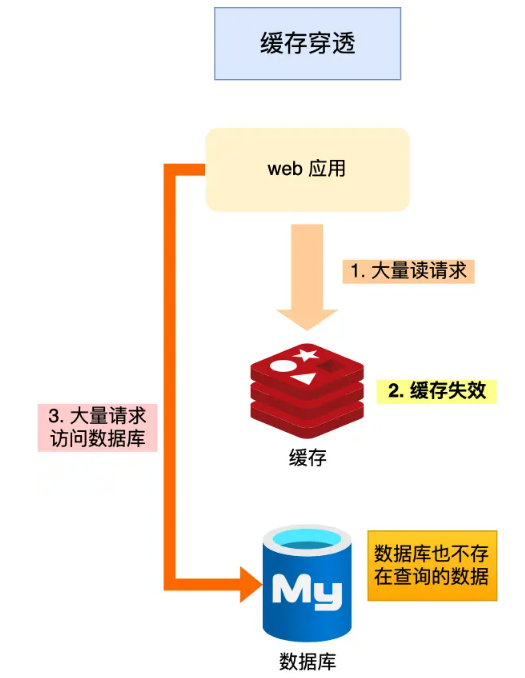

## 1. redis概述

Remote Dictionary Server(远程字典服务)是完全开源的，使用ANSIC语言编写遵守BSD协议，是一个高性能的Key-Value数据库提供了丰富的数据结构，例如String、Hash、List、Set、SortedSet等等。数据是**存在内存**中的，同时**Redis支持事务、持久化、LUA脚本、发布/订阅、缓存淘汰、流技术等多种功能特性提供了主从模式、Redis Sentinel和Redis Cluster集群架构方案**。


### redis 与 memcached比较：

共同点：

1. 都是基于内存的数据库，一般都用来当做缓存使用。
2. 都有过期策略。
3. 两者的性能都非常高。

Redis 与 Memcached **区别**：

- Redis 支持的数据类型更丰富（String、Hash、List、Set、ZSet），而 Memcached 只支持最简单的 key-value 数据类型；
- Redis 支持数据的持久化，可以将内存中的数据保持在磁盘中，重启的时候可以再次加载进行使用，而 Memcached 没有持久化功能，数据全部存在内存之中，Memcached 重启或者挂掉后，数据就没了；
- Redis 原生支持集群模式，Memcached 没有原生的集群模式，需要依靠客户端来实现往集群中分片写入数据；
- Redis 支持发布订阅模型、Lua 脚本、事务等功能，而 Memcached 不支持

 总结：redis支持**多数据类型、持久化、集群模式**还有其他**发布订阅模型、Lua 脚本、事务**等功能。

### 使用场景：

Redis 是一种基于内存的数据库，对数据的读写操作都是在内存中完成，因此**读写速度非常快**，常用于**缓存，消息队列、分布式锁等场景**

#### 为什么用Redis作为MySQL缓存：

1. redis数据在内存中，高性能

2. 缓存特性，高并发

### redis优势：

* 性能高，Redis能读的速度是110000次/秒，写的速度是81000次/秒
* Redis数据类型丰富，不仅仅支持简单的key-value类型的数据，同时还提供list，zset，set，hash等数据结构的存储
* Redis支持数据的持久化，可以将内存中的数据保存在磁盘中，重启的时候可以再次加载进行使用
* Redis支持数据的备份，即master-slave模式的数据备份
  - 生成dump.rpb文件(可以在配置文件中改) 默认生成在redis.conf同级目录


## 2. redis常见数据类型

常见的五种：**String（字符串），Hash（哈希），List（列表），Set（集合）、Zset（有序集合）**

之后新增的四种：**BitMap（2.2 版新增）、HyperLogLog（2.8 版新增）、GEO（3.2 版新增）、Stream（5.0 版新增）、Bitfield**

 

### String 

String 类型是 Redis 最基本的数据类型，一个 Redis 中字符串 value 最多可以是 512M。

二进制安全的，可以保存文本数据，而且能保存图片、音频、视频、压缩文件这样的二进制数据。


#### 底层：

* 底层是 int 和 SDS（简单动态字符串）

* SDS中有记录长度的变量len，而且可以自动扩容，类似与vector；
* 内部编码方式有三种：整形用int编码类型为long；字符串长度短的用embstr编码，长的用raw编码，界限redis5.0之后是44字节

这里embstr编码是**优化保存短字符串**的方式，**连续空间，只读的**，所以要修改还要变成raw编码


#### 常见命令：

```shell
set   <key><value>添加键值对
get   <key>查询对应键值
append  <key><value>将给定的<value> 追加到原值的末尾
strlen  <key>获得值的长度
setnx  <key><value>只有在 key 不存在时    设置 key 的值
incr  <key>
	将 key 中储存的数字值增1
	只能对数字值操作，如果为空，新增值为1
decr  <key>
	将 key 中储存的数字值减1
	只能对数字值操作，如果为空，新增值为-1
incrby / decrby  <key><步长>
	将 key 中储存的数字值增减。自定义步长。
批量设置
mset  <key1><value1><key2><value2>  ..... 
	同时设置一个或多个 key-value对  
mget  <key1><key2><key3> .....
	同时获取一个或多个 value  
msetnx <key1><value1><key2><value2>  ..... 
	同时设置一个或多个 key-value 对，当且仅当所有给定 key 都不存在。
范围查找
getrange  <key><起始位置><结束位置>
	获得值的范围，类似java中的substring，前包，后包
setrange  <key><起始位置><value>
	用 <value>  覆写<key>所储存的字符串值，从<起始位置>开始(索引从0开始)。
setex  <key><过期时间><value>
	设置键值的同时，设置过期时间，单位秒。
getset <key><value>
	以新换旧，设置了新值同时获得旧值
```


#### 使用场景：

1. 常规缓存对象，一种是直接存整个 `SET user:1 '{"name":"xiaolin", "age":18}'` ,一种存各属性值`MSET user:1:name xiaolin user:1:age 18 user:2:name xiaomei user:2:age 20`

2. 常规计数，redis处理是单线程的，所以技术是原子性，线程安全
3. 用NX实现分布式锁(设置过期时间) `SET lock_key unique_value NX PX 10000`； 注意释放分布式锁的时候用lua脚本保证原子性
4. 分布式架构，缓存Session信息


### List

字符串列表，**按照插入顺序排序**，可以从头部或尾部向 List 列表添加元素。

#### 底层:

- 底层就是个双向链表，对两端的操作性能很高，通过索引下标的操作中间的节点性能会较差

Redis 3.2之前用双向链表或压缩链表（将所有的元素紧挨着一起存储，分配的是一块连续的内存），之后都用**quicklist**实现


#### 常见命令：

```shell
# 将一个或多个值value插入到key列表的表头(最左边)，最后的值在最前面
LPUSH key value [value ...] 
# 将一个或多个值value插入到key列表的表尾(最右边)
RPUSH key value [value ...]
# 移除并返回key列表的头元素
LPOP key     
# 移除并返回key列表的尾元素
RPOP key 

# 返回列表key中指定区间内的元素，区间以偏移量start和stop指定，从0开始
LRANGE key start stop

# 从key列表表头弹出一个元素，没有就阻塞timeout秒，如果timeout=0则一直阻塞
BLPOP key [key ...] timeout
# 从key列表表尾弹出一个元素，没有就阻塞timeout秒，如果timeout=0则一直阻塞
BRPOP key [key ...] timeout
```

#### 使用场景：

消息队列，list使用的注意满足消息队列的三大需求（消息保序、处理重复的消息和保证消息可靠性）。

- 消息保序：使用 LPUSH + RPOP；
- 阻塞读取：使用 BRPOP；
- 重复消息处理：生产者自行实现全局唯一 ID；
- 消息的可靠性：使用 BRPOPLPUSH（让消费者程序从一个 List 中读取消息，同时，Redis 会把这个消息再插入到另一个 List（可以叫作备份 List）留存）

缺陷：并不支持对各消费者消费同一个消息，之后有Stream类型


### Hash

一个 string 类型的 field 和 value 的映射表，Hash 特别适合用于存储对象 `value=[{field1，value1}，...{fieldN，valueN}]`。


#### 底层

Hash 类型的底层数据结构是由**压缩列表或哈希表**实现的：

- 如果哈希类型元素个数小于 `512` 个（默认值，可由 `hash-max-ziplist-entries` 配置），所有值小于 `64` 字节（默认值，可由 `hash-max-ziplist-value` 配置）的话，Redis 会使用**压缩列表**作为 Hash 类型的底层数据结构；
- 如果哈希类型元素不满足上面条件，Redis 会使用**哈希表**作为 Hash 类型的 底层数据结构。

**在 Redis 7.0 中，压缩列表数据结构已经废弃了，交由 listpack 数据结构来实现了**


#### 常见命令

```shell
# 存储一个哈希表key的键值
HSET key field value   
# 获取哈希表key对应的field键值
HGET key field

# 在一个哈希表key中存储多个键值对
HMSET key field value [field value...] 
# 批量获取哈希表key中多个field键值
HMGET key field [field ...]       
# 删除哈希表key中的field键值
HDEL key field [field ...]    

# 返回哈希表key中field的数量
HLEN key       
# 返回哈希表key中所有的键值
HGETALL key 

# 为哈希表key中field键的值加上增量n
HINCRBY key field n  
```

#### 使用场景：

缓存对象（key，field， value）= （对象id， 属性， 值）


### Set

**无序**，**唯一**的键值集合

#### 底层

Set 类型的底层数据结构是由**哈希表或整数集合**实现的：

- 如果集合中的元素都是整数且元素个数小于 `512` （默认值，`set-maxintset-entries`配置）个，Redis 会使用**整数集合**作为 Set 类型的底层数据结构；
- 如果集合中的元素不满足上面条件，则 Redis 使用**哈希表**作为 Set 类型的底层数据结构。

#### 常见命令

```shell
# 往集合key中存入元素，元素存在则忽略，若key不存在则新建
SADD key member [member ...]
# 从集合key中删除元素
SREM key member [member ...] 
# 获取集合key中所有元素
SMEMBERS key
# 获取集合key中的元素个数
SCARD key

# 判断member元素是否存在于集合key中
SISMEMBER key member

# 从集合key中随机选出count个元素，元素不从key中删除
SRANDMEMBER key [count]
# 从集合key中随机选出count个元素，元素从key中删除
SPOP key [count]

集合运算
# 交集运算
SINTER key [key ...]
# 将交集结果存入新集合destination中
SINTERSTORE destination key [key ...]

# 并集运算
SUNION key [key ...]
# 将并集结果存入新集合destination中
SUNIONSTORE destination key [key ...]

# 差集运算
SDIFF key [key ...]
# 将差集结果存入新集合destination中
SDIFFSTORE destination key [key ...]
```


#### 使用场景

利用去重和无需效果，对集合做聚合计算（交集、差集、并集）

* Set 的差集、并集和交集的**计算复杂度较高**，在数据量较大的情况下，如果直接执行这些计算，会**导致 Redis 实例阻塞**；一般在从库完成聚合统计后，数据返回客户端，**避免主库阻塞**。


点赞：一个用户只能点一个赞；

共同关注：交集SINTER 

抽奖: SRANDMEMBER和SPOP 


### Zset

排序属性score（分值），唯一

#### 底层：

Zset 类型的底层数据结构是由**压缩列表或跳表**实现的：

- 如果有序集合的元素个数小于 `128` 个，并且每个元素的值小于 `64` 字节时，Redis 会使用**压缩列表**作为 Zset 类型的底层数据结构；
- 如果有序集合的元素不满足上面的条件，Redis 会使用**跳表**作为 Zset 类型的底层数据结构；

**在 Redis 7.0 中，压缩列表数据结构已经废弃了，交由 listpack 数据结构来实现了。**

> 当然还有哈希表，**元素的权重是用哈希表**O(1)获得的


跳表说明：

对于有序集合的底层实现，可以用数组、平衡树、链表等。数组不便元素的插入、删除；平衡树或红黑树虽然效率高但结构复杂；链表查询需要遍历所有效率低。Redis采用的是跳跃表。跳跃表效率堪比红黑树，实现远比红黑树简单。

⼀种「多层」的有序链表，这样的好处是能快读定位数据


#### 常见命令：

```shell
# 往有序集合key中加入带分值元素
ZADD key score member [[score member]...]   
# 往有序集合key中删除元素
ZREM key member [member...]                 
# 返回有序集合key中元素member的分值
ZSCORE key member
# 返回有序集合key中元素个数
ZCARD key 

# 为有序集合key中元素member的分值加上increment
ZINCRBY key increment member 

# 正序获取有序集合key从start下标到stop下标的元素
ZRANGE key start stop [WITHSCORES]
# 倒序获取有序集合key从start下标到stop下标的元素
ZREVRANGE key start stop [WITHSCORES]

# 返回有序集合中指定分数区间内的成员，分数由低到高排序。
ZRANGEBYSCORE key min max [WITHSCORES] [LIMIT offset count]

# 返回指定成员区间内的成员，按字典正序排列, 分数必须相同。
ZRANGEBYLEX key min max [LIMIT offset count]
# 返回指定成员区间内的成员，按字典倒序排列, 分数必须相同

集合运算
# 并集计算(相同元素分值相加)，numberkeys一共多少个key，WEIGHTS每个key对应的分值乘积
ZUNIONSTORE destkey numberkeys key [key...] 
# 交集计算(相同元素分值相加)，numberkeys一共多少个key，WEIGHTS每个key对应的分值乘积
ZINTERSTORE destkey numberkeys key [key...]
不支持差集
```


#### 使用场景：

排行榜，谁赞多ZREVRANGE

ZRANGEBYLEX 分数相同的元素，按照字典序返回：姓名排序、电话排序


### BitMap

Bitmap，即位图，是一串连续的二进制数组（0和1），可以通过**偏移量（offset）定位元素**。BitMap通过最小的单位bit来进行`0|1`的设置，表示某个元素的值或者状态，时间复杂度为O(1)。

由于 bit 是计算机中最小的单位，使用它进行储存将非常节省空间，特别适合一些**数据量大**且使用**二值统计的场景**。

#### 底层：

String 是保存为二进制的字节数组。所以Redis 就把字节数组的每个 bit 位利用起来，用来表示一个元素的二值状态。
也就说可以把 Bitmap 看作是一个 bit 数组

#### 常见命令：

```shell
# 设置值，其中value只能是 0 和 1
SETBIT key offset value

# 获取值
GETBIT key offset

# 获取指定范围内值为 1 的个数
# start 和 end 以字节为单位
BITCOUNT key start end

# BitMap间的运算
# operations 位移操作符，枚举值
  AND 与运算 &
  OR 或运算 |
  XOR 异或 ^
  NOT 取反 ~
# result 计算的结果，会存储在该key中
# key1 … keyn 参与运算的key，可以有多个，空格分割，not运算只能一个key
# 当 BITOP 处理不同长度的字符串时，较短的那个字符串所缺少的部分会被看作 0。返回值是保存到 destkey 的字符串的长度（以字节byte为单位），和输入 key 中最长的字符串长度相等。
BITOP [operations] [result] [key1] [keyn…]

# 返回指定key中第一次出现指定value(0/1)的位置
BITPOS [key] [value]
```

#### 使用场景：

处理海量数据，只要数据满足了**二值状态**，可以用BitMap有效节省内存空间

1. 考勤统计 6月份天数`BITCOUNT uid:sign:100:202306 ` 

2. 判断用户登录状态 

3. 判断三天连续打卡的用户数 

   ```
   # 与操作
   BITOP AND destmap bitmap:01 bitmap:02 bitmap:03
   # 统计 bit 位 =  1 的个数
   BITCOUNT destmap
   ```

注意考虑位的利用率，比如一亿用户，但是日活只有几百，就浪费内存而不适合

### HyperLogLog

「**统计基数**」: 统计一个集合中不重复的元素**个数**(不能返回具体的)。

不提供精确的去重技术： HyperLogLog 是统计规则是基于概率完成的，不是非常准确，标准误算率是 0.81%。


> 解决基数问题有很多种方案：
>
> 1. 数据存储在 MySQL 表中，使用 distinct count 计算不重复个数。
>
> 2. 使用 Redis 提供的 hash、set、bitmaps 等数据结构来处理。
>
> 以上的方案结果精确，但随着数据不断增加，导致占用空间越来越大，对于非常大的数据集是不切实际的。能否能够**降低一定的精度来平衡存储空间**？Redis 推出了 HyperLogLog。
>
> Redis HyperLogLog 是用来做基数统计的算法，HyperLogLog 的优点是：在输入元素的数量或者体积非常非常大时，计算基数所需的空间总是固定的、并且是很小的。
>
> 在 Redis 里面，每个 HyperLogLog 键只需要花费 12 KB 内存，就可以计算接近 2^64 个不同元素的基数。这和计算基数时，元素越多耗费内存就越多的集合形成鲜明对比。
>
> 但是，因为 HyperLogLog 只会**根据输入元素来计算基数**，而**不会储存输入元素本身**，所以 HyperLogLog 不能像集合那样，返回输入的各个元素。
>
> 


#### 底层：

不懂

https://en.wikipedia.org/wiki/HyperLogLog

#### 常见命令：

```shell
# 添加指定元素到 HyperLogLog 中
PFADD key element [element ...]

# 返回给定 HyperLogLog 的基数估算值。
PFCOUNT key [key ...]

# 将多个 HyperLogLog 合并为一个 HyperLogLog
PFMERGE destkey sourcekey [sourcekey ...]
```


#### 使用场景：

统计百万计网页的UV（unique visitor）计数，大概数量


### GEO

存储地理位置信息，并对存储的信息进行操作

#### 底层：

没有设计新的数据结构，只是利用了Sorted Set 集合类型

把经纬度保存到 Sorted Set 中，利用 Sorted Set 提供的“按权重进行有序范围查找”的特性，实现 LBS 服务中频繁使用的“搜索附近”的需求

#### 常见命令：

```shell
# 存储指定的地理空间位置，可以将一个或多个经度(longitude)、纬度(latitude)、位置名称(member)添加到指定的 key 中。
GEOADD key longitude latitude member [longitude latitude member ...]

# 从给定的 key 里返回所有指定名称(member)的位置（经度和纬度），不存在的返回 nil。
GEOPOS key member [member ...]

# 返回两个给定位置之间的距离。
GEODIST key member1 member2 [m|km|ft|mi]

# 根据用户给定的经纬度坐标来获取指定范围内的地理位置集合。
GEORADIUS key longitude latitude radius m|km|ft|mi [WITHCOORD] [WITHDIST] [WITHHASH] [COUNT count] [ASC|DESC] [STORE key] [STOREDIST key]
```

#### 使用场景：

打车： 1. 输入车辆的经纬度信息， 2. 查找经纬度5公里范围内的车辆信息


### Stream

Redis 专门为**消息队列**设计的数据类型。

在 Redis 5.0 Stream 没出来之前，消息队列的实现方式都有着各自的缺陷，例如：

- 发布订阅模式**，不能持久化**也就无法可靠的保存消息，并且对于离线重连的客户端不能读取历史消息的缺陷；
- List 实现消息队列的方式**不能重复消费**，一个消息消费完就会被删除，而且生产者需要自行实现全局唯一 ID。

基于以上问题，Redis 5.0 便推出了 Stream 类型也是此版本最重要的功能，用于完美地实现消息队列，它**支持消息的持久化、支持自动生成全局唯一 ID、支持 ack 确认消息的模式、支持消费组模式**等，让消息队列更加的稳定和可靠。

#### 常见命令：

```shell
XADD：插入消息，保证有序，可以自动生成全局唯一 ID；
XLEN ：查询消息长度；
XREAD：用于读取消息，可以按 ID 读取数据；
XDEL ： 根据消息 ID 删除消息；
DEL ：删除整个 Stream；
XRANGE ：读取区间消息
XREADGROUP：按消费组形式读取消息；

XPENDING 和 XACK：
XPENDING 命令可以用来查询每个消费组内所有消费者「已读取、但尚未确认」的消息；
XACK 命令用于向消息队列确认消息处理已完成
```

#### 使用场景：

##### Redis 基于 Stream 消息队列

- 消息保序：XADD/XREAD，插入消息后会返回唯一的ID，之后读可以在指定ID的后面开始读
- 阻塞读取：XREAD block, 设置超时时间
- 重复消息处理：Stream 在使用 XADD 命令，会自动生成全局唯一 ID；
- 消息可靠性：内部使用 PENDING List 自动保存消息，使用 **XPENDING** 命令**查看消费组已经读取但是未被确认的消息**，消费者使用 XACK 确认消息；
  
- 支持消费组形式消费数据：
  1. 同一个消费组里的消费者不能消费同一条消息
  2. 不同消费组的消费者可以消费同一条消息（但是有前提条件，创建消息组的时候，不同消费组指定了相同位置开始读取消息）


##### Redis 基于 Stream 消息队列与专业的消息队列有哪些差距？

1、Redis Stream 消息在消息存储阶段可能丢失：
AOF写盘是异步的，宕机可能会数据丢失；主从复制时异步的，主从切换可能会数据丢失

2、Redis Stream 消息可堆积吗？ 
Redis 的 Stream 提供了可以指定队列最大长度的功能，防止内存持续增长；但是新消息挤入，旧消息可能会被丢失，而不像Kafka等存储到磁盘上。


> 也就是说场景简单，数据丢失不敏感，且消息挤压概率较小的情况下，可以作为消息队列
>
> 如果你的业务有海量消息，消息积压的概率比较大，并且不能接受数据丢失，那么还是用专业的消息队列中间件吧


发布/订阅机制只适合即时通讯的场景，比如构建哨兵集群的场景采用了发布/订阅机制


## 3. redis数据结构


 

### redis内部存储的数据类型


其中void * key 和 void * value 指针指向的是 **Redis 对象**，Redis 中的每个对象都由 redisObject 结构表示


- type，标识该对象是什么类型的对象（String 对象、 List 对象、Hash 对象、Set 对象和 Zset 对象）；
- encoding，标识该对象使用了哪种底层的数据结构；
- **ptr，指向底层数据结构的指针**。


### SDS

char* 的不足：

- 获取字符串长度的时间复杂度为 O（N）；
- 字符串的结尾是以 “\0” 字符标识，字符串里面不能包含有 “\0” 字符，因此不能保存二进制数据；
- 字符串操作函数strcat strcpy不高效且不安全，比如有缓冲区溢出的风险，有可能会造成程序运行终止；

SDS结构：


1.  len 成员变量来记录长度，所以可存储包含 “\0” 的数据，保存任意格式的二进制数据。但是 SDS 为了兼容部分 C 语言标准库的函数， SDS 字符串结尾还是会加上 “\0” 字符。

2. 不会发生缓冲区溢出，而且会自动扩容

   > - 如果所需的 sds 长度**小于 1 MB**，那么最后的扩容是按照**翻倍扩容**来执行的，即 2 倍的newlen
   > - 如果所需的 sds 长度**超过 1 MB**，那么最后的扩容长度应该是 newlen **+ 1MB**。

3. flags：5 种类型。分别是 sdshdr5、sdshdr8、sdshdr16、sdshdr32 和 sdshdr64

   > 区别时len和alloc的类型时 uint16_t 还是 uint32_t 等
   >
   > * **灵活保存不同大小的字符串，从而有效节省内存空间**

4. buf[]，字符数组，用来保存实际数据。不仅可以保存字符串，也可以保存二进制数据。

 

### 链表

学习一下redis对原生C的链表封装：

1. 节点封装

```c
typedef struct listNode {
    //前置节点
    struct listNode *prev;
    //后置节点
    struct listNode *next;
    //节点的值
    void *value;
} listNode;
```

2. list封装

```c
typedef struct list {
    //链表头节点
    listNode *head;
    //链表尾节点
    listNode *tail;
    //节点值复制函数
    void *(*dup)(void *ptr);
    //节点值释放函数
    void (*free)(void *ptr);
    //节点值比较函数
    int (*match)(void *ptr, void *key);
    //链表节点数量
    unsigned long len;
} list;
```


封装后的链表，内存分配还是不连续的，开销大，无法利用CPU缓存


### 压缩列表

一种内存紧凑型的数据结构，占用一块**连续**的内存空间，不仅可以利用 CPU 缓存，而且会针对不同长度的数据，进行相应编码，这种方法可以有效地节省内存开销。

优势：

每个元素是按照数据大小和类型进行不同的空间大小分配设计的，节省空间开销。

缺陷： 

1. 不能保存太多，**查询效率低**； 
2. **新增**的时候可能涉及内存重新分配；如果新插入的元素较大，会导致后续元素的占用空间发送变化，导致**连锁更新**。


### 哈希表

解决哈希冲突用的是**拉链法**

rehash：目的是在哈希表变得拥挤时，通过扩大哈希表的大小来保持哈希表的高效性能。在哈希表中进行rehash操作可能会导致性能开销，因此一些哈希表实现会采取一些策略来减少rehash的频率或将rehash操作分散到多个插入/删除操作之间

### 整数集合

一个 Set 对象只包含整数值元素，并且元素数量不大就会用这个。

类型设置int32_t int16_t等，有**升级规则**来**节省内存资源**，不支持降级操作


### 跳表

多层次的有序链表，支持平均 O(logN) 复杂度的节点查找

跳表节点

```cpp
typedef struct zskiplistNode {
    //Zset 对象的元素值
    sds ele;
    //元素权重值
    double score;
    //后向指针 用于逆向查找
    struct zskiplistNode *backward;
  
    //节点的level数组，保存每层上的前向指针和跨度
    struct zskiplistLevel {
        struct zskiplistNode *forward; // 指向下一个跳表节点的指针
        unsigned long span; // 跨度
    } level[];
} zskiplistNode;
```

跳表结构体

```cpp
typedef struct zskiplist {
    struct zskiplistNode *header, *tail;
    unsigned long length;
    int level; // 跳表的最大层数
} zskiplist;
```


#### **查询过程**

查找一个跳表节点的过程时，跳表会从头节点的**最高层**开始，逐一遍历每一层。在遍历某一层的跳表节点时，会用跳表节点中的 SDS 类型的元素和元素的权重来进行判断，共有两个判断条件：

- 如果当前节点的权重「小于」要查找的权重时，跳表就会访问该层上的下一个节点。
- 如果当前节点的权重「等于」要查找的权重时，并且当前节点的 **SDS 类型数据「小于」要查找的数据时**，跳表就会访问该层上的下一个节点。

如果上面**两个条件都不满足，或者下一个节点为空**时，跳表就会使用目前遍历到的节点的 level 数组里的**下一层指针**，然后沿着下一层指针继续查找，这就相当于跳到了下一层接着查找。


#### 跳表节点设置

跳表的相邻两层的节点数量最理想的比例是 **2:1**，查找复杂度可以降低到 O(logN)。

redis是用概率的方法随机分层，设置最大层数：Redis 7.0 定义为 32，Redis 5.0 定义为 64


#### 为什么不用AVL而是用跳表

1. 从内存占用上来比较，跳表比平衡树更灵活一些。 存的指针少

2. 在做**范围查找**的时候，跳表比平衡树操作要简单。 直到最大或最小值，用第一层的数组找范围肯定比树快

3. 从算法实现难度上来比较，跳表比平衡树要简单得多。 AVL插入删除涉及树的调整


### quicklist

链表不连续、压缩列表的扩容导致连锁更新等问题。 

也就是很多压缩链表 ziplist 组成的

quicklist 解决办法，通过控制每个**链表节点**中的**压缩列表的大小或者元素个数**，来规避连锁更新的问题。因为压缩列表元素越少或越小，连锁更新带来的影响就越小，从而提供了更好的访问性能。


结构和C++的deque很像

```cpp
typedef struct quicklistNode {
    //前一个quicklistNode
    struct quicklistNode *prev;     //前一个quicklistNode
    //下一个quicklistNode
    struct quicklistNode *next;     //后一个quicklistNode
    //quicklistNode指向的压缩列表
    unsigned char *zl;              
    //压缩列表的的字节大小
    unsigned int sz;                
    //压缩列表的元素个数
    unsigned int count : 16;        //ziplist中的元素个数 
    ....
} quicklistNode;
```


### **listpack**

**替代压缩列表**，它最大特点是 listpack 中每个节点不再包含前一个节点的长度了；

压缩列表每个节点正因为需要保存前一个节点的长度字段，就会有**连锁更新的隐患**。


 

## 4. 持久化


### AOF (Append Only File)


#### AOF持久化流程：

1. 客户端请求写命令append追加到AOF缓冲区`server.aof_buf`内, 然后write()系统调用写道内核缓冲区` page cache`,等待写入硬盘；
2. AOF缓冲区根据AOF持久化策略（always,everysec,no)将操作sync同步到磁盘的AOF文件中；
3. AOF文件大小超过重写策略或手动重写的时候，AOF文件rewrite，压缩文件容量；
4. redis服务重启时，会重新loadAOF文件的写操作，达到数据恢复的目的。


#### 持久化策略选择

其实就是控制`fsync()`函数调用时机

- **Always**，每次写操作命令执行完后，同步将 AOF 日志数据写回硬盘； 

  > 最大程度保护数据不丢失，但是影响主线程性能 -》 适合高可靠要求 

- **Everysec**，每次写操作命令执行完后，先将命令写入到 AOF 文件的**内核缓冲区**，然后**每隔一秒**将缓冲区里的内容写回到硬盘；

  > 允许一秒内数据丢失 》 如果允许数据丢失一点，但又想性能高，就选择 Everysec 策略

- **No**，意味着不由 Redis 控制写回硬盘的时机，**转交给操作系统控制写回的时机**，也就是每次写操作命令执行完后，先将命令写入到 AOF 文件的内核缓冲区，再由操作系统决定何时将缓冲区内容写回硬盘

  > 操作系统写回硬盘的时机是不可预知的，一旦服务器宕机，就会丢失不定数量的数据 》适合高性能


- Always 策略就是每次写入 AOF 文件数据后，就执行 fsync() 函数；
- Everysec 策略就会创建一个异步任务来执行 fsync() 函数；
- No 策略就是永不执行 fsync() 函数;

#### 配置打开AOF

在 Redis 中 AOF 持久化功能默认是不开启的，需要我们修改 `redis.conf` 配置文件中的以下参数


#### AOF日志内容


「`*3`」表示当前命令有三个部分，每部分都是以「`$+数字`」开头，后面紧跟着具体的命令、键或值。然后，这里的「`数字`」表示这部分中的命令、键或值一共有多少字节。例如，「`$3 set`」表示这部分有 3 个字节，也就是「`set`」命令这个字符串的长度。

#### AOF重写机制

**作用**：避免写操作越来越多，日志做些压缩工作

**实现**： 

1. bgrewriteaof 触发重写，判断是否当前有 bgsave 或 bgrewriteaof 在运行，如果有，则等待该命令结束后再继续执行；

2. 主进程 fork 出子进程执行重写操作，保证主进程不会阻塞；

3. 子进程遍历 redis 内存中数据到临时文件，客户端的写请求同时写入 aof_buf 缓冲区和 aof_rewrite_buf 重写缓冲区，保证原 AOF 文件完整以及新 AOF 文件生成期间的新的数据修改动作不会丢失；

4. 子进程写完新的 AOF 文件后，向主进程发信号，父进程更新统计信息。主进程把 aof_rewrite_buf 中的数据写入到新的 AOF 文件；

5. 使用新的 AOF 文件覆盖旧的 AOF 文件，完成 AOF 重写。
   

**子进程**：

后台子进程bgrewriteaof 重写。  用进程主要是1. 防止主进程阻塞，2. 不用线程不用锁，用**写时复制**，只读的情况物理内存是同一块

#### 优缺点

优点： 1. 备份机制稳健，丢失概率低； 2. 可读的日志文件，可操作性

缺点：1. Redis执行命令是**单线程**负责，AOF**恢复重放**按照命令**一条条放会比较慢**。 2. 存日志的空间开销

### RDB

一定时间段，拍全量的快照

- save 命令，在主线程生成 RDB 文件，由于和执行操作命令在同一个线程，所以如果写入 RDB 文件的时间太长，**会阻塞主线程**；
- bgsave 命令，会创建一个**子进程**来生成 RDB 文件，这样可以**避免主线程的阻塞**


#### 子进程 快照处理

bgsave命令， 后台子进程拍快照。 1. 同样防止主线程阻塞 2. 写时复制，共享同一块物理内存（但是之后主进程继续写入数据，那就会写时复制，产生新的内存，子进程**快照保存的是原本的内存数据**）


#### 优缺点

优点： 全量的快照，恢复的快。

缺点： 快照的频率不好把握，太低损失太多数据，太高性能开销大


### RDB和AOF比较

#### 混合使用

AOF重写日志的时候，采用折中方法，子进程 写入RDB快照，然后 把操作命令记录 写AOF格式的增量数据。

```shell
aof-use-rdb-preamble yes
```

好处： **重启的时候有快照会很快，之后用AOF写日志数据丢失的少**


### 大key对持久化的影响

AOF日志：

在使用 Always 策略的时候，主线程在执行完命令后，会把数据写入到 AOF 日志文件，然后会调用 fsync() 函数，将内核缓冲区的数据直接写入到硬盘，等到硬盘写操作完成后，该函数才会返回。

**当使用 Always 策略的时候，如果写入是一个大 Key，主线程在执行 fsync() 函数的时候，阻塞的时间会比较久，因为当写入的数据量很大的时候，数据同步到硬盘这个过程是很耗时的**。

当使用 Everysec 策略的时候，由于是**异步执行** fsync() 函数，所以大 Key 持久化的过程（数据同步磁盘）不会影响主线程。

当使用 No 策略的时候，由于永不执行 fsync() 函数，所以大 Key 持久化的过程不会影响主线程。


AOF重写：

创建子进程复制页表阻塞；

写时复制拷贝内存阻塞；


其他：

因为redis是单线程处理，客户端阻塞； 网络阻塞； 工作线程阻塞； 内存分配不均匀等


消除： 拆分、 unlink 命令


## 5. 主从复制

解决单点故障就要用复制状态机， 集群化

主要记录三种模式：

Master-Slave

Sentinel

Cluster


redis集群： 将多个Redis节点连接在一起以实现高可用性、数据分片和负载均衡的技术

3.0之前分片后用代理器处理，3.0之后用的是无中心化集群，组与组之间可以互相访问

代理主机模式：


无中心化集群模式：


### 主从复制模式： 读写分离


#### 第一次同步

配置

```shell
# 服务器 B 执行这条命令
replicaof <服务器 A 的 IP 地址> <服务器 A 的 Redis 端口号>
```

步骤： 

- 第一阶段是建立链接、协商同步；
- 第二阶段是主服务器同步数据给从服务器 **全量复制** RDB文件；
- 第三阶段是主服务器发送新写操作命令给从服务器。


#### 命令传播

主从之间建立 **TCP长连接**，方便把操作命令和状态一致。


#### 分摊主服务器的压力

主服务器同步的压力太大，可能导致主进程阻塞时间过长， 可以设置从服务器的从服务器，减轻主服务器的负担。

```shell
replicaof <目标服务器的IP> 6379
```


#### 增量复制

如果遇到从服务器网络断开又重连上，增量复制就可以上场了，不过这个还跟 repl_backlog_size 这个大小有关系。

如果它配置的过小，主从服务器网络恢复时，可能发生「从服务器」想读的数据已经被覆盖了，那么这时就会导致主服务器采用全量复制的方式。所以为了避免这种情况的频繁发生，要**调大这个参数的值**，以降低主从服务器断开后全量同步的概率。


##### 缓冲区 repl_backlog_buffer 

主服务器，命令传播的时候不仅发给从服务器，**还写到整个个缓冲区**。
从服务器网络恢复时可以从缓冲区**增量同步**，但是如果从服务器落后太多数据不再缓冲区了，就需要主服务器对他进行**全量同步**。


#### redis的心跳机制


Redis 主节点：
默认每隔 10 秒对从节点发送 ping 命令，判断从节点的存活性和连接状态，可通过参数repl-ping-slave-period控制发送频率。


Redis 从节点：

每隔 1 秒发送 replconf ack{offset} 命令，给主节点上报自身当前的复制偏移量，目的是为了：

- 实时监测主从节点网络状态；
- 上报自身复制偏移量， 检查复制数据是否丢失， 如果从节点数据丢失， 再从主节点的复制缓冲区中拉取丢失数据。


#### 主从数据不一致问题


原因： 异步复制，不一定更新很及时

解决： 

1. 保证网络状况良好
2. INFO replication命令 查看**主节点接受命令的进度信息**和**从节点复制写命令的进度信息**，做个差值就是进度差距了。然后如果进度差大于预期阈值，不允许客户端读整个从节点。


### 哨兵模式sentinel

`哨兵`： 允许在特殊模式下的一个Redis进程，作为观察者节点，实现**监控、选主和通知**。


哨兵也是一个集群，单数集群，然后遵循大多数原则来选哨兵leader

#### 判断主节点故障了：

1. 心跳检测（Heartbeat）：每个 Sentinel 节点会定期向主节点发送心跳检测请求，以确认主节点是否仍然可用。如果 Sentinel 节点连续一定次数（默认为 10 次）未收到主节点的响应，则判定主节点为故障状态。
2. 主观下线和客观下线（Subjective and Objective Down）：当 Sentinel 节点判定主节点故障后，会将主节点标记为主观下线。然后，**Sentinel 节点会请求其他 Sentinel 节点的意见**，如果其他 Sentinel 节点也将主节点标记为主观下线，则主节点会被标记为客观下线，表示多个 Sentinel 节点都认为主节点已经故障。
3. 某个哨兵判断主节点客观下线后，哨兵发起投票，竞选leader。
4. 进行主从故障转移 


#### 主从故障转移

一旦主节点被标记为客观下线，Sentinel 节点将从所有可用的从节点中选举一个新的主节点，并将其升级为**新的主节点**。然后，Sentinel 节点会通知其他 Sentinel 节点关于主节点的更新信息，并执行故障转移操作，使集群恢复正常工作。


* **哪个从机会被选举为主机呢？**根据优先级别：以此看优先级slave-priority 、复制进度最靠前的节点、ID小
* **客户端怎么直到主服务器换了？** 发布订阅功能
* 原主机重启后会变为从机。


## 6. 缓存


#### 缓存穿透

 当用户访问的数据，**既不在缓存中，也不在数据库中**，导致请求在访问缓存时，发现缓存缺失，再去访问数据库时，发现数据库中也没有要访问的数据，没办法构建缓存数据，来服务后续的请求。那么当有大量这样的请求到来时，数据库的压力骤增。



原因： 

- 业务误操作，缓存中的数据和数据库中的数据都被误删除了，所以导致缓存和数据库中都没有数据；
- 黑客恶意攻击，故意大量访问某些读取不存在数据的业务；


解决方法： 

第一种方案，非法请求的限制。用白名单

第二种方案，缓存空值或者默认值。如果一个查询返回的数据为空（不管是数据是否不存在），我们仍然把这个空结果（null）进行缓存，设置空结果的过期时间会很短，最长不超过五分钟。

第三种方案，使用布隆过滤器快速判断数据是否存在，避免通过查询数据库来判断数据是否存在。

#### 缓存击穿

key 对应的**数据存在**，**但在 redis 中过期**，此时若有大量并发请求过来（一些**热点数据**），这些请求发现缓存过期一般都会从后端数据库加载数据并回设到缓存，这个时候大并发的请求可能会瞬间把后端数据库压垮。


原因： 热点数据过期了


现象：

数据库访问压力瞬时增加，数据库崩溃
redis 里面没有出现大量 key 过期
redis 正常运行


解决方法：

- **不给热点数据设置过期时间**，由后台**异步更新缓存**，或者在热点数据准备要过期前，提前通知后台线程更新缓存以及重新设置过期时间；

- **互斥锁方案：**当一个请求发现缓存中不存在需要的数据时，可以尝试加互斥锁。如果获取到锁，则该请求可以继续**从数据库中获取数据，并将数据存入缓存**；如果没有获取到锁，则说明其他请求正在加载数据，当前请求可以等待一段时间再次尝试从缓存中获取数据。这样可以避免多个请求同时穿透缓存并查询数据库
- 多级缓存、异步加载数据、熔断机制

#### 缓存雪崩


**大量缓存数据在同一时间过期（失效）或者 Redis 故障宕机，数据库中有**，如果此时有大量的用户请求，都无法在 Redis 中处理，于是全部请求都直接访问数据库，从而导致数据库的压力骤增，严重的会造成数据库宕机，从而形成一系列连锁反应，造成整个系统崩溃。


原因： 大量数据同时过期； Redis故障宕机


方法： 

其一，针对数据同时过期：

1. **均匀 随机** 设置超时时间
2. 互斥锁， 业务线程发现了数据不再Redis内，就加锁然后构建缓存，设置锁的超时时间。 保证**一个时间只有一个请求来构建缓存**
3. 设置缓存永久有效，后台设计策略来更新缓存


>  其实不设置缓存超时时间，也会被淘汰，因为系统内存有限。这里看一下过期删除策略和内存淘汰策略


其二，针对Redis故障宕机：

1. 服务熔断或请求限流机制：

当redis故障导致缓存雪崩的时候，可以用来**暂停业务应用访问缓存服系统**。

启用**请求限流**机制，**只将少部分请求发送到数据库进行处理，再多的请求就在入口直接拒绝服务**，等到 Redis 恢复正常并把缓存预热完后，再解除请求限流的机制。


2. 构建 Redis 缓存高可靠集群

如果 Redis 缓存的主节点故障宕机，从节点可以切换成为主节点，继续提供缓存服务，避免了由于 Redis 故障宕机而导致的缓存雪崩问题


### 缓存和数据库的 数据一致性


在数据库前放Redis作为缓存中间件，提升性能，但是要考虑数据怎么更新？


方法一： 推荐的【先更新数据库，然后删除缓存】 可以保证数据的一致性，但是会对缓存命中率产生影响；


方法二： 当缓存命中率有高要求的时候，可以采用【更新数据库 + 更新缓存】方案，但是可能存在数据一致性问题

但是更新缓存线程不安全，不能保证数据一致性（前后关系未知）  

怎么解决？ -》 分布式锁 加在更新缓存过程中 开销大，降低瓶颈 
-》 缓存过期时间， 防止旧数据留太久


#### 【先更新数据库，然后删除缓存】的原子性 如何保证 ？

更新数据库成功，但是删除缓存失败的情况会导致 旧数据 没有被删除 （虽然有缓冲时间）


1. 重试机制， 引入**消息队列**， 删除缓存失败后，重写读取数据。 两步都完成了再删除数据。

2. 联想MySQL如何实现的？ 是undolog和binlong 。这里可以订阅binlog，模拟Mysql的从节点


## 7.缓存过期删除 和 内存淘汰


缓存技术设计key的过期时间， 将已过期的键值对删除进行删除； 
内存淘汰是解决内存过大的问题，当 Redis 的运行内存超过最大运行内存时，就会触发内存淘汰策略。

### 缓存过期删除

设置缓存过期的时间

```
expire <key> <n>：设置 key 在 n 秒后过期，比如 expire key 100 表示设置 key 在 100 秒后过期；
pexpire <key> <n>：设置 key 在 n 毫秒后过期，比如 pexpire key2 100000 表示设置 key2 在 100000 毫秒（100 秒）后过期。
expireat <key> <n>：设置 key 在某个时间戳（精确到秒）之后过期，比如 expireat key3 1655654400 表示 key3 在时间戳 1655654400 后过期（精确到秒）；
pexpireat <key> <n>：设置 key 在某个时间戳（精确到毫秒）之后过期，比如 pexpireat key4 1655654400000 表示 key4 在时间戳 1655654400000 后过期（精确到毫秒）
```

设置字符串时，同时设置key过期时间

```
set <key> <value> ex <n> ：设置键值对的时候，同时指定过期时间（精确到秒）；
set <key> <value> px <n> ：设置键值对的时候，同时指定过期时间（精确到毫秒）；
setex <key> <n> <valule> ：设置键值对的时候，同时指定过期时间（精确到秒）。
```


#### 过期字典 判断 key过期

- 期字典的 key 是一个指针，指向某个键对象，value 是一个 long long 类型的整数，这个整数保存了 key 的过期时间
- 其实就是一个哈希

判断过期： 请求到达redis时，首先**在过期字典中查找**过期时间是不是小于当前系统时间

```cpp
typedef struct redisDb {
    dict *dict;    /* 数据库键空间，存放着所有的键值对 */
    dict *expires; /* 键的过期时间 */
    ....
} redisDb;
```


#### 过期策略


常用的过期策略有三种： 

1. 定时删除：**在设置 key 的过期时间时，同时创建一个定时事件，当时间到达时，由事件处理器自动执行 key 的删除操作。**

删的快，内存尽快释放； CPU开销大，相应时间和吞吐量有影响

2. 惰性删除： **不主动删除过期键，每次从数据库访问 key 时，都检测 key 是否过期，如果过期则删除该 key**

删的慢，内存浪费多； CPU开销小，占用很少系统资源

3. 定期删除 ： **每隔一段时间「随机」从数据库中取出一定数量的 key 进行检查，并删除其中的过期key。**

折中方案 优化内存同时减少CPU额外开销。 缺点是难以确定定期**时长和频率**


redis 采用的是**「惰性删除+定期删除」**

惰性： 在访问key的时候判断是否过期，然后删除。 异步同步可选

定期： 定期随机找key是否过期


### 内存淘汰


#### 设置Redis最大内存 ：  

redis.conf 中，参数 `maxmemory <bytes>`

64G 默认是无限制， 32G限制3G内存


#### 淘汰策略 8种

*1、不进行数据淘汰的策略*： 超过最大内存限制报错，禁止写入

*2、进行数据淘汰的策略*： 可选 选淘汰什么内容`config get maxmemory-policy` 命令，来查看当前 Redis 的内存淘汰策略

在设置了过期时间的数据中进行淘汰：

- **volatile-random**：随机淘汰设置了过期时间的任意键值；
- **volatile-ttl**：优先淘汰更早过期的键值。
- **volatile-lru**（Redis3.0 之前，默认的内存淘汰策略）：淘汰所有设置了过期时间的键值中，最久未使用的键值；
- **volatile-lfu**（Redis 4.0 后新增的内存淘汰策略）：淘汰所有设置了过期时间的键值中，最少使用的键值；

在所有数据范围内进行淘汰：

- **allkeys-random**：随机淘汰任意键值;
- **allkeys-lru**：淘汰整个键值中最久未使用的键值；
- **allkeys-lfu**（Redis 4.0 后新增的内存淘汰策略）：淘汰整个键值中最少使用的键值。


#### LRU 和 LFU 

LRU无法解决缓存污染问题， 比如应用一次读了大量数据，数据只被读一次，但是会保留在缓存很长时间

> 传统LRU用链表串请求起来， 额外空间开销，调整也耗时。Redis是记录数据的最后一次访问时间,然后随机采样淘汰最久没使用的那个

LFU 记录访问频次


## 8. 事务


### Redis 事务定义

Redis 事务是一个单独的隔离操作：事务中的所有命令都会序列化、按顺序地执行。事务在执行的过程中，不会被其他客户端发送来的命令请求所打断。

Redis 事务的主要作用就是串联多个命令防止别的命令插队。

 `Multi、Exec 和 discard` 三个指令，

在 Redis 中，从输入 Multi 命令开始，输入的命令都会依次进入命令队列中，但不会执行，直到输入 Exec 后，Redis 会将之前的命令队列中的命令依次执行。而组队的过程中可以通过 discard 来放弃组队。


事务分为前后两阶段： 第一阶段组队 这时候可以通过discard来放弃组队， ； 第二阶段提交执行，**就算错了也会提交**


锁：乐观锁 悲观锁（多读机制）


不支持回滚的，如果提交就会执行就算错了，所以不保证原子性

#### watch和unwatch


在执行multi之前，先执行watch key1 [key2],可以监视一个(或多个) key ，如果在事务**执行之前这个(****或这些) key** **被其他命令所改动，那么事务将被打断。**

取消 WATCH 命令对所有 key 的监视。

如果在执行 WATCH 命令之后，EXEC 命令或DISCARD 命令先被执行了的话，那么就不需要再执行UNWATCH 了。


### Redis事务特性

*  单独的隔离操作 

事务中的所有命令都会序列化、按顺序地执行。事务在执行的过程中，不会被其他客户端发送来的命令请求所打断。 

*  没有隔离级别的概念 

 队列中的命令没有提交之前都不会实际被执行，因为事务提交前任何指令都不会被实际执行

*  不保证原子性 

事务中如果有一条命令执行失败，其后的命令仍然会被执行，没有回滚


分布式锁的一种错误情况：A拿到锁进行操作时卡顿了，锁自动释放；B拿到锁进行操作；A反映过来了，继续操作之后手动释放锁；这样造成A在手动释放B的锁。

解决方法：uuid：设置 uuid，释放前获取这个值，判断是否自己的锁，防止误删锁，造成没锁的情况。


另一种错误情况：因为判断uuid和删除锁是串行，不能保证原子性。比如A判断uuid成功后正在删除操作，这时候锁到了过期时间释放了；B拿到锁开始执行；A完成后续的删除操作，并且手动删除锁，这时候会删除B拿到的锁

解决方法：插入lua脚本保证删除的原子性（分布式锁释放用lua脚本）。


关于lua脚本：在Redis中，可以使用嵌入LUA脚本保证原子性操作和线程安全性。

表现：保证lua脚本内语句执行在单机上的原子性；比锁机制更高效和可靠。

原理：Redis保证lua脚本作为一个整体执行；先编译把结果缓存起来，然后执行脚本时会直接使用缓存结果


## 位置

安装包在 klchen/WinToUbuntu/ 下

安装目录在 /usr/local/bin

修改后台启动为yes后，配置文件在 /etc/redis.conf


后台启动 

cd /usr/local/bin

redis-server /etc/redis.con

创建客户端连接 redis-cli

客户端关闭quit, 服务器关闭shutdown 或者ps -ef| grep redis -> kill 9 pid


## 其他问题


#### lua脚本的原子性是怎么保证的？

当做事务

先编译，缓存编译结果，执行

期间不会被其他客户端请求打扰


分布式锁实现的三种方式：

https://baijiahao.baidu.com/s?id=1760626188155647396&wfr=spider&for=pc

