# C++八股问题整理

## C++

### 1. 内存对齐

#### 原因： 

1. 有些CPU访问任意地址上的任意数据，但是有些CPU只能特定地址访问数据，为了兼容不同硬件平台，保证可移植性，需要对分配的内存进行对齐。

2. 假如cpu一次只能读四个字节，假如一块数据为234|5，那么就需要读两次。所以，内存对齐可以有效地提高CPU读写内存的速度，但是浪费一点空间。

#### 系数：

按照操作系统位数32位是4， 64为位是8

操作系统的位数是CPU单次操作执行的数据量位数

#### 理解：

1、 分配内存的顺序是按照声明的顺序。
2、 每个变量**相对于起始位置的偏移量**必须是该变量类型大小的整数倍，不是整数倍空出内存，直到偏移量是整数倍为止。
3、 最后整个结构体的大小必须是里面变量类型最大值的整数倍。

#### 结构体存对齐：

对于结构体的各个成员，第一个成员位于偏移为0的位置，结构体第一个成员的偏移量(offset)为0，按照结构体中size最大的成员对齐，如有需要编译器会在成员之间加上填充字节。

除了结构成员需要对齐，结构本身也需要对齐，结构的长度必须是编译器默认的对齐长度和成员中最长类型的倍数对齐。

#### 指定对齐：

```text
1、 
.#pragma pack(2)  /*指定按2字节对齐*/
...
#pragma pack() /*取消指定对齐，恢复缺省对齐*/
2、
struct alignas(4) Info2 {
 uint8_t a;
 uint16_t b;
 uint8_t c;
};
```

1. packed 属性则与之相反，用来减少地址对齐，用来指定变量或类型使用最可能小的地址对齐方式

2. aligned 属性一般用来增大变量的地址对齐，元素之间因为地址对齐会造成一定的内存空洞

#### 查看结构成员相对于结构开头的字节偏移量

```cpp
#include <stddef.h>
offsetof(S, x)
```

### 2.C++程序中的内存布局和编译过程

### C++程序内存布局

高地址到低地址依次是： 栈（中间是未分配空间） 堆 数据段（全局 静态 常量） 代码段

1、栈区（stack）— 由编译器自动分配释放 ，存放**局部变量、临时变量、参数值** `函数调用帧`所在。
2、堆区（heap） — 一般由程序员分配释放， 若程序员不释放，程序结束时可能由OS回收 。
3、全局区（静态区）（static）—，全局变量和静态变量的存储是放在一块的， **未初始化的全局变量和未初始化的静态变量**在一块区域（.bss区）**初始化的全局变量和静态变量**在相邻的另一块区域（.data区）。 - 程序结束后由系统释放。
4、文字常量区（常量区） —常量字符串就是放在这里的。 程序结束后由系统释放
5、程序代码区—存放**函数体的二进制代码**。

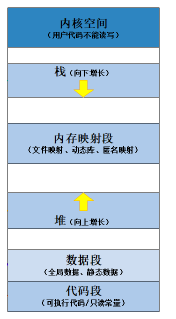


### 栈比堆快的原因，为什么栈命中率高？

**连续**的，**顺序IO**比较快； 栈是**系统提供**的数据结构，，底层有**专门的寄存器**放栈的地址，专门的指令，效率比较高； 

堆是**C/C++函数库**提供的，**不连续**，实现机制复杂，比如要分配一块内存，要**先找到足够大的空间**（如果没有就要系统增加数据段内存空间），效率比较低，而且容**易产生内存碎片**。

#### 为什么栈命中率高？

1. 局部性原则的存在，栈是**先进后出**，操作和内存满足**时间和空间局部性原则**。 

2. 栈是连续内存分配，**顺序IO**比较快。

3. 栈上数据生命周期短，减小缓存替换开销，提高缓存命中率。


### C++程序编译过程

#### 预编译阶段 

处理（#include、#define、#if等）重新组装c++代码

产物： 没有注释、没有include、没有define、没有条件编译（#if/#else）等指令的`.i文件`

#### 编译阶段

词法分析、语法分析和语义分析： 

产物： 汇编代码 

##### 词法分析 ： 字母组合成单词

按照构词规则对字符串内容分解，主要是找token（关键字、标识符、常数、分界符、运算符）。 

用到的是 正则表达式、有限状态机、等

> 之前实习用的flex解析。

##### 语法分析：单词组合成句子

按照词法找到的token ，判断串能不能符合语法规则。如果符合就连成一个句子。

用到的是上下文无关文法、LL1文法、AST抽象语法树等

> 之前实习用的是Bison构建AST

##### 语义分析：确定 句子的意义和执行方式

按照生成的语法树，做些检查和确定执行方式。

用到的是 类型检查、 作用域检查 、 符号解析、 控制流分析、 错误检查和处理等

> 实习在这个组，主要是扁平化过程：
>
> 1）符号表管理， 存储源代码的标识符信息，包括变量、函数、类等
>
> 2）类型检查 、作用域管理， 语义错误处理等。 
>
> 了解了Yacc/Bison等语义分析的工具

#### 汇编阶段

汇编代码翻译成机器指令

产物： 每个.cpp文件都会产生对应的.obj或.o文件。 一般包含两段： 代码段 和 数据段

> 实习时这部分叫做最终代码生成，应该是用的LLVM

#### 链接阶段

不同.cpp文件互相调用，所以删除的.obj文件也需要链接起来啊，最终得到可执行程序。

过程： 

1. 静态链接： 目标文件，直接拷贝到可执行文件中
2. 动态链接： 程序运行时，动态加载进去


### 3. sizeof 和 strlen区别


```cpp
const char* str1 = "name";    
string str2 = "name";    
char str3[]  = "name";       
 
cout << sizeof str1 << endl; // 8    char指针
cout << sizeof str2 << endl; // 8    
cout << sizeof str3 << endl; // 5  数组字节数，记得加上\0
      
cout << strlen(str1) << endl; // 4    
cout << strlen(str2.data()) << endl; // 4    
cout << strlen(str3) << endl; // 4
```


### 4. C++程序内存泄露

#### 原因和后果：

原因：疏忽或错误造成了程序未能释放掉不再使用的内存的情况。

后果：失去对该段内存的控制，大量的内存泄露程序会性能下降，导致程序失败

#### 如何检测C++程序内存泄露

Linux下可以使用Valgrind工具
Windows下可以使用CRT库


使用工具软件BoundsChecker，BoundsChecker是一个运行时错误检测工具，它主要定位程序运行时期发生的各种错误；

调试运行DEBUG版程序，运用以下技术：CRT(C run-time libraries)、运行时函数调用堆栈、内存泄漏时提示的内存分配序号(集成开发环境OUTPUT窗口)，综合分析内存泄漏的原因，排除内存泄漏。

#### 解决方法

智能指针

#### 检查定位

1. 检查方法：

在main函数最后面一行，加上一句\_CrtDumpMemoryLeaks()。调试程序，自然关闭程序让其退出，查看输出：
输出这样的格式{453}normal block at 0x02432CA8,868 bytes long

被{}包围的453就是我们需要的内存泄漏定位值，868 bytes long就是说这个地方有868比特内存没有释放。


2. 定位代码位置

在main函数第一行加上_CrtSetBreakAlloc(453);意思就是在申请453这块内存的位置中断。然后调试程
序，程序中断了，查看调用堆栈。加上头文件#include <crtdbg.h>


### 5.char int string 类型转换

#### char* 或者char[] 互换 string

1.1 char \*或者char [ ]转换为 string时，可以直接赋值。

1.2 string转换为char*或者char[ ]时，有3种方法。
1.2.1 使用string内置c_str()函数。注意不直接赋值，因为string类对象最后会析构导致左值成为空指针。**附加结束符\0**

```
string x = "waseda";
    char *ptr;
    strcpy(ptr,x.c_str());
```
1.2.2 使用string内置data()函数。**不附加结束符\0**

 ```
string x = "waseda";
    char *ptr;
    strcpy(ptr,x.data());
 ```
1.2.3 使用string内置copy()函数。**不附加结束符\0**

   ```
string str="waseda";
    char ptr[10];
    str.copy(ptr,5,0);
   ```

#### char互换int
char数字 转int ，直接减'0'就好
int 转char数字，直接加'0

#### char[]或者char*互换int
1. char数组 到int用 atoi, stringstream
 ```
char u = '3';
    int num0 = u-'0';
    char x[] = "223";
    char *k = "233";
    int num1 = atoi(x);
    int num2 = atoi(k);
//stringstream
    int num0;
    char x[10] = "233" ;
    stringstream ss;
    ss<<x;
    ss>>num0;
 ```
2. int到char数组用 itoa,sprintf,stringstream

  * itoa函数windows平台独有，不通用。第三个参数为**使用的进制**。

 ```
int num0 = 233;
    char x[10] ;
    itoa(num0,x,10);
 ```
  * sprintf函数 (我一般用这个，C标准库的格式化函数)

  ```
int num0 = 233;
    char x[10] ;
    sprintf(x, "%d", num0);
  ```
 * stringstream，重复使用记得clear。

  ```
int num0 = 233;
    char x[10] ;    
    stringstream ss;
    ss<<num0;
    ss>>x;
  ```

#### string互换int
1. int 转string,有std内置to_string函数与stringstream流。
 * to_string
```
    string str ;
    int num=233;
    str = to_string(num);
```
*  stringstream，可以输出到string或者使用流的str()函数。
```
    int num = 233;
    string str ;
    stringstream ss;
    ss<<num;
    ss>>str;
    cout<<str<<endl;//第一种
    cout<<ss.str()<<endl;//第二种
```
2. string转int，先转为char\*然后转为int的方法,或者stoi，或者stringstream
* 使用c_str(),atoi()中转
```
    int num ;
    string str="233" ;
    stringstream ss;
    num = atoi(str.c_str());
```
* stoi
```cpp
    int num ;
    string str="233" ;
    num = stoi(str);
```
* stringstream
```
    int num0;
    string str = "233" ;
    stringstream ss;
    ss<<str;
    ss>>num0;
```

### 6. 回调函数

这个函数是内核调用，程序员只负责写，捕捉到信号后如何去处理信号。
回调函数：

1. 需要程序员实现，提前准备好的，函数的类型根据实际需求，看函数指针的定义
2. 不是程序员调用，而是当信号产生，由内核调用，系统或其他函数将会自动调用你定义的一段函数
3. 函数指针是实现回调的手段，函数实现之后，将函数名放到函数指针的位置就可以了。

#### signal举例说明：

比如signal信号捕捉函数

    #include <signal.h>
    typedef void (*sighandler_t)(int);
    sighandler_t signal(int signum, sighandler_t handler);
        - 功能：设置某个信号的捕捉行为
        - 参数：
            - signum: 要捕捉的信号
            - handler: 捕捉到信号要如何处理
                - SIG_IGN ： 忽略信号
                - SIG_DFL ： 使用信号默认的行为
                - 回调函数 :  这个函数是内核调用，程序员只负责写，捕捉到信号后如何去处理信号。
                回调函数：
                    - 需要程序员实现，提前准备好的，函数的类型根据实际需求，看函数指针的定义
                    - 不是程序员调用，而是当信号产生，由内核调用
                    - 函数指针是实现回调的手段，函数实现之后，将函数名放到函数指针的位置就可以了。
    
        - 返回值：
            成功，返回上一次注册的信号处理函数的地址。第一次调用返回NULL
            失败，返回SIG_ERR，设置错误号
            
    SIGKILL SIGSTOP不能被捕捉，不能被忽略。

* 用setitimer配合signal捕捉

```cpp
#include <stdio.h>
#include <sys/time.h>
#include <stdlib.h>
#include <signal.h>

//设置回调函数
void myAlarm(int num){
    //这里可以查表得到信号14是SIGALRM
    printf("捕捉到了信号编号是: %d\n",num);
    printf("xxxxxxxxxxxx\n");
}

int main(){

  // 注册信号捕捉
    // signal(SIGALRM, SIG_IGN);
    // signal(SIGALRM, SIG_DFL);
    // void (*sighandler_t)(int); 函数指针，int类型的参数表示捕捉到的信号的值。
    signal(SIGALRM,myAlarm);

    //设置间隔时间
    struct itimerval new_value;
    //时间变量必须要初始化
    new_value.it_interval.tv_sec = 2;
    new_value.it_interval.tv_usec = 0;

    //延迟时间,到3s后开始计时
    new_value.it_value.tv_sec = 3;
    new_value.it_value.tv_usec = 0;

     //是非阻塞的   
    int ret = setitimer(ITIMER_REAL,&new_value,NULL);
    printf("开始计时\n");
    if(ret == -1){
        perror("setitimer");
        exit(0);
    }
	//保存程序不关闭 阻塞
    getchar();

    return 0;
}
```


### 7. 关键词


#### const

1. const修饰变量，表示是常量，程序中不能更改，存**放在常量存储区**; 处理指针的情况下 就看修饰的是指针还是指向变量。

   > 真要改底层const用const_cast 

   ```cpp
       int a = 2, b = 3;
       int * const p = &a;
       *p = 2; // ok
       // p = &b; //error 
         
       const int * k = &a;
       // *k = 2; // error
       k = &b; //ok 
   ```

   

2. const修饰函数形参，表示传入的参数在函数内部不能修改

3. 非静态成员函数const 后置： **强制的常函数**，表示传入的**this指针是const指针**，不能修改函数的对象的成员变量，**除非变量声明为mutable** 

常函数可以定义为虚函数


#### mutabel

声明变量是可变的，在const函数中**修改**一些**与类状态无关的数据成员**


#### static

出发点：  如果想将函数中此变量的值保存至下一次调用时，如何实现？ 最容易想到的方法是定义为全局的变量，但定义一个全局变量有许多缺点，最明显的缺点是破坏了此变量的访问范围（使得在此函数中定义的变量，不仅仅只受此函数控制）。static 关键字则可以很好的解决这个问题

1. 修饰变量：static 修饰的静态局部变量**只执行初始化一次**，而且延长了局部变量的生命周期，**直到程序运行结束以后才释放**;

修饰成员变量: 不能用构造函数初始化，**只能类外初始化，类内只是声明**（**例外： const修饰后可以在类内直接初始化**）；类的所有实例中静态变量只有一个；访问用的是 类名::静态成员变量名；

修饰全局变量：这个全局变量**只能在本文件中访问**，不能在其它文件中访问，即便是 extern 外部声明也不可以;

2. 修饰函数：则这个函数的**只能在本文件中调用**，不能被其他文件调用，放到全局数据静态区；

修饰成员函数： **没有this指针，不能访问非静态成员**（变量，函数）

#### constexpr 

修饰变量（常量表达式）：**值不会改变**并且在**编译过程就能得到计算结果**的表达式, 声明为constexpr的变量一定是const变量

函数（常量表达式函数）：函数的**返回值、所有形参类型都是字面值类型**，函数体中**只有一条return**


#### volatile

修饰变量后，编译器对访问该变量的代码就不再进行优化，从它所在的内存读取数据，而不是读寄存器的备份。（因为变量可能会被硬件中断、外部因素等改变变量的内存）

在release模式下，编译器常常做些优化，吃掉一些变量，比如这个m就会被吃掉，所有声明为volatile防止优化

```cpp
// 例子1，不优化吃掉变量 用release跑
int main(){
  volatile int m = 0; // int m = 0 的写法m会被优化掉
  int k = m;
  cout<< k << endl;
  return 0;
}

// 例子2，优化吃掉了一段编译器看来无用的代码 用release跑

void delay(){
    using namespace std::chrono;
    const auto start = system_clock::now();
    { // 括号内部分会被优化掉
    int i = 10e5; // 加上volatile就不会优化掉，结束时间差就不是0
    while (i--) {}
    }
    std::cout << duration_cast<milliseconds>(system_clock::now() - start).count() << endl; 
}

```

 

#### inline：

因为函数需要分配函数栈、处理参数和返回等，为了减少开销，编译阶段把函数替换为函数的本体。只是一种建议。

修饰构造和析构函数没有意义，因为涉及内存分配等复杂操作，不会替换。修饰虚函数只有对象本身调用且简单的函数有用。

inline 和 constexpr 函数一般定义在头文件中


#### explicit

修饰类的**单个参数的构造函数**，控制**不能发生隐式的类型转换**


#### typedef：

1. 一般用法 typedef unsigned char UCHAR;//右边代替左边
2. 定义函数指针 typedef void (*FUN)(); //定义一个函数指针来实现对成员函数的继承

   ```
   typedef void (*FUN)();
   FUN f = nullptr;
   ```

#### register

关键字：这个关键字请求编译器尽可能的将变量存在**CPU内部寄存器**中，而不是通过内存寻址访问，以提高效率


#### NULL

NULL是C中宏定义的，不同编译器定义可能不太一样，因为类型转换的原因，可以被转换为表示空指针，也可以表示int(0),所以可能会有二义性

尽量使用nullptr表示空指针


#### final

修饰类，表明类不能被继承

修饰函数，表示派生类不能重写


### 8. 常见锁

#include <mutex>

#### 互斥锁：

std::mutex、std::recursive_mutex、std::timed_mutex、std::recursive_timed_mutex

  互斥锁用于控制多个线程对它们之间共享资源互斥访问的一个信号量。也就是说为了避免多个线程在某一时刻同时操作一个共享资源，例如一个全局变量，任何一个线程都要使用初始锁互斥地访问，以避免多个线程同时访问发生错乱。

  在某一时刻只有一个线程可以获得互斥锁，在释放互斥锁之前其它线程都不能获得互斥锁，以阻塞的状态在一个等待队列中等待。

头文件：#include <mutex>

类型：std::std::mutex、std::lock_guard

用法：在C++中，通过构造std::mutex的实例创建互斥单元，调用成员函数lock()来锁定共享资源，调用unlock()来解锁。

##### lock_gurard<mutex> guard(mt);

> 不过一般不使用这种解决方案，更多的是使用C++标准库中的`std::lock_guard`类模板，实现了一个互斥量包装程序，提供了一种方便的**RAII风格**的机制在作用域块中。
>
> 用法： （用{}作用域提供并发操作，实际上是构造函数和析构函数中加锁解锁）
>
> RAII风格 ： 资源获取就是初始化 ：当我们在使用资源的时候，在构造函数中进行初始化，在析构函数中进行销毁

```cpp
#include <iostream>
#include <thread>//C++11线程库是跨平台的
#include <mutex>//C++互斥锁
#include <vector>
#include <windows.h>

int g_num = 0;
std::mutex g_mutex;

void ThreadFunc(int a)
{
	cout << "启动线程:" << a << endl;
	for (int i = 0; i < 1000000; i++)
	{
		//g_mutex.lock();
		std::lock_guard<std::mutex> m(g_mutex);//互斥量包装程序
		g_num++;
		//g_mutex.unlock();
	}
}

int main()
{
	for (int i = 0; i < 4; i++)
	{
		std::thread t(ThreadFunc, i);
		t.detach();
	}
	Sleep(2000);
	cout << "g_num:" << g_num << endl;
	return 0;
}
```

##### unique_lock<mutex> unique(mt)

为了解决lock_guard锁的粒度过大的原因

会在构造函数加锁，然后可以利用unique.unlock()来解锁；


##### 递归锁 

std::recursive_mutex

不常用 容易隐藏问题

Mutex可以分为递归锁(recursive mutex)和非递归锁(non-recursive mutex)。可递归锁也可称为可重入锁(reentrant mutex)，非递归锁又叫不可重入锁(non-reentrant mutex)。

二者唯一的区别是，**同一个线程可以多次获取同一个递归锁，不会产生死锁**。而如果一个线程多次获取同一个非递归锁，则会产生死锁。

##### 定时锁

std::time_mutex：定时 mutex 类


#### 条件锁

std::condition_variable、std::condition_variable_any

  条件锁就是所谓的条件变量，当某一个线程因为某个条件未满足时可以使用条件变量使该程序处于阻塞状态，一旦条件满足则以“信号量”的方式唤醒一个因为该条件而被阻塞的线程。

最为常见的就是在线程池中，初始情况下因为没有任务使得任务队列为空，此时线程池中的线程因为“任务队列为空”这个条件处于阻塞状态。一旦有任务进来，就会以信号量的方式唤醒该线程来处理这个任务。

##### wait操作

`std::condition_variable` 提供了两种 `wait()` 函数，一个是不带条件的，一个是可传入条件，通常为lambda表达式

```
//无条件等待
void wait (unique_lock<mutex>& lck); // 阻塞并释放锁
//有条件等待
template <class Predicate>
void wait (unique_lock<mutex>& lck, Predicate pred); // pred为false时阻塞
```

- 当线程调用`wait (unique_lock<mutex>& lck)`时，当前线程会阻塞并释放当前获得的锁`lck`,以提醒其他线程可以获得这个自由锁了。因此对于`wait (unique_lock<mutex>& lck)`只要一调用就会阻塞，那么在外部必须给它价格条件判断，判断线程是否执行`wait`
- 而`wait (unique_lock<mutex>& lck, Predicate pred)`是当`pred`返回`false`时线程会阻塞，即其自带了条件判断，我们只需传入即可

##### notify 操作

- `std::condition_variable::notify_one()`
  唤醒某个等待（`wait`）线程。如果当前没有等待线程，则该函数什么也不做，如果同时存在多个等待线程，则唤醒某个线程是不确定的（`unspecified`）。
- `std::condition_variable::notify_all()` 唤醒所有的等待（wait）线程。如果当前没有等待线程，则该函数什么也不做。


#### 自旋锁 

std::spin_lock、std::atomic_flag

一种busy-waiting的锁。

如果一个线程想要获得一个被使用的**自旋锁**，那么它会一直占用CPU请求这个自旋锁使得CPU不能去做其它的事情，直到获取这个锁为止
当发生阻塞时，（**互斥锁**可以让CPU去处理其它的事务），但自旋锁让CPU一直不断循环请求获取这个锁。

如果别的线程长时期占有锁那么自旋就是在浪费CPU做无用功，但是自旋锁一般应用于加锁时间很短的场景，避免上下文切换带来的开销，这个时候效率比较高

#### 读写锁

std::shared_mutex、std::shared_timed_mutex

允许多个线程同时读取共享资源，但只允许一个线程写入共享资源；  

写者优先于读者（一旦有写者，则后续读者必须等待，唤醒时优先考虑写者）

##### 使用要求：

1. 当读常见远多于写操作时，使用读写锁可以提高并发性能。 否则就用互斥锁算了。。。
2. 读还是写想清楚，锁管理对象是用用 std::shared_lock还是std::unique_lock

##### 使用方法：

1. 声明和初始化：

```cpp
std::shared_mutex mutex;
```

2. 读取共享数据：

```cpp
std::shared_lock<std::shared_mutex> lock(mutex); // 获取读锁
// 使用共享数据
```

3. 写入共享数据：

```cpp
std::unique_lock<std::shared_mutex> lock(mutex); // 获取写锁
// 修改共享数据
```


#### 原子操作

包括std::atomic、std::atomic_flag等。原子操作用于保证某个操作的执行不会被其他线程中断，从而避免了数据竞争的发生

```
atomic_int i = 2；// std::atomic<int> i = 2
```


#### 信号量

包括std::binary_semaphore、std::counting_semaphore等。信号量用于控制同时访问某个资源的线程数量，可以实现线程的互斥和同步。

函数：

#### 函数

- `std::try_lock`：尝试同时对多个互斥量上锁。
- `std::lock`：可以同时对多个互斥量上锁。
- `std::call_once`：如果多个线程需要同时调用某个函数，`call_once` 可以保证多个线程对该函数只调用一次


### 9. 智能指针

头文件在memory

#### 什么时候用智能指针，什么时候用裸指针？

指针其实有四种（漏了一种auto_ptr），shared_ptr, weak_ptr, unique_ptr和裸指针，其中最常用的就是unique_ptr和裸指针，因为shared_ptr有引用计数，额外的开销比较大。一般写应用时，遇到指针我一般都是先无脑用unique_ptr，如果遇到需要一个副本，就改成shared_ptr，写完之后看哪些指针的生命周期是全局生命周期，最后再把它改成裸指针。说简单点，就是`局部作用的地方用unique，多处作用用shared，全局用裸指针`。


#### Shared_ptr循环引用问题

```cpp

struct ListNode
{
	hb::shared_ptr<ListNode> _next = nullptr;
	hb::shared_ptr<ListNode> _prev = nullptr;
 
	int _val = 0;
 
	~ListNode()
	{
		cout << "~ListNode()" << endl;
	}
};
 
int main()
{
	// 循环引用
	hb::shared_ptr<ListNode> p1(new ListNode);
	hb::shared_ptr<ListNode> p2(new ListNode);
 
	cout << p1.use_count() << endl;
	cout << p2.use_count() << endl;
 
	p1->_next = p2;
	p2->_prev = p1;
 
	cout << p1.use_count() << endl;
	cout << p2.use_count() << endl;
 
	return 0;
}
```

循环引用分析：
① p1和p2两个智能指针对象指向两个节点，引用计数变成1，我们不需要手动delete。

② p1的_next指向p2，p2的_prev指向p2，引用计数变成2。

③ p1和p2析构，引用计数减到1，但是_next指向下一个节点，并且_prev还指向上一个节点。

④ 也就是说_next析构了，p2就释放了；_prev析构了，p1就释放了。

⑤ 但是_next属于p的成员，p1释放了，_next才会析构，而p1由_prev管理，_prev
属于p2成员，所以这就叫循环引用，谁也不会释放。


#### weak_ptr什么时候使用

weak_ptr只是用来观察其对应的强指针的使用次数，是不参与指向资源的释放管理的。

1、解决share_ptr循环引用的问题 : 把指向双方的任意一个成员变量改为weak_ptr

2、当你想使用对象，但是并不想管理对象（没有拥有控制权），并且在需要使用对象时可以判断对象是否还存在（expired 或 lock）。比如有个类只用观察某个变量的状态然后不同的状态做出不同的操作，但又不实际操控这个变量的资源，这时候就可以用weak_ptr。（观察者模式）

需要使用的weak_ptr指向的对象时，可以用lock()函数转化为shared_ptr,转换失败则返回空的shared_ptr对象；也可以用expired()判断shared_ptr是否到期

```cpp
if (shared_ptr<int> np = wp.lock()){...} // 如果expired返回true，lock返回一个指向w对象的shared_ptr, 否则返回空的shared_ptr
```


#### Shared_ptr线程安全吗

Shared_ptr本身是线程安全的，它的引用次数加减操作内部自动实现加锁解锁。

但是用智能指针去**访问资源**不是线程安全的，需要手动加锁解锁。 可以通过**互斥锁等同步机制**来保护共享的 std::shared_ptr 对象，或者使用线程安全的替代品（std::atomic 或 std::shared_mutex）来实现线程安全的操作。

控制块中的**引用计数是原子类型**，引用计数本身的更新是线程安全的，但是有不同线程同时访问**数据块**导致的race condition

#### Shared_ptr的缺点

1. 传播病毒（污染）：一旦对资源对象染上了shared_ptr，在其生存期内便无法摆脱。比如 **创建了一个shared_ptr p1，然后p2通过调用get接口获得到了对象资源，然后p3通过这个p2的裸指针也构造了一个shared_ptr，此时p1的计数器为1，p3的计数器也是1，当离开作用域时，p3计数器清零并释放资源，p1也会释放，这时候就再次释放，导致程序崩溃。**

解决： 不要混用普通指针和智能指针


2. 开销大，维护计数器，还要维护计数器的线程安全，线程安全是通过原子量来实现的，但是还是有开销。

其他注意的方面 ：

1. 资源管理能力单一，不能管理malloc出来的资源，不能管理文件指针。

​				这个其实不太像缺点，因为本身可以重载删除器

2.  循环引用问题。。

#### 写一个shared_ptr

```cpp
template <typename T>
class SharedPtr
{
    
public:
    // 构造函数
    SharedPtr() : _ptr(nullptr), _pcount(new int(1))
    // 接受指针参数的智能指针构造函数是explict的
       // 别忘了写默认参数
    explicit SharedPtr(T* ptr = nullptr): _ptr(ptr), _pcount(new int(1)){}
    
    
    // 拷贝构造
    SharedPtr(const SharedPtr<T>& s) : _ptr(s._ptr), _pcount(s._pcount){
        (*_pcount)++;
    }
    //拷贝赋值
    // 1. 重载=需要判断是不是本身，因为是已有对象情况下，把另一个对象的值覆盖对象，所以需要判断是不是本身； 2. 拷贝构造函数是在创建对象时调用的，它的作用是通过从已有对象创建一个新的副本，不可能拷贝本身
    SharedPtr<T>& operator=(const SharedPtr<T>& s){
        if (this != &s)
        {
            // 本指针原来指向的对象，判断是否销毁
            if (--(*_pcount) == 0)
            {
                delete _ptr;
                _ptr = nullptr;
                delete _pcount;
                _pcount = nullptr;
            }
            // 改为现在指向的对象
            _ptr = s._ptr;
            _pcount = s. _pcount;
            (*_pcount) ++;
        }
        return *this;
    }
    
    // 移动构造
    SharedPtr(SharedPtr<T>&& s) noexcept {
            _ptr = s._ptr;
            _pcount = s._pcount;
            
            s._ptr = nullptr;
            s._pcount = nullptr; 
    }
    
    SharedPtr& operator=(SharedPtr<T>&& s)  noexcept {
        if (this != &s)
        {
            if (--(*_pcount) == 0)
            {
                delete _ptr;
                _ptr = nullptr;
                delete _pcount;
                _pcount = nullptr;
            }
            _ptr = s._ptr;
            _pcount = s._pcount;
    
            // 置于可析构状态
            s._ptr = nullptr;
            s._pcount = nullptr; 
        }
        return *this;
    }
    
    
    T& operator*()
    {
        return *(this-> _ptr);
    }
    
    T* operator->()
    {
        return this-> _ptr;
    }
    
    long use_count() const
    {
        return *(this-> _pcount);
    }
    
    bool unique() const
    {
        return (*(this-> _pcount) == 1);
    }
    
    ~SharedPtr()
    {
        if (--(*(this-> _pcount)) == 0)
        {
            delete _ptr;
            _ptr = nullptr;
            delete _pcount;
            _pcount = nullptr;
        }
    }
    
private:
    T* _ptr;
    int* _pcount; // 指向引用计数的指针
};
```


#### 智能指针自定义删除器，为什么需要有

智能指针的默认删除器是用delete关键字来释放资源的，这适用于大多数通过new分配的内存。但是在一些情况下用不同的方式来分配内存，比如使用**malloc、打开文件**或者使用其他外部库来分配函数，这些情况下某人的删除器无法正确清理资源。需要重定义智能指针的删除器。

1. unique_ptr的删除器是通过自己实现的仿函数，

在**模板参数列表**中显式的给出可调用对象（仿函数），就可以在析构时去调用对应的仿函数析构。

```cpp
unique_ptr<connection, decltype(end_connection)*>;
```

2. shared_ptr不是通过模板参数的仿函数来实现，而是通过传对象来实现。以下用lambda表达式

```cpp
shared_ptr<connection> p(q, end_connection);
shared_ptr<connection> p(q, [](connection *p) {disconection(*p);});

// 也可以用reset
p.reset(q, end_connection);
```


### 10.可调用对象

函数、函数指针、lambda表示、bind创建的对象、仿函数

#### 函数指针

一种用法是 函数指针作为回调函数 传入自定义函数中

> 只能处理无捕获的lambda

```cpp
int (*compute)(int, int);

int max(int x, int y) { return x >= y ? x : y; }
int min(int x, int y) { return x <= y ? x : y; }
int add(int x, int y) { return x + y; }
int multiply(int x, int y) { return x * y; }

// 一个包含函数指针作为回调的函数
int compute_x_y(int x, int y, int(*compute)(int, int))
{
	// 调用回调函数
	return compute(x, y);
}
int main()
{
    int res = compute_x_y(1, 2, add);
    // 无捕获的lambda可以转换为同类型的函数指针
	auto sum = [](int x, int y)->int{ return x + y; }; // lambad必须用尾置返回来指定返回类型
    res = compute_x_y(1, 2, sum);
}
```

#### function模板存储可调用对象

<functional>

>  可以兼容所有具有相同参数类型（函数、仿函数、lambda（带捕获、不带捕获）、 函数指针）的函数实体

定义模板：

```cpp
std::function<int(int, int)> SumFunction;


// 普通函数
int func_sum(int a, int b)	{return a + b;}
SumFunction = func_sum;

// 仿函数
class ImitateAdd
{
public:
	int operator()(const int a, const int b) const { return a + b; };
};
ImitateAdd imitate;
SumFunction = imitate;

// lambda函数
auto lambda_func_sum = [](int a, int b) -> int { return a + b; };
SumFunction = lambda_func_sum;

// 带捕获的lambda函数
int base = 10;
auto lambda_func_with_capture_sum = [&base](int x, int y)->int { return x + y + base; };
SumFunction = lambda_func_with_capture_sum;

// 函数指针
int (*func_pointer)(int, int);
func_pointer = func_sum;
SumFunction = func_pointer;

```

#### bind绑定使用注意

1. 占位符 std::placeholders::_1

2. 就算是绑定的时候制定了默认参数，但是在调用的时候也**需要指定相同的参数个数**（虽然不会起作用），否则编译不通过

3. bind用于类成员函数的时候，需要传递成员函数的指针作为第一个参数，所属对象的指针或引用作为第二个参数（我们知道成员函数的第一个隐式参数就是对象的this指针，那这个所属对象的指针或引用就是作为成员函数的隐式this参数），然后之后传入后续参数

   ```CPP
   MyClass obj;
   auto boundFunc = std::bind(&MyClass::printSum, &obj, 10, std::placeholders::_1);
   boundFunc(5); // 绑定了成员函数printSum，并将10作为第一个参数，将5作为第二个参数进行调用
   ```

4. 希望传递给函数的参数是一个对象又不拷贝他（比如ostream不能复制），可以用ref()函数返回对象的引用，且返回的是可复制的，用cref()生成一个保存const引用的类

#### 回调函数是什么，以及用法

通过函数等作为另外一个函数的参数的形式，在调用者层指定被调用者行为的方式

1. function把函数作为参数类型。

```cpp
std::function<int(int, int)> ComputeFunction;
int (*compute_pointer)(int, int);

int compute1(int x, int y, ComputeFunction func) {
    // do something
	return func(x, y);
}
```

2. 面向对象的回调函数方式

```cpp
#include <iostream>

// 定义标准的回调接口
class ComputeFunc
{
public:
	virtual int compute(int x, int y) const = 0;
};

// 实现回调接口
class ComputeAdd : public ComputeFunc
{
public:
	int compute(int x, int y) const override { return x + y; }
};

int compute3(int x, int y, const ComputeFunc& compute)
{
	// 调用接口方法
	return compute.compute(x, y);
}

// 调用方法如下
int main()
{
    ComputeAdd add_func; // 创建一个调用实例
    int sum = compute3(3, 4, add_func); // 传入调用实例
}
```


### 11.STL中的traits

目的： 获取iterator所指元素的type

#include<type_traits> 中提供了在编译期进行计算、判断、转换、查询等功能


主要是用模板元编程实现，用模板 偏特化 、还有typename实现


#### 为什么stl里面一些算法或者函数都是传进去iterator，就可以正确的运行，但对应的各个容器的iterator却并不是一模一样的，而是有各自特性的，那么他们究竟是怎么实现的呢？

1. 这些通用算法（模板实现的泛化）中调用的是 针对不同迭代器类型（iterator_category）的偏特化函数。
2. 按照定义迭代器时定义的iterator_category决定调用函数的偏特化版本。


迭代器的常用识别类型

```cpp
template <class _Iterator>
struct iterator_traits {
  typedef typename _Iterator::iterator_category iterator_category;  //迭代器类型（可随机访问的迭代器、单向迭代器、双向迭代器等）
  typedef typename _Iterator::value_type        value_type;         //容器类型（类类型）
  typedef typename _Iterator::difference_type   difference_type;    //标识迭代器距离
  typedef typename _Iterator::pointer           pointer;            //指针
  typedef typename _Iterator::reference         reference;          //引用
};
```

iterator_category的主要类型

```
1、input_iterator：istream独有的迭代器。
2、output_iterator：ostream独有的迭代器。
3、forward_iterator：继承自input_iterator，单向走的迭代器，只能走一个，不能跳。如forward_list、单向list的hashtable
4、bidirectional_iterator：继承自forward_iterator，双向走的迭代器，只能走一个，不能跳。如list、rb-tree、双向list的hashtable
5、random_access_iterator：继承自bidirectional_iterator，可以跳的迭代器。如array、vector、deque。
```

### 12. 编译器

GNU 是一个操作系统 一类Unix操作系统

GCC 是GNU编译器套装 开源 跨平台 支持多种语言、操作系统、处理器架构， 可以高效生成本地机器代码

MinGW 是简化的GCC在windows上的移植版本

IDE 是继承开发环境 ，Clion和dev C++默认都是gcc (mingw32)，Xcode用的是clang。VS用的是微软自己的

### 13. 容器中删除

#### remove函数

将[first, last)范围内所有等于value的值移动到尾部，返回一个指向新的最后一个元素之后的位置的迭代器

```cpp
// 删除所有的A,执行remove函，返回一个迭代器position
    vector<char>::iterator position = remove(vec.begin(), vec.end(), 'A');
```


#### vector的删除

主要有三种方法：`erase、pop_back和 remove（algortihm）`。

- `iterator erase(iterator first,iterator second)` 删除区间[first,last)之间的元素
  - `iterator erase(iterator position)` 删除当前位置的元素，但注意删除后、position 会自动++， 返回的iterator指向新的容器中(最后一个删除元素)的下一个位置。
- `void clear()` 清空所有元素
- `void pop_back()` 删除最后一个元素
- `iterator remove(iterator first,iterator second,value)`

##### 常用删除vector中等于remove_value的值

```cpp
iv.erase(remove(iv.begin(), iv.end(), remove_value), iv.end());
```


#### map的删除

```
map::erase()
```

下面两种方法和vector的相同

- `iterator erase(iterator first,iterator second)` 删除区间[first,last)之间的元素
- `iterator erase(iterator position)`
  删除当前位置的元素和迭代器，返回一个void**，注意与vector区别**


#### set的删除

- (1) 移除set容器内元素值为value的所有元素，返回移除元素的个数

**`size_type erase(value)`**

- (2) 移除pos位置上的元素，无返回值

**`void erase(iterator pos)`**

删除当前位置的元素和迭代器，返回一个void**，注意与vector区别**

- (3) 移除迭代区间[first,last)内的所有元素，无返回值

**`void erase(iterator first, iterator last)`**


#### vector和map 的erase()使用区别

1. 顺序容器 vector

erase迭代器不仅使所指向被删除的迭代器失效，而且因为后面的元素需要往前调整，使被删元素之后的所有迭代器失效(list除外)，所以
不能使用erase(it++)的方式，但是erase的返回值是下一个有效迭代器；

```cpp
auto it2 = c.erase(it);
```

2. 关联容器 set map multimap multiset

erase迭代器只是被删除元素的迭代器失效，但是返回值是void，所以要采用erase(it++)的方式删除迭代器；

```cpp
c.erase(it ++); // 移除这个元素及迭代器，然后it指向下一个有效的元素
```


### 14. 虚函数

#### 为什么析构函数一般写成虚函数

因为delete一个动态分配的对象的指针时，需要执行对象的动态类型的析构函数。 如果删除指针的静态类型与被删除对象的动态类型不符合时，不声明虚析构函数，可能会调用基类的析构函数析构派生类的对象，析构不完全，造成内存泄漏。需要动态指向对象类型的析构函数，按照析构函数调用规则（先派生类，再成员类对象，然后基类）析构

有例外 CRTP

析构函数也可以是纯虚函数（为了使基类为抽象了）,但是有限制

#### 构造函数能不能是虚函数

不能定义为虚函数，因为对象存储一个vptr指向vtable，如果还没有构造初始化对象，就没有这个vptr

可以调用虚函数，不过调用的是正在构造的虚函数，而不是子类的虚函数，因为此时子类尚未构造好

#### 虚函数表

虚表位置： 

​	虚函数表位于常量区，虚函数位于代码区，虚函数表一个类一个，类似数组，编译时构造完成

虚函数指针：

​	含有虚函数的对象前4字节指针指向虚函数表，构造对象时生成虚指针，指向虚表。如果子类继承了两个父类，两个父类都有虚函数，那么子类就有两个指针。


1. 在构造子类对象时，会先调用父类的构造函数，此时，编译器只“看到了”父类，并为父类对象初始化虚表指针，令它指向父类的虚表；当调用子类的构造函数时，为子类对象初始化虚表指针，令它指向子类的虚表。

2. 当派生类对基类的虚函数没有重写时，派生类的虚表指针指向的是基类的虚表；当派生类对基类的虚函数重写时，派生类的虚表指针指向的是自身的虚表；当派生类中有自己的虚函数时，在自己的虚表中将此虚函数地址添加在后面


#### 虚继承 解决菱形继承

class A{};

class B: virtual public A{};

class C: virtual public A{};

class D: public B, public C{}; // D 不需要虚继承

虚继承下，无论基类被继承多少次，只会存在一个实体。 原理：虚拟继承的子类增加一个指针bptr指向虚基类对象


### 15. 默认构造函数的生成


#### 什么时候用拷贝构造？什么时候用赋值？

拷贝构造是用一个已经构造好的对象去初始化一个新的对象，赋值是有两个构造好的对象，一个对象对另一个对象进行赋值。

```
int main() {
    MyClass obj1(5);  // 调用自定义构造函数
    MyClass obj2 = obj1;  MyClass obj2(obj1)也是一样的过程// 使用拷贝初始化，调用拷贝构造函数
    return 0;
}
```


#### 合成默认构造函数的时机

不是没有构造函数的类都会合成构造函数

1. 没有构造函数，但是含有一个成员对象，成员对象含有默认构造函数
2. 没有构造函数，但是派生自由默认构造函数的基类
3. 带有虚函数的类，因为vptr需要初始化构造
4. 带有一个虚基类的类

#### 合成拷贝构造函数的时机

1. 没有拷贝构造函数，含有一个成员变量，该类型含有拷贝构造函数；
2. 没有拷贝构造函数，但是继承自有拷贝构造函数的基类；
3. 没有拷贝构造函数，但是声明或继承了虚函数；
4. 没有拷贝构造函数，但是含有虚基类；


### 拷贝构造函数和移动构造函数


#### 拷贝构造函数的参数类型为什么必须是引用，为什么要用const

拷贝构造函数在创建对象的副本时需要获取源对象的值,当拷贝构造函数的参数不是引用类型时，而是传值会**触发另一个拷贝构造函数的调用**。这样就形成了无限递归的循环，导致栈溢出或程序崩溃。使用const的原因是**防止**在拷贝构造函数内部对**引用形参进行修改象**。


#### 重载=为什么需要判断本身if (&s != this)，拷贝构造不需要

1. 重载=需要判断是不是本身，因为是已有对象情况下，把另一个对象的值覆盖对象，所以需要判断是不是本身； 
2. 拷贝构造函数是在创建对象时调用的，它的作用是通过从已有对象创建一个新的副本，不可能拷贝本身


#### 移动构造函数的使用场景有哪些

1. 动态内存管理：当一个对象拥有动态分配的资源（如堆内存、文件句柄等），并且需要传递给其他对象或返回给调用者时，可以使用移动构造将资源所有权快速转移而不是执行深拷贝。
2. 容器操作：在容器中插入、删除元素时，使用移动构造可以避免多余的复制操作。
3. 临时对象转移：当一个函数返回一个临时创建的对象时，编译器会自动选择移动构造来提高效率。

#### move是什么，使用场景，什么时候用move比不用快

move的作用主要是更改对象的所有权，将一个对象的所有权给另一个对象，使用起来就是传一个左值进来然后变成右值。

使用场景：

(1) 避免无意义的大规模拷贝 用移动
(2) 包含不可复制的数据 用移动

什么时候更快，比如现在有一个变量string A，然后我想要把它push_back进一个vector，这个时候用move更快，因为相当于是直接将这个已经构造好了的临时变量push到vector里面，如果不用move则会再多一层拷贝构造函数的调用。

实现：首先有一个接收万能引用的参数，然后将参数转换为右值引用 


### 16. 野指针和悬空指针

“野指针”(wild pointer)：是没有被初始化过的指针，所以不确定指针具体指向。

“悬空指针”（dangling pointer）：是指针最初指向的内存已经被释放了的一种指针


#### 解决方法：

野指针：指针变量未及时初始化 => 定义指针变量及时初始化，要么置空。
悬空指针：指针free或delete之后没有及时置空 => 释放操作后立即置空。


### 17. 哪些场景会内存泄漏

- 忘记delete了，或者没有delet数组 

  （常见的有 1. 异常了没有办法delete，应该用智能指针 auto_ptr，C11后用unique_ptr

  ​		  2. 加入容器的元素是new的，直接用clear()清空，而没有逐个delete

- 父类的析构函数不是虚函数

- 构造函数发生异常，没调用析构函数


#### 内存泄漏如何排查

经验法就是：

- new delete有没有成对出现。
- 析构函数是不是虚函数


工具的话我只用过valgrind，它有很多参数。

```
valgrind -options ./proc args
```

常用的options，有trace-children跟踪子进程，当然最常用的就是memcheck选项，检查内存问题。它会打印若干类型，directly lost，indirectly lost，possible lost，still reachable。主要是directly和still reachable，前者的意思是有一个内存没有释放，并且所有指针变量都访问不到这块内存。后者表示可以访问，但是还没释放。


--leak-check 会显示具体位置

### 18 C++ 四种类型转换

static_cast：最常用的，可以用于内置类型的转换，父类子类的转换（向上是安全的，向下是不安全的（但是缺乏类型检查，所有要尽量避免））。

const_cast：用于去除const和valitale属性。 修改底层const

reinterpret_cast：最暴力的强制类型转换，不管两个类型是否相关都可以转换，但是原类型和目标类型**必须要有一个是指针**，可以把指针转换成整数，如果比特位数一样。

dynamic_cast：其他的都是在编译时处理，这个时在运行时处理的（有开销），运行时会进行类型检查，所有在有多态的场景下，在进行下行转换时更安全，因为这个特点，它**只能作用于指针或者引用**。


### 编写.h文件时需要注意的事

1、<>和引号的问题，系统自带的使用尖括号，引号一般是自己写的文件

2、pragma once，防止重复定义

3、模板的实现一般放在头文件里，因为编译的时候模板文件时并不会生成实例化代码，在链接阶段，在使用模板的地方会去实例化，这时候编译器就会去找头文件，这时候是感知不到.cpp文件的，如果不把源代码放在头文件里，就会编译失败。


### 20 模板

#### 为什么定义和实现 特化 偏特化都放在头文件？

编译的时候需要进行实例化，需要知道模版具体实现代码，才能生成对应的类型或函数。如果实现放在.cpp文件中，编译时会出现链接错误，因为无法找到模版的实现代码。


其实，根源是C++的单独编译原则， 只编译.cpp文件，.h文件的内容会复制到.cpp中。模版的代码没有具体类型，放到.h或者.hpp就不会成为编译单元，而是放到调用的.cpp文件编译。 如果模版放到了.cpp中，那就要有一个编译单元了，但是没有具体类型不产生任何函数，就会产生没有任何函数的汇编代码。


一般就是把模版的定义和实现都放在.h文件，如果模版比较复杂就放到.hpp文件。


#### 如果要分开写怎么实现？

为什么有这个需求？： 分离接口和实现；方便修改，改完只要编译该的文件就行； 封装性考虑

怎么做？

1.  .h文件写模版定义， 然后#include上实现的文件；
2.  实现文件用tpp文件，#include上定义的文件； 
3.  防止循环引用，用 #ifndef 或者 #program once

**MyVector.h**：

```cpp
#ifndef MYVECTOR_H
#define MYVECTOR_H

template <typename T>
class MyVector {
public:
    MyVector();
    void push_back(const T& value);
    T& operator[](int index);

private:
    T* data;
    int size;
};

#include "MyVector.tpp" // 包含实现部分的头文件

#endif
```

**MyVector.tpp**：

```cpp
#ifndef MYVECTOR_TPP
#define MYVECTOR_TPP

#include "MyVector.h"

template <typename T>
MyVector<T>::MyVector() {
    data = nullptr;
    size = 0;
}

template <typename T>
void MyVector<T>::push_back(const T& value) {
    // 实现代码
}

template <typename T>
T& MyVector<T>::operator[](int index) {
    // 实现代码
}

#endif
```


### lambda


```cpp
auto cmp = [capture list](parameter list) -> return type{ function body} //lambda写法

堆应用lambda作为Functional比较，记住需要传lambda对象作为参数，类型用decltype推导
    priority_queue<ListNode*, vector<ListNode*>, decltype(cmp)> heap(cmp);
```

### STL 底层

#### 写个简单的String

```cpp
#include <iostream>
#include <cstring>

using namespace std;

class MyString
{
public:
    MyString(): _str(nullptr){}
    // 别忘了写默认参数 记得要重新开辟空间
    MyString(const char* s = "") : _str(new char[strlen(s) + 1]){
        strcpy(_str, s);
    }
 
    // 拷贝构造 常量引用
    MyString(const MyString& s) : _str(new char[strlen(s._str) + 1]){
        strcpy(_str, s._str);
    }
	// 拷贝赋值 记得要用指针判断是不是本身， 返回的是对象的引用支持连续复制操作
    // 注意delete[],注意空间是+1,因为string后面要\0
    MyString& operator=(const MyString& s){
        if (&s != this){
            delete[] _str;
            _str = new char[strlen(s._str) + 1];
            strcpy(_str, s._str);
        }
        return *this;
    }
    
    ~MyString() {
        delete[] _str;
        _str = nullptr;
    }
    
    char* getchar() const {return _str;}
    
  
private:
    char *_str;
};


int main(){
    MyString s("This is a MyString!!");
    MyString s2(s);
    
    cout << s2.getchar() << endl;
    return 0;
}
```


### 单例


懒汉模式 c++11标准要求局部静态变量初始化具有线程安全性

```cpp
class Singleton
{
private:
   Singleton(){}
   Singleton(const Singleton& other) = delete;
   Singleton& operator= (const Singleton& other) = delete;
public:
    int a = 2;
    static Singleton& getInstance(){
        static Singleton instance; // 静态成员函数的静态变量
        return instance; 
    }
};

// 拿单例必须要用引用，因为拷贝构造已经delete了
int main(){
	Singleton& s1 = Singleton::getInstance();
    cout << s1.a << endl;
    return 0;
}

```


饿汉模式

```cpp
class Singleton
{
private:
    Singleton(){}
    
    Singleton(const Singleton&) = delete;
	Singleton& operator=(const Singleton&) = delete;
	
	static Singleton instance;

public:
    int a = 2;
    static Singleton& getInstance(){
        return instance;
    }

};
// 类静态成员变量，别忘了类外初始化
Singleton Singleton::instance;

int main(){
    
    Singleton& s1 = Singleton::getInstance();
    cout << s1.a << endl;
    return 0;
}
```


### C++常用的性能分析工具 之后用用试试

\1. Valgrind: Valgrind是一个开源工具，可用于检测内存泄漏和其他内存错误。它还包括一个可用于性能分析的工具集。
\2. Perf: Perf是Linux系统上一个强大的工具，可用于分析CPU使用率、内存使用率和磁盘I/O性能等方面的问题。
\3. Gprof: Gprof是GNU项目中的一个工具，它用于分析程序的性能，并生成函数级别的分析报告。
\4. Google Performance Tools (gperftools): gperftools是Google发布的一组性能分析工具，其中包括CPU profiler、heap checker和heap profiler等工具。
\5. Intel VTune Amplifier: Intel VTune Amplifier是一款商业性能分析工具，可用于分析各种类型的应用程序，包括C++应用程序。它提供了深入的分析和优化建议。
\6. CodeXL: CodeXL是AMD发布的一款免费的性能分析工具，可以用于分析CPU、GPU和APU等硬件的性能问题。
这些工具都有各自的优点和适用范围，根据具体情况选择合适的工具进行性能分析。


### C11相关题目


#### std::move 本质上解决了什么问题 ？ 什么时候起作用 编译还是运行？

**编译的时候起作用**，将对象标记为右值引用，提示编译器用移动语义来提高代码的性能和效率；

运行时，它不执行移动操作，而是移动构造函数或移动赋值函数来完成的。


## 算法

### 1. 树

#### 二叉树

空集或者有一个根节点和两颗互不相交的、分别为根节点的左右子树的二叉树组成
#### 满二叉树

所有分支结点都存在左右子树，且所有叶子在同一层的二叉树
#### 完全二叉树
编号i的节点与同样深度的满二叉树中编号同为i的节点在二叉树的位置完全相同
#### 线索二叉树
让原本指向左右子树的空指针，去指向中序遍历的前驱和后继的指针称为线索，加上线索的二叉链表称为线索链表，相应的二叉树就称为线索二叉树
#### 最小生成树
图论中，构造连通网的最小代价生成树称为最小生成树；算法有prim(每一步为目标扩大树)和Kruskal(边为目标，不构成环前提，向上生成)
#### 二叉排序/查找/搜索树Binary Search Tree，简称 BST
若左子树不为空，则左子树上所有结点的值均小于它的根结点的值；
若右子树不为空，则右子树上所有结点的值均大于它的跟结点的值；
它的左右子树也分别为二叉平衡树；

#### 平衡二叉树AVL
一种二叉排序树，其每个节点的左子树和右子树的高度差不大于1

##### 最小不平衡树

通过旋转操作使树的高度尽可能地小，从而达到平衡的二叉搜索树

距离插入节点最近的，且平衡因子（左子树和右子树高度差）的绝对值大于1的节点为根的子树（也就是非根节点的所有结点左右子树高度差不大于1的AVL）

#### 红黑树
平衡二叉搜索树中常被使用的一种（`是不严格的平衡二叉树，但某些时候左右高度差超过1`）；排序规则有利search和insert，并保持高度平衡；
红黑树提供遍历和iterators；按照正常规则遍历，就能得到排序状态；

`特点：`

1. 树中所有节点非红即黑。
2. 根节点必为黑节点。
3. 红节点的子节点必为黑（黑节点子节点可为黑）。
4. 从根到NULL的任何路径上黑结点数相同。
5. 查找时间一定可以控制在O(logn)。

`好处：`

AVL平衡条件太苛刻，当删除元素的时候，最多需要logN此旋转，加上查询的时间，删除的复杂度O(2log(N))；而红黑树有染色和自动平衡效果，旋转是O(1)。
虽然查找的效率不如AVL，但是对于频繁增删的情况效率更好

- rbTree查询元素：O(log(N))
- rbTree插入元素：插入最多2次旋转，加上查询的时间O(log(N))，插入的复杂度O(log(N))
- rbTree删除元素：删除最多需要3次旋转，加上查询的时间，删除的复杂度O(log(N))

虽然插入和删除元素后，需要旋转和变色（本文中统一为维护），但是这一时间复杂度可以估算为O(1)不计

`应用：`

1. c++ stl map,set（红黑树的封装）
2. 进程调度cfs（用红黑树存储进程的集合，把调度的时间作为key，那么树的左下角时间就是最小的）
3. 内存管理（每次使用malloc的时候都会分配一块小内存出来，那么这么块就是用红黑树来存，如何表述一段内存块呢，用开始地址+长度来表示，所以key->开始地址，val->大小）
4. epoll中使用红黑树管理socketfd
5. nginx中使用红黑树管理定时器，中序遍历第一个就是最小的定时器

#### 多路查找树 B树
阶数是节点最大的孩子数目
##### 2-3树
每个节点都有2或3个孩子：
2节点包含1个元素和2个孩子（或者没有），3节点包含一小一大2个元素和3个孩子（或者没有）
###### 2-3-4树
#### B树
#### B+树
B树结构中往返节点的开销太大；加入分支结点的元素被当做他们在该分支节点位置的中序后继者（叶子节点）中再次列出，另外每个叶子结点保存一个指向后一个叶子结点的指针；
1. 有n颗子树的结点中包含有n个关键字；
2. 所有的叶子结点包含全部关键字的信息，及指向含这些关键字记录的指针，叶子结点本身依关键字的大小自小而大的顺序链接；
3. 所有分支结点可以看成是索引，结点中仅含有其子树中的最大（最小）关键字；
数据库中叶子结点包含整条行记录就是聚簇索引B+树，比如说InnoDB
####  堆
##### 大顶堆
一颗完全二叉树，且每个结点的值都大于或等于其左右孩子结点值
##### 小顶堆
一颗完全二叉树，且每个结点的值都小于或等于其左右孩子结点值


### B树和B+树区别

1. B+树数据只放在叶子结点，B树数据可以放在中间节点：
2. B+树支持范围查询，因为数据都存在叶子结点，叶子结点之间有前后指针
3. B+树查询效率比较稳定，因为B+树每次都要走到最后一层，B树时快时慢，程序员不好掌控。比如说，SQL语句慢了，不知道是B树的结构除了问题还是SQL语句没写好，或者索引没建好。（准备以下SQL语句慢的原因、定位、改善问题）
4. B+树的并发更好一点，B+节点数据的增删时，会引起分裂或者合并，对于B+树来说，只需要考虑向上递归分裂或者合并。而B树，还可能会影响向下的节点，这种模式对整棵树的结构影响较大，不利于并发。因为在变更树结构的时候，不支持其他数据的查询


### 写一个LRU

记住几个点： 

1. 用哈希表存节点，用双链表存顺序；

2. remove 移除节点不delete;

```cpp
class LRUCache {
public:
    struct Node{
        int val, key;
        Node *left, *right;
        Node(int _key, int _val): key(_key), val(_val), left(nullptr), right(nullptr) {}
    } *L, *R; // 注意是指针类型

    unordered_map<int, Node*> hash;
    int n;

    LRUCache(int capacity) {
        n = capacity;
        L = new Node(-1, -1);
        R = new Node(-1, -1);
        L -> right = R;
        R -> left = L;
    }
    
    int get(int key) {
        if (hash.count(key) == 0) return -1;
        auto p = hash[key];
        remove(p);
        insert(p);
        return p->val;
    }
    
    void put(int key, int value) {
        if (hash.count(key) == 0){
            if (n == hash.size()){
                auto k = R -> left;
                hash.erase(k->key);
                remove(k);
                delete k;
                k = nullptr;
            }
            auto p = new Node(key, value);
            insert(p);
            hash[key] = p;
        }else{
            auto k = hash[key];
            remove(k);
            k -> val = value;
            insert(k);
        }
    }

    void insert(Node* node){
        node -> left = L;
        node -> right = L-> right;
        L -> right -> left = node;
        L -> right = node;
    }

    void remove(Node *node){
        node -> left -> right = node-> right;
        node -> right -> left = node -> left;
    }
};
```


### 快排

```c++
void quick_sort(int q[], int l, int r){
    if (l >= r) return ;
    int i = l - 1, j = r + 1, x = q[i + j >> 1];
    while (i < j){
        do i++; while (q[i] < x);
        do j--; while (q[j] > x);
        if (i < j) swap(q[i], q[j]);
    }
    
    quick_sort(q, l, j);
    quick_sort(q, j + 1, r);
}
```


### 归并

单链表排序用归并

递归写法：

```cpp
int temp[N];
void merge_sort(int q[], int l, int r){
    if (l >= r) return;
    // 先划分
    int mid = l + r >> 1;
    merge_sort(q, l, mid);
    merge_sort(q, mid + 1, r);
    // 后合并
    int i = l, j = mid + 1, k = 0;
    while (i <= mid && j <= r){
        if (q[i] <= q[j]) temp[k++] = q[i++];
        else temp[k++] = q[j ++];
    }
    // 扫尾
    while (i <= mid) temp[k++] = q[i++];
    while (j <= mid) temp[k++] = q[j++];
}
```

归并的迭代写法：

TODO


### 堆排序

```cpp
int h[N], sz;

void down(int u){
    int t = u;
    if (2 * u <= sz && h[2*u] < h[u]) t = u * 2;
    if (2 * u + 1 <= sz && h[2*u+1] < h[t]) t = u * 2 + 1;
    if (u != t){
        swap(h[u], h[t]);
        down(t);
    }
}
一个个插入是N(logN),优化是用
O(N)用数组 建堆
    // 从 n/2 开始down, 到顶点 
    // 注意这里是n/2 开始，从下往上搭
   for (int i = n / 2; i > 0; i--){
        down(i);
    }
```


### 单例

懒汉模式 c++11标准要求局部静态变量初始化具有线程安全性

```
class Singleton
{
private:
   Singleton(){}
   Singleton(const Singleton& other) = delete;
   Singleton& operator= (const Singleton& other) = delete;
   

public:
    int a = 2;
    static Singleton& getInstance(){
        static Singleton instance;
        return instance;
    }
};

```


### 工厂模式：

用处：封装产品的实例化过程，保存一致性； 有良好的拓展性，简单工厂模式只有一个工厂类，然后用swich判断，拓展性封装性不好； 解耦和，使用者不需要管产品具体特征，只要知道需要什么产品。

缺点：代码臃肿，对于复杂结构设计比较繁琐


```cpp
#include <iostream>
using namespace std;


// 抽象产品类
class Prodect
{
public:
    Prodect(int price) :m_price(price) {};

    virtual ~Prodect() {};

    int getPrice() {
        return m_price;
    }

protected:
    int m_price;
};

// 具体产品类-苹果

class AppleProdect : public Prodect
{
public:
    AppleProdect(int price) :Prodect(price) {
        cout << "获得了一个苹果。" << endl;
    };

    virtual ~AppleProdect() {
    cout << "吃掉了一个苹果。" << endl;
    };
};

// 具体产品类-香蕉
class BananaProdect : public Prodect
{
public:
    BananaProdect(int price) :Prodect(price) {
        cout << "获得了一个香蕉。" << endl;
    };

    virtual ~BananaProdect() {
        cout << "吃掉了一个香蕉。" << endl;
    };
};

// 具体产品类-梨
class PearProdect : public Prodect
{
public:
    PearProdect(int price) :Prodect(price) {
        cout << "获得了一个梨。" << endl;
    };

    virtual ~PearProdect() {
        cout << "吃掉了一个梨。" << endl;
    };

};


// 抽象工厂类
class Factory
{
public:
    virtual Prodect* getProdect() = 0;
};


// 具体工厂类-苹果
class AppleFactory : public Factory
{
public:
    virtual Prodect* getProdect() {
        Prodect* prodect = new AppleProdect(5);
        return prodect;
    }

};

// 具体工厂类-香蕉
class BananaFactory : public Factory
{
public:
// 获取产品
    virtual Prodect* getProdect() {
        Prodect* prodect = new BananaProdect(2);
        return prodect;
    }
};

// 具体工厂类-梨
class PearFactory : public Factory
{
public:
    virtual Prodect* getProdect() {
        Prodect* prodect = new PearProdect(3);
        return prodect;
    }

};

int main()

{

    Factory* factoryA = new AppleFactory();
    Factory* factoryB = new BananaFactory();
    Factory* factoryC = new PearFactory();
    cout << "开始生产。" << endl;

    Prodect* A = factoryA->getProdect();
    Prodect* B = factoryB->getProdect();
    Prodect* C = factoryC->getProdect();

    int applePrice = A->getPrice();
    int bananaPrice = B->getPrice();
    int pearPrice = C->getPrice();
    int sum = A->getPrice() + B->getPrice() + C->getPrice();
    cout << "苹果价格：" << applePrice << "元。" << endl;
    cout << "香蕉价格：" << bananaPrice << "元。" << endl;
    cout << "梨子价格：" << pearPrice << "元。" << endl;
    cout << "累计消费：" << sum << "元。" << endl;

    delete A;
    delete B;
    delete C;
    delete factoryA;
    delete factoryB;
    delete factoryC;
    cout << "享用完毕。" << endl;
    return 0;

}
```


### 生产者消费者模型


关于notify_all

1. 条件变量的锁是为了保证包括condition判断在内的整个wait过程是原子的。

2. **释放锁之后**再唤醒，可以让消费者唤醒的时候**更快地**拿到锁，如果放到锁内，那条件变量拿不到锁，浪费了一次唤醒。

3. 一般条件变量**wait的条件满足**才需要被notify唤醒（否则闲着蛋疼唤醒），某种场景下它会在未被notify就被唤醒，这就是**虚假唤醒**。 所以一般wait需要在一个while循环里边，以防被虚假唤醒而条件不满足，然后while循环会保证再次wait。除了while循环，还可以用wait的lambda重载形式，我这样用的就是这个。

4. 为了通用性可以单个线程只执行一次任务，完成后退出，我这里用while是为了程序多跑几个测试

```cpp
#include <iostream>
#include <queue>
#include <thread>
#include <mutex>
#include <condition_variable>
// #include <unistd.h>
#include <chrono>

std::queue<int> task_queue;  // 任务队列
std::mutex mtx;             // 互斥锁
std::condition_variable cv; // 条件变量

static const int MaxTaskNum = 5;
static const int SumTaskNum = 20;
static int startTaskNum = 0;
static int finishTaskNum = 0;


// 生产者线程函数
void Producer() {
    while (1){
        {
            std::unique_lock<std::mutex> lock(mtx);
            // 全部任务生产完成后，不再生产，线程退出
            if (startTaskNum >= SumTaskNum) {
                mtx .unlock();
                return;
            }
            cv.wait(lock, []{ return task_queue.size() != MaxTaskNum; }); 
            task_queue.push(1); // 生产任务
            ++ startTaskNum;
            std::cout << "Producer :"<< startTaskNum << " now tasks num : " << task_queue.size() << std::endl;
            
        }
        cv.notify_one();   // 唤醒等待的消费者线程
        std::this_thread::sleep_for(std::chrono::milliseconds(100));  
    }
    
}

// 消费者线程函数
void Consumer() {
    
    while (1){
        {
            std::unique_lock<std::mutex> lock(mtx);
            // 全部消费完成后，不再消费，线程退出
            if (finishTaskNum >= SumTaskNum) {
                mtx .unlock();
                return;
            }
            cv.wait(lock, []{ return !task_queue.empty(); }); 
            task_queue.pop();
            ++ finishTaskNum ;
            std::cout << "Consumer:"<< finishTaskNum << " now tasks num : " << task_queue.size() << std::endl;
        }
        std::this_thread::sleep_for(std::chrono::milliseconds(100));  
    }
    
}

int main() {
    
    std::thread consumers[5];
    std::thread producers[5]; 
    // 创建消费者、消费者线程
    for (int i = 0; i < 5; ++i) {
        consumers[i] = std::thread(Consumer);
        producers[i] = std::thread(Producer);
    }

    // 等待消费者、 消费者线程结束
    for (int i = 0; i < 5; ++i) {
        producers[i].join();
        consumers[i].join(); 
    }

    return 0;
}
```


### 三个线程交替打印数值


```cpp

#include <iostream>
#include <queue>
#include <thread>
#include <mutex>
#include <condition_variable>

std::mutex mtx;             // 互斥锁
std::condition_variable cv; // 条件变量
static int flag = 0;
static int num = 0;

void printa(){
    std::unique_lock<std::mutex> lock(mtx);
    for (int i = 0; i < 10; i++){
        cv.wait(lock, []{return flag == 0; });
        std::cout << "thread a :" << ++ num << std::endl;
        flag = 1;
        cv.notify_all();
    }
}

void printb(){
    std::unique_lock<std::mutex> lock(mtx);
    for (int i = 0; i < 10; i++){
        cv.wait(lock, []{return flag == 1; });
        std::cout << "thread b :" << ++ num << std::endl;
        flag = 2;
        cv.notify_all();
    }
}

void printc(){
    std::unique_lock<std::mutex> lock(mtx);
    for (int i = 0; i < 10; i++){
        cv.wait(lock, []{return flag == 2; });
        std::cout << "thread c :" << ++ num << std::endl;
        flag = 0;
        cv.notify_all();
    }
}

int main() {
    
    std::thread th2(printa);
    std::thread th1(printb);
    std::thread th3(printc);
    th1.join();
    th2.join();
    th3.join();

    return 0;
}
```


top K问题做一下 快选


## WebServer

### 优化角度/瓶颈

我觉得很大的一个优化角度是线程池的大小，我项目里面的大小是人工设定的，不能动态调整，假如想修改线程池的大小必须修改源码去修改，线程开多了占用系统资源，开少了又限制并发量，假如能够根据CPU核心的数量和服务器状态动态调整线程数量就好了。

怎么看服务器状态呢？netstat命令，可以看网络状态，比如所有连线的端口和端口的对应TCP连接状态；或者是top指令可以看CPU负载，各个线程占用CPU的资源程度等。


**优化角度汇总：**

1、硬件：cpu核心数，内存有多大，网络带宽最大多少（iftop工具可以看占用情况）

2、软件方面

配置优化：线程池大小、TCP发送缓冲区、timewait_reuse功能、epoll_wait超时时间、文件描述符数量。

- 一个是线程池的大小问题，多了切换开销大，少了任务又处理来不及。

- 服务端的每个TCP连接的接受缓冲区（最大8M）和发送缓冲区（最大16M）的大小设置，用webbench测的，不明显，它那个模拟包数据量可能很小。

- 整个系统支持最大的文件描述符数量好像是一千万左右，单进程最大文件描述符最大是一百万左右，如果单进程的并发连接最多就支持一百万，想突破一百万就必须得多进程。其实我做的测试，也没有达到百万级别，但是刚开始写出来的时候并没有意识到这个问题，导致我的长连接数量有限，后面改了之后会有提升，但是长连接数量一上来，CPU占用程度就特别大，特别卡。

  当然前面说的是长连接，但很多时候连接都是短连接，短连接它不会长时间占用文件描述符，它比较不关心最大并发数量，可能关心的是平均响应时间，这个方面：

  - 我印象比较深的是timewait_reuse功能，没有打开这个的话，短连接连接多的时候，很多端口都会出现timewait状态，因为服务器在处理完短连接后会主动关闭连接，打开timewait_reuse和tcp_timestamp功能就可以复用超过一段时间的timewait状态的端口，这样就能一定程度上缓解timewait带来的负面作用。

- ~~还有就是epollwait超时时间的设置，我发现这个参数不能太大也不能太小，最完美情况下是多少我可能不清楚，但是太小了的话，我发现很占cpu资源，应该就是一直反复使用系统调用，内核用户切来切去，但是太大了的话，在并发度高的时候，响应就慢了，因为等太久了。可能得慢慢调吧~~

  - time_out除非是0，否则不会影响epoll的开销。因为有事件来时，epoll一个循环就会返回并不会达到超时时间。除非设置得超级短。


可以继续做的点：

1、缓存优化？LRUCache。

- Cache页的设计：页号，计数器。
- 维护文件的页表。

2、Reactor之间的负载均衡。本身用的是RoundRobin。选择连接数量最少的。维护一个每个Reactor中连接数量的数组。

3、再扯远一点就是分布式了


### LT模式也有优点

在socket集合小的时候，请求少的时候，由于LT醒的更频繁, 可能**时效性更好些.** 


### 在事件少的情况下，阻塞和非阻塞哪个更快

阻塞吧。因为非阻塞能够成功返回必须要事件已经发生了才会起到作用，不然就返回-1，那么这时候用非阻塞的模式频繁地去询问事件是否完成，很大程度是浪费资源。所以阻塞的效率更高。


### 如何实现一个线程池

线程池主要维护一个东西，任务队列。我在实现时，是参照生产者消费者模型去实现的，因为各个线程空闲时都要去任务队列取任务，所以还需要维护一个条件变量和锁保证并发的安全性。然后每个线程是在线程池构造时就生成好了，逻辑也很简单，就是一个死循环，循环里面的内容就是一直判断，任务队列里有无任务，有的话就取一个进行执行，同时循环里还要判断线程池是否关闭，关闭了就执行完任务后退出。


### 线程池大小如何确定

最简单的经验就是看cpu核心数。

高阶一点：

（cpu_time + io_time） / cpu_time * NumberOfCore

IO时间越多，说明线程等待的时间就越长，这个时间其实可以理解CPU是空闲的，这个时候就多分配一些线程数量。

代码里面除了读磁盘的html文件被视为io操作，其他都认为是cpu操作。然后利用std::chrono::system_clock::now()函数来统计时间确定


### 为什么要用定时器

最主要的原因是处理非活跃连接，比如一个短连接来了，但迟迟不进行读写数据，占用描述符，所以就用定时器让他一定时间后滚蛋，减轻服务器压力。除了这个原因之外，还可以方便其他定时事件的处理，比如长连接时间到了为了不断开我就重新注册它的超时时间。

代码逻辑：定时器每个时间点到了，就会通过管道向主线程发送alarm信号，主线程收到信号后，便对所有的定时器开始检验，检测是否有超时回调函数需要执行。


### 压力测试相关

怎么进行压测的？我是使用Webbench对服务器进行压力测试，webbench可以模拟多少个客户端在多长时间内对server进行并发访问。

测试遇到什么问题？

1. 在并发量高的时候有些连接无法正常断开，直接导致我的程序崩了。

   排查：

   起初我以为是内存泄漏问题，我重构了整个项目的指针，有些地方用智能指针，很大改善，log中error明显减少，但仍有问题，还是无法断开。

   *然后我又纠结在一个socket有多个事件来临时，能不能同时处理，就比如说一个socket同时可读和可写，这里的逻辑是if加上else if ，还是if 加上另一个if，结果发现是第一种能使我代码并发量更高，后来分析原因感觉是，当你把可读的事件处理完之后，假如想立即去处理可写事件，因为可读事件的处理花费了一定时间，这时候socket不一定可写了，可能连接已经断开了，所以应该是if加上else if的组合，也就是说一次epollwait中，对每个socket只处理一类事件。*

   最后发现还是不能断开，后来发现是对可读事件的回调函数写错了，当不可读的时候，read返回的是-1，我没有对erro的类型做出判断，最后出了问题。

2. 长连接只能达到1000个，起初我的epoll管理的数组的大小问题，改完之后没有反应。然后看top指令看cpu负荷，好像也不大，最后用了lsof看了文件描述符的占用情况，发现只能用到1024，这才发现问题，后面修改了一下单个进程最大文件描述符个数的那个配置文件，解决问题，最终提高了长连接的最大数量。


### 服务端大数据包怎么发，一个send解决？

计算出要发多少个字节，然后维护一个变量表示剩下多少字节需要发送，然后while循环里面套send函数（ET模式），send函数的返回值是发送成功的字节数，返回成功后剩下的字节数就减少，直到剩余字节为0。

http2.0还支持数据的压缩。


### 正则的使用

std::regex 和 std::smatch


### 多线程的信号问题

对于内核，信号的发送是发送到某一个进程的，它不知道进程内的多线程情况，因此在多线程下使用信号，如果不提前处理也就是说屏蔽，那么每一个线程都会收到信号，线程可以使用信号掩码屏蔽某些信号。

因为我项目里用的是线程池，对每个线程池一一去屏蔽有点麻烦，所以比较好的方式是单独开一个线程去处理信号，然后主线程在线程池创建之前屏蔽信号，这样线程池创建的线程就会继承信号的屏蔽。屏蔽的api：pthread_sigmask


### BackLog参数是全连接队列的大小


### 线程越多越好吗？

不是，最好和CPU核心数量一致。否则也会涉及到线程的切换，如果太多了，切换的开销会奇大无比。


### 为什么要用边缘触发？

说一下和水平触发的区别，然后说一下优势。

- 优势在于：因为Epoll一个socket在有事件来临时只会通知一次，因为要求用户态的程序必须一次性处理完。这样在高并发，大流量的情况，**会比LT模式下少很多epoll的系统调用，因此效率比较高**。频繁的系统调用，就会频繁地从用户态切换到内核态。

  

### 为什么要用Epoll？

说一下和select和poll的区别，然后说一下优势。


### 发送一个HTTP请求，服务器生成响应，怎么判断这个响应是否完整然后浏览器进行渲染？

返回的HTTP报文中含有content-lenth字段


### 了解网络编程的API吗？说一下建立连接的整体流程。三次握手第一个包是对应哪个API，第二个包第三个包等。

socket一个文件描述符，内核里面发生了什么？

- 首先说说系统调用的执行过程，就是用户态执行这个系统调用时，会产生一个叫做ECALL的硬件中断，然后内核会感受到这个中断，并切换到内核态，这个ECALL是带了一个数字，然后内核就根据这个数字去system call表去查，然后执行对应系统调用的代码。

  至于内核发生了什么，这里我可能只能说个大概。

  第一步就是先创建socket的结构体，这个结构体里面的内容就定义了协议族（AF_INET、AF_INET6），ipv4或者ipv6，然后又定义了套接字类型，流类型还是数据包类型，表示是TCP还是UDP，不同协议族不同套接字类型好像是放在不同类型的链表上进行空间管理。

  第二步就是在创建好结构体之后，然后调用文件系统的接口，申请空闲的文件描述符，然后和结构体进行关联。

bind的时候内核发生了什么？

- socket系统调用只规定了地址族和IP协议类型，比如说走TCP（SOCK_STREAM）还是UDP，然后bind系统调用就需要指定本地的ip地址和端口号。

  内核会做的第一件事，就是检查参数地址是否正确，这个时候会查一下页表，检查参数地址是否合法，不合法就直接杀死进程，说简单点就是内存越界。

  第二件事就是，判断IP地址是否符合格式，并且判断端口号是否已经被占用了，并且如果端口号<1024还得判断是否有权限，因为<1024的很多是一些特定功能的端口，只能root用户使用。

  第三件事，就是创建一个结构体，这个结构体就是socket和ip和端口一个绑定的信息，然后内核会将端口号进行一个hash，然后放到对应哈希表链表的桶里面，大概是这样。

listen时内核发生了什么？说backup参数是干嘛的。过大过小会发生什么？

- 第一步，先根据文件描述符，找到对应的socket结构体。

  第二步把结构体的状态设置成listen，并设置backlog的队列大小。


## 6.824

### raft的CAP选择，

raft选的时CP，也就是为了保证**强一致性**，退让了一部分高可用，也就是在网络分区的部分机器不应答客户端请求

常见的AP有Amazon Dynamo，具有高度可扩展性和高可用性，可以处理大规模数据存储和高读写负载，使用**最终一致性**代替强一致性。


首先一致性就是节点通过同步保持一致。
比如A从1更新到5，A广播，过了一会使得B也从1到5。
强一致性是:
当A从1更新到5后，你去读B，要么你读取不到，要么你读到的一定是5，不可能是1。
最终一致性是:
当A从1更新到5后，你去读B，你可以读到1，因为它还没有更新。然后你重复读，你终究会读到5，因为A，B最终都会一致。
因为raft读取都需要从leader读取，所以你必定读到的是最新的值。


### RPC

在不同计算机节点之间进行通信和交互的机制，运行程序调用另一个节点的函数或方法，就像本地调用一样，隐藏了网络通信的细节。

写法：客户端有一个函数，服务器端有一个函数的实现 ； RPC保证远程调用，传递参数，然后返回结果


过程： 在 RPC 中，客户端和服务器端都有一个 stub。Stub 是指一份**代理**，它代表了本地对象与远程对象之间的一个代理，实现了客户端和服务器端的交互。当客户端调用 stub 上的方法时，stub 内部会**将请求（包括函数的类型、参数等）封装成一条消息并发送给服务器端**，（中间数据有序列化和反序列化）服务器端接收到请求并将执行结果返回给 stub，然后 stub 再将**执行结果返回给客户端（中间数据有序列化和反序列化）**。这个过程中，stub 将客户端和服务器端的交互细节封装了起来，让客户端和服务器端像本地调用一样进行 RPC 调用，从而降低了复杂度和使用难度，提高了开发效率。

协议： MIT6.824项目中使用的是gRPC。 

代理调用远程方法使用的常见协议有TCP HTTP HTTPS等。 代理还负责序列化和反序列化请求和响应消息，一般是JSON XML 或者二进制编码形式表示


## 集群聊天服务器

项目名称：集群聊天服务器/基于muduo库实现的ChatServer服务器

涉及技术：cmake构建、

项目内容：

使用muduo网络库作为项目的网络核心模块，提高网络IO服务，解耦网络和业务代码；

使用json序列化和反序列化消息作为私有通信协议；

配置nginx基于tcp负载均衡，实现聊天服务器的集群功能，提高后端服务并发能力；

基于redis发布订阅，实现跨服务器的消息通信；

使用mysql作为项目数据的落地存储；

使用连接池提高数据库的数据存储性能

收货： 熟悉基于muduo库进行服务端开发，掌握nginx均衡配置，存储，服务中间件的使用

问题及解决方案：通过代码脚本或者专业的压测工具Jmeter测试服务器并发量，通过设置进程可使用的fd资源上线数量，提高并发。


### Nginx惊群现象


## 计网


### 幂等性解释下，怎么保证幂等性

幂等性：就是用户对于**同一操作**发起的**一次请求或者多次请求**的**产生的影响是一致的**，不会因为多次点击而产生了副作用。

**为什么要考虑幂等性？**

因为网络传输过程中用户重复提交或者恶意攻击，以及超时重试机制 导致接口重复调用；

所以对于数据变更类的接口要考虑幂等性

**哪些操作时幂等的？**

对于计网中服务器内数据来说，get时获取数据具有幂等性，put和post时新增或者提交数据的操作，对服务器的数据进行修改，所以不是幂等的。

**怎么保证幂等性？**

保证整个接口的执行结果只影响一次,后续调用不能影响结果 f(f(x)) = f(x)

1. 数据库的唯一约束，数据库中的订单号是唯一的，多次创建也就是一个
2. 可以用状态机实现，一条数据的完整运行过程不同状态改变，状态只会前向变更，对数据的修改产生影响只有一次
3. 还有写token、去重表方法
4. Raft分片kv系统就是用了表存储client编号和RPC请求的最新请求编号，防止相同的RPC重复修改数据库


### 握手为什么不是两次和四次

讲握手的时候要说确认ack和**同步**seq两层


不是两次： 第三次是为了: 1. 防止“已经失效的链接请求报文段”突然又传给了服务器,导致服务器等着浪费资源，所以**两次握手不够** 2. **通知服务端连接已经建立**，否则客户端会阻塞后重发发送多次SYN报文，服务端就会建立多个 冗余的无效链接，导致资源浪费

不是四次： 1. **第二次握手**其实包括了ack确认和seq同步，但是可以合成一步完成 2. **已经完成了双方同步初始化序列号**的目的了


### HTTP为什么说是无状态的

由于Web服务器不保存发送请求的Web浏览器进程的任何信息，因此HTTP协议属于无状态协议。也就是说服务端不知道客户端时什么状态，每个请求都是独立的，不涉及状态变更。

原因：维持状态代价高；历史原因

手段： 1. **Cooie技术**在**客户端**保存，之后的请求附带Cooie头；  后面有了Token

2. **Session技术**在**服务端**保存客户表


### TLS连接过程

TLS是HTTPS引入提高HTTP安全性的协议，一般在TCP建立连接之后

TLS1.3之前是四次握手，之后优化为两次

1. 客户端向服务端发送ClientHello, 包含支持的TLS版本号，用于密钥生成的随机数，支持的密码套件

2.服务端向客户端信息中选出一个TLS版本号，一个随机数，一个随机算法； 此外还需要发送证书、公钥和ServerHelloDone（表示握手消息结束）

3.客户端验证证书后，回送服务端给的公钥加密的随机数；握手结束通知

4. 服务器最后结束回应，用私钥解密刚才公钥加密的随机数后，告知改用最终会话秘钥进行以后的加密解密，结束通知

> 建立连接用的是非对称密钥（公钥，私钥），不易被劫持但是速度慢（设计大数计算离散对数等）； 握手建立连接之后用的是对称密钥（只用位运算和置换）


### Get和Post区别

https://baijiahao.baidu.com/s?id=1767283884905701226&wfr=spider&for=pc

底层都是基于TCP/IP协议实现的。

GET 请求是用来获取资源的，也就是进行查询操作的，而 POST 是用来传递实体的。

内容：Get请求查数据参数接到URL上传递，而POST是放在请求正文中。

缓存： GET在客户端有缓存，也就是第二次访问的时候客户端发送If-Modified-Since报头，如果资源没有修改，返回304，利用缓存减少数据传输。POST不会缓存

幂等： 对于计网中服务器内数据来说，get时获取数据具有幂等性，put和post时新增或者提交数据的操作，对服务器的数据进行修改，所以不是幂等的。

回滚和刷新：GET直接返回，POST回滚数据再次提交


### HTTP报文结构


##### 请求报文

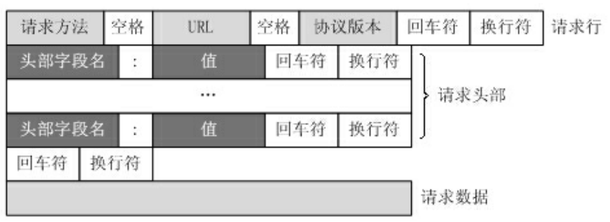

```http
GET / HTTP/1.1
Host: www.baidu.com
User-Agent: Mozilla/5.0 (Windows NT 10.0; Win64; x64; rv:86.0) Gecko/20100101 Firefox/86.0
Accept: text/html,application/xhtml+xml,application/xml;q=0.9,image/webp,/;q=0.8
Accept-Language: zh-CN,zh;q=0.8,zh-TW;q=0.7,zh-HK;q=0.5,en-US;q=0.3,en;q=0.2
Accept-Encoding: gzip, deflate, br
Connection: keep-alive
Cookie: BAIDUID=6729CB682DADC2CF738F533E35162D98:FG=1; 
BIDUPSID=6729CB682DADC2CFE015A8099199557E; PSTM=1614320692; BD_UPN=13314752; 
BDORZ=FFFB88E999055A3F8A630C64834BD6D0; 
__yjs_duid=1_d05d52b14af4a339210722080a668ec21614320694782; BD_HOME=1; 
H_PS_PSSID=33514_33257_33273_31660_33570_26350; 
BA_HECTOR=8h2001alag0lag85nk1g3hcm60q
Upgrade-Insecure-Requests: 1
Cache-Control: max-age=
```

##### 响应报文

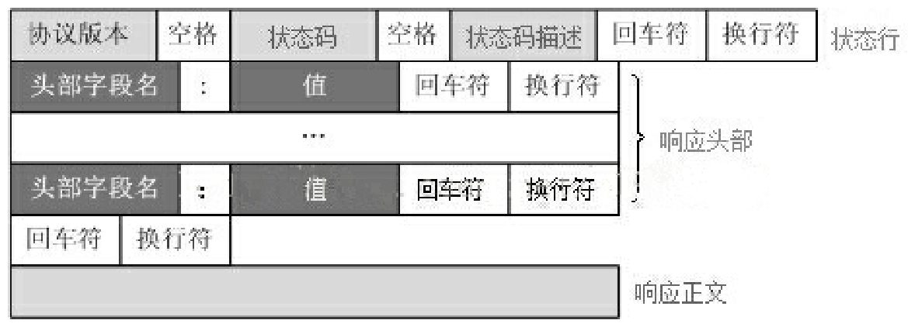

```http
HTTP/1.1 200 OK
Bdpagetype: 1
Bdqid: 0xf3c9743300024ee4
Cache-Control: private
Connection: keep-alive
Content-Encoding: gzip
Content-Type: text/html;charset=utf-8
Date: Fri, 26 Feb 2021 08:44:35 GMT
Expires: Fri, 26 Feb 2021 08:44:35 GMT
Server: BWS/1.1
Set-Cookie: BDSVRTM=13; path=/
Set-Cookie: BD_HOME=1; path=/
Set-Cookie: H_PS_PSSID=33514_33257_33273_31660_33570_26350; path=/; domain=.baidu.com
Strict-Transport-Security: max-age=172800
Traceid: 1614329075128412289017566699583927635684
X-Ua-Compatible: IE=Edge,chrome=1
Transfer-Encoding: chunked
```

### http状态码

所有HTTP响应的第一行都是状态行，依次是当前HTTP版本号，3位数字组成的状态代码，以及描述状态
的短语，彼此由空格分隔。
状态代码的第一个数字代表当前响应的类型：
1xx消息——请求已被服务器接收，继续处理
2xx成功——请求已成功被服务器接收、理解、并接受
3xx重定向——需要后续操作才能完成这一请求
4xx请求错误——请求含有词法错误或者无法被执行
5xx服务器错误——服务器在处理某个正确请求时发生错误
虽然 RFC 2616 中已经推荐了描述状态的短语，例如"200 OK"，"404 Not Found"，但是WEB开发者仍
然能够自行决定采用何种短语，用以显示本地化的状态描述或者自定义信息。


#### 常见状态码

1. 1xx（信息）：表示服务器已接收到请求，需要进一步处理。
   - 100（继续）：表示客户端可以继续发送请求体。
   - 101（切换协议）：表示服务器正在切换协议。
2. 2xx（成功）：表示服务器已成功处理请求。
   - 200（OK）：表示请求已成功处理。
   - 201（已创建）：表示请求已经被创建。
   - 204（无内容）：表示请求已经成功处理，但是响应报文中没有实体的主体部分。
3. 3xx（重定向）：表示需要进行附加操作以完成请求。
   - 301（永久移动）：表示请求资源已被**永久**移动到新的位置。
   - 302（临时移动）：表示请求资源已被**临时**移动到新的位置。
   - 303（查看其他位置）：表示请求资源可在另一个URI处找到。
   - 304（未修改）：表示请求资源未被修改。
   - 307（临时重定向）：表示请求资源临时被移动到新的位置。
4. 4xx（客户端错误）：表示客户端发送的请求有误。
   - 400（错误请求）：表示服务器无法理解请求语法。
   - 401（未授权）：表示请求需要身份验证。
   - 403（禁止）：表示服务器**拒绝**请求访问。
   - 404（未找到）：表示请求资源不存在。
   - 405（方法不允许）：表示**请求方法不被允许**。
   - 408（**请求超时**）：表示客户端没有在服务器预备等待的时间内完成请求。
5. 5xx（服务器错误）：表示服务器在处理请求时发生了错误。
   - 500（服务器内部错误）：表示服务器遇到了意料不到的情况，无法完成请求。
   - 501（未实现）：表示服务器不支持请求的功能。
   - 502 Bad Gateway 
   - 503（服务不可用）：表示服务器**暂时无法处理**请求，通常是由于**过载或维护**等原因造成的


### ISO七层模型及作用概述

物理层： 物理连接、传输介质，光纤 等 ——比特流

数据链路层： 物理网络上的可靠数据传输，MAC地址识别和传输 ——帧

网络层： 数据包在不同网络之间转发，IP地址，路由器跳转 ——包

传输层： 端到端的可靠数据传输功能， TCP UDP ——段

应用层: 为用户提供网络应用程序接口

>  其中 会话层： 控制应用程序之间回话能力，不同软件数据分发不同软件
>
> 表示层： 数据表示，压缩、加密、格式化等，确保双方可以识别
>
> 应用层： 用户接口和网络服务


### Cookie和Session

都是用于在Web应用中管理用户状态的机制，但它们之间有以下几个区别：

1. 存储位置不同：Cookie存储在客户端（浏览器）中，而Session存储在服务器端。
2. 数据安全性不同：Cookie中的数据是**明文**存储在客户端中的，因此可能会被非法获取和篡改；而Session中的数据存储在服务器端，客户端**只保存了一个Session ID，保证了数据的安全性**。
3. 有效期不同：Cookie可以**设置过期时间**，具有**较长**的存储时间，而Session通常在用户关闭浏览器或者长时间不活动后**自动过期**。
4. 数据容量限制不同：Cookie的大小通常受到浏览器的限制，不能超过4KB，而Session的大小通常受到服务器硬件和软件配置的限制。
5. 应用场景不同：Cookie主要用于**客户端与服务器之间的状态管理**，例如记住用户登录状态、记录用户偏好等；而Session主要用于服**务器端的状态管理**，例如保持用户登录状态、跨页面共享数据等。

为什么需要两个一起用：

1. 数据存储量限制，cookie较小，session可以大点
2. 安全性考虑：Cookie中的数据存储在客户端，虽然容**易被非法获取和篡改**，但它可以**提供方便的身份验证和用户体验**；而Session中的数据存储在服务器端，**相对较安全**，适用于 保存敏感信息。


#### sso

单点登录，一种对于许多相互关联，但是又是各自独立的软件系统，提供访问控制的方法。用户登录到一个应用程序，然后自动登录到其他应用程序时，无论用户使用何种平台、技术或域。

常见CAS OAuth2架构可以实现sso


#### token

令牌方式在http的header头中新增字段标识，**在用户登陆完成后，服务端根据用户信息和其他安全因素加密生成一个安全令牌，该令牌中包含了用户的身份信息返回给客户端，在认证鉴权时只需验证令牌的合法性即可，解密即可取到用户信息。**

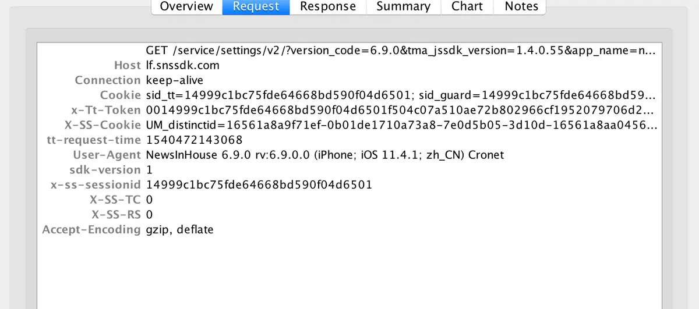

优点： 1. 加密和签名，安全性保障； 2. 扩展性，灵活跨平台； 3. 比session服务端不需要存数据，减压力


## TCP 


TCP包的格式？ 怎么解析的？ 怎么判断完整性？

https://zhangbinalan.gitbooks.io/protocol/content/tcpan_quan_wen_ti.html

源端口号 目标端口号 seq序列号 ack确认好 首部长度，标志位，窗口大小

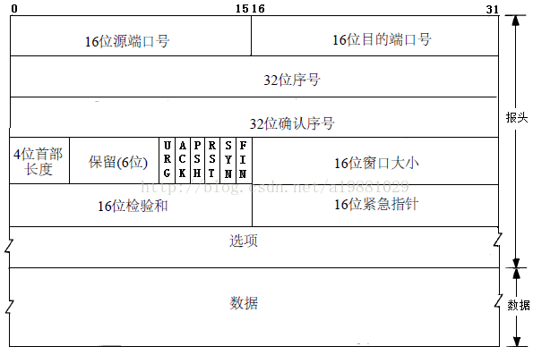


TCP粘包问题


## OS

熟悉Linux系统常用命令及相关工具使用：了解的不够多，怕有坑


### ！！！进程、线程、协程的关系和区别？

先答：进程是操作系统资源分配的基本单元，线程是CPU调度的基本单位。然后围绕资源分配（堆栈空间，寄存器，虚拟地址）展开，共享资源 -> 通信，切换开销等。

#### 协程和线程的区别?

最主要的区别是**协程不被内核调度**，而是由用户态的程序调度，它是在**用户态下实现**的。一个线程可以跑多个协程，在线程切换频繁的场景(IO密集型计算)中，**使用协程可以减少切换开销**。因为线程的开销是固定的，在线程切换频繁的场景，想要减少切换开销，唯一的办法就是减少线程数量，但是程序又需要多任务并发执行的逻辑，这就抽象出协程的概念，一个线程里跑多个协程，由自己调度，通过减少线程的总数量来减少线程切换开销。

（别说到并发量，应该说并行!!!

用户态和内核态的区别：


#### 场景：

多线程：**IO密集型/或者需要频繁进行通信多任务**，IO密集型因为经常有IO中断，任务会被阻塞，这时候最好就把阻塞的任务切走，因为多线程的切换开销小一点，所以用多线程。

​		缺陷：稳定性较差，隔离性较差，需要用锁之类。

多进程：**计算密集型/对资源的管理和保护要求高**，计算密集型就是任务主要是需要CPU参与计算，而IO中断会少一点。这时候就用多进程，因为很少发生中断出现阻塞，即使进程开销大一点，受的影响也会相对较小，同时多进程各个进程的地址空间都是独立的，隔离性更好，程序也相对稳定。

​		缺陷：多个进程之间通信成本高，切换开销大。

多协程：**超多任务量。** std::coroutine C++20

​		缺陷：一般没必要使用。（**在没有达到CPU核心数的任务量时，用户态的开销是多余的**）


> > 多线程请求返回是无序的，那个线程有数据返回就处理那个线程，而协程返回的数据是有序的。
>
> 缺陷：单线程执行，处理密集CPU和[本地磁盘](https://www.zhihu.com/search?q=本地磁盘&search_source=Entity&hybrid_search_source=Entity&hybrid_search_extra={"sourceType"%3A"answer"%2C"sourceId"%3A2868711843})IO的时候，性能较低。处理网络I/O性能还是比较高。


semaphore

### select poll epoll区别

都是IO多路复用技术，都是同步方式，同时监视多个描述符，一旦描述符就绪（读就绪或写就绪）通知程序进行相应读写操作。

select：把**已经连接的Socket**放到一个**文件描述符集合**中，用**select函数**把整个**集合**拷贝到**内核**，内核检查网络事件的产生，**遍历fd集合**，如果有事件产生把Socket标记为可读或可写，然后把整个集合拷贝到**用户态**，用户态还要**遍历**找到可读或可写的Socket操作。 用固定长度的BitsMAp（位图表）数组表示，最大1024

poll也是集合的方式的，但是用的是链表实现，没有最大连接数限制。

这两种方式都是用线性结构存储，需要两次拷贝两次遍历，O(N)复杂度

epoll就不采用线性集合的方式

1. 在内核中用**红黑树**跟踪进程待检测的fd，sockt通过epoll_ctl()函数加入内核的红黑树；
2. 使用**事件驱动机制**，内核维护**一个链表记录就绪事件**，用户调用epoll_wait()函数只会返回有事件发送的文件描述符的个数，不需要遍历。复杂度就变成O(1)。

epoll方式在Sockt数量多的时候效率也不会大幅度降低，上限时系统定义的进程的最大fd数

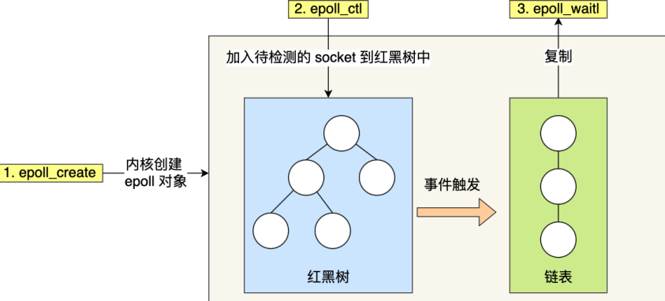

```cpp
第一步，创建一个 epoll 句柄
int epoll_create(int size);
第二步，向内核添加、修改或删除要监控的文件描述符。
int epoll_ctl(
  int epfd, int op, int fd, struct epoll_event *event);
第三步，类似发起了 select() 调用
int epoll_wait(
  int epfd, struct epoll_event *events, int max events, int timeout);

```


### epoll线程安全吗

安全；Epoll内部的就绪队列用的自旋锁，红黑树用的互斥锁。


#### 已知一个进程名，如何杀掉这个进程

ps -ef | grep "进程名"， kill -15 进程号正常退出，如果无法正常退出就用 kill -9 进程号


### Linux5种IO模型

因为有内核态和用户态区分，用户程序要做一些IO比如访问磁盘、远程API等需要用操作系统的系统调用。用户程序想内核发起系统调用完成对IO的间接访问是一次**IO操作**

主要包括： 1. IO系统调用 2. 执行阶段：数据准备 + 数据拷贝

分为五种模式： 

BIO read的默认状态 ： 阻塞等待浪费性能

NIO 非阻塞同步 ： 频繁轮询和CPU切换，开销大； 最后数据拷贝过程需要等待

IO multiplexing IO多路复用 ： 一次多个减少系统调用次数，但第一阶段数据准备阶段还是阻塞的,因为epoll_wait没有设置超时默认是阻塞的

signal-driven 信号驱动 ： 两阶段，第一阶段异步回调函数，第二阶段同步 数据拷贝是阻塞的

AIO asynchronous 异步 ： 数据准备和拷贝都是异步的aio_read


### Actor和Reactor模式区别

Actor是一种基于消息传递的并发模型，它将系统中的每个对象都视为一个独立的Actor，对象之间通过消息进行通信和协作。Actor模型具有良好的并发性和可扩展性，可以轻松地实现分布式应用程序。在Actor模型中，每个Actor都有自己的状态和行为，并通过接收和发送消息来与其他Actor进行交互。

Reactor是一种基于事件驱动的并发模型，它将系统中的每个I/O操作都视为一个事件，当某个I/O事件发生时，Reactor模型会通知相应的处理程序来处理该事件。Reactor模式具有高效的I/O处理能力和良好的可扩展性，例如在Web服务器中常用的Nginx就是采用了Reactor模式来实现高并发。


### 常见的多线程模型


一个请求创建一个线程

线程池+阻塞IO

非阻塞IO+IO多路复用

one loop per thread 

Leader / Follower等高级模式


### 虚拟技术

时分复用： 多线程和多进程，每次执行一个小时间片来快速切换

空分复用：虚拟地址空间，物理内存抽象位地址空间， 地址空间的页不需要全部在物理内存中，当发送缺页中断时，置换该页刀片内存中 


#### 虚拟地址

1. **维度：**

虚拟内存是进程维度的，为进程提供一种对内存的抽象，使得每个进程仿佛拥有独立的、连续的地址空间，而不受实际物理内存大小的限制。
CPU维度没有虚拟内存，通过MMU地址转换、页面置换 等

2. **作用：**

内存隔离，每个进程独立的页表，独立的访问内存空间，互相不干扰。

虚拟内存，运行进程使用比内存大的空间，局部性原理，一部写到磁盘中，用到再写入。

内存保护： 操作系统控制内存权限， 防止非法的内存访问

地址重定位: 提供了程序加载到任意内存位置的能力


虚拟地址转换：1. 进程首先用虚拟地址在TLB中查找对应的物理页号; 2. 如果没有找到就用页表转换，CPU中的 **MMU** 会自动利用进程中页表进行转换（如如果不在物理内存，触发缺页中断，页表转换）。虚拟地址分为页号和偏移量，多级页表查找数据所在页。3. 判断该页有效性和访问权限，如果通过就用页号和偏移量计算物理地址


## 数据库

### DDL 和DML

1. DDL Data Definition Language，数据定义语言，是用于定义和管理数据库结构的一组SQL命令，CREATE ALTER DROP TRUNCATE

2. DML（Data Manipulation Language，数据操作语言）是用于操作数据库中数据的一组SQL命令，SELECT INSERT UPDATE DELETE


### Mysql select和update底层处理过程


mysql内部构造结构图如下

#### 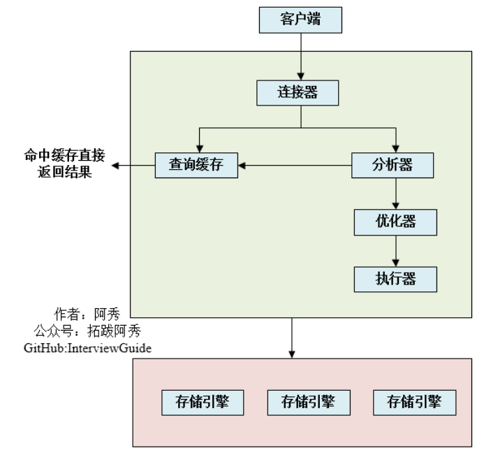


#### selct过程

客户端请求发过来，**连接器**验证身份权限，**查询缓存**判断缓存有没有命中，如果没有命中**分析器**进行词法分析语法分析语义分析，还负责查询语句改写优化，然后**优化器**`选择最佳的执行方案`（选择索引），**执行器**`判断用户权限`后去用**引擎提供的接口**，引擎层获取数据返回。

- 词法分析：这个步                                                                                                                                                                                                                                                                                                                                                                                                                                                                                                                                                                                                                                                                                                                                                                                                                                                                                                                                                                                                                                                                                                                                                                                                                                                                                                                                                                                                                                                                                                                                                                                                                                                                                                                                                                                                                                                                                                                                                                                                                                                                                                                                                                                                                                                                                                                                                                                                                                                                                                                                                                                                                                         骤是将查询语句分割成单词和符号，并生成**语法树**。词法分析是对SQL语句进行最基本的分析，它会将SQL语句中的每个字符按照一定的规则进行分类，如关键字、标识符、运算符、常量等，并将它们组合成一个个有意义的单元，称为词法单元或者记号。然后，它会根据SQL语言的文法规则，将这些词法单元按照一定的结构组织起来，形成一棵抽象的语法树。

- 语法分析：这个步骤是检查语法树是否符合MySQL的**语法规则**，如果不符合则报错，否则继续解析。语法分析是对SQL语句进行更深入的分析，它会对词法分析生成的语法树进行进一步的检查和验证，确保它没有违反MySQL支持的SQL语言的语法规则。如果发现有任何语法错误，如括号不匹配、关键字拼写错误等，则会立即报错，并终止解析过程。如果没有发现任何语法错误，则会继续进行语义分析。

- 语义分析：这个步骤是**检查语法树中的对象是否存在**，如表名、列名等，如果不存在则报错，否则生成解析树。语义分析是对SQL语句进行最终的分析，它会对语法分析生成的语法树进行进一步的检查和补充，确保它没有违反MySQL支持的SQL语言的语义规则。如果发现有任何语义错误，如引用了不存在的表名或列名、使用了不兼容的数据类型等，则会立即报错，并终止解析过程。如果没有发现任何语义错误，则会在语法树的基础上添加一些额外的信息，如表名和列名对应的ID、数据类型等，并生成一个完整的解析树。


#### MySQL 8.0 删除了缓存了查询缓存？

https://blog.csdn.net/wtopps/article/details/127733437

因为在我们大多数的场景中，很少情况下会出现只读不写的情况，更多的情况则是读多写少或读写均衡，这使得`Query Cache`很难对我们的实际业务产生正向的影响

优点：缓存在大量读的情况下可以提升查询效率；

缺点： 1.缓存是字节级别的，**SQL语句**发生一点变化就无法命中；2. 表中**数据修改**都会导致缓存失效，只有读远大于写才提高效率，甚至读写均衡也很难发挥作用； 3. **维护整个缓存区需要开销**，相较下正向影响不大。

#### update过程


#### 引擎层还要具体讲一下

如果是InnoDB有redolog，MyISAM没有crash-safe的能力

执行器向引擎层 拿 B+树搜索这一行记录，如果BufferPool中没有该行记录所在页，需要缺页中断先从磁盘读取到 BufferPool。

**执行器**把这行数据修改后，需要重新写回磁盘。过程是**引擎**把新数据放到内存中，更新操作写到redo log中，**执行器**写入该操作的binlog（所以是server层），binlog写入磁盘，事务提交。

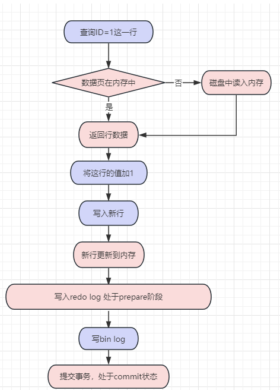


### 关系型非关系型

关系型就是**行列表格形式**存储， ； 非关系型NOSQL是使用适合数据类型的存储模型（**数据集**）

一般选用的方式：事务处理和数据一致性，对于复杂查询、持久存储选前者（金融、电商）； 高并发、可拓展、处理大数据高吞吐（物联网、社交网）

扩展方式不同： 关系型访问量上来了很难拓展负载 ；非关系型是分布式的，可以增加节点资源来分担负载

事务支持： 关系型支持负载的高事务性 ； 非关系型只是最终一致性

查询语句： 关系型用SQL语句； 非关系型用自己的查询语句或则API，比较灵活


### Mysql的引擎哪些？ 说下区别，什么时候用？

InnoDB MyISAM Memory

InnoDB ：大多数，事务要求

1. 支持**事务**，
2. 支持**表级锁、行级锁**
3. 必须有**主键**（默认隐藏列主键分配）、
4. 支持**外键**、
5. 因为聚簇索引所以**存储文件**包括frm（表文件）、ibd（数据文件）
6. 因为事务存在，所以行数不一定、支持行锁、

MyISAM ： 读密集型（数据仓和报表）

1. 不支持事务、外键、行锁（只支持表级锁），
2. 不一定有主键
3. 因为不是聚簇索引，需要回表拿数据 都是二级索引， 所以**存储文件** 包括frm（表文件）、myd(数据文件)、myi（索引文件）

Memory

表存在内存中：存一些数据小的临时表

#### InnoDB和MyISAM二者使用场景/如何选择？

- 支持事务的话只能选InnoDB
- 如果系统崩溃导致数据难以恢复，且成本高，不要选择MyISAM。因为InnoDB有事务的存在，必须支持undo redo等操作，具有故障恢复的能力
- 如果大部分表操作都是查询，选择MyISAM，有写又有读选InnoDB。因为写多了就可能冲突，得选支持事务的。


### sql慢了怎么查？-重点问题

1 先去打开mysql的**慢查询日志**，看是哪个耗时最长；

2 用explain去看sql有没有命中索引，看耗时最长的那个对应的表，有没有索引，索引是否合理，并检查自己的语句是否合理，有没有符合最左匹配

- 重点关注哪些列？
- type：本次查询的方式，如null，index，range；
- key：选择的哪个索引；
- rows：扫描多少记录，越小越好

3 看单表是否数据量过大，单表数据过大，有会导致查询瓶颈，这个情况就应该切分表

4 网络原因

5 如果是写表的话，也有可能是bufferpool刷脏页到磁盘比较慢

#### explain可以看什么

- 表的读取顺序
- 哪些索引被实际使用到
- 数据读取操作的操作类型 **system > const > eq_ref > ref > range > index > ALL**
- 表有大约有多少行被优化器查询

#### 慢查询具体怎么优化？

1. 选择合适的索引，看WHERE子句有没有被索引覆盖，索引是否需要调整。避免全表扫描
2. 优化查询语句，避免不必要的外连接，用合适类型的连接（LEFT JOIN 、INNER JOIN等）;避免使用Select *、子查询、OR、 不等于
3. 对于频繁查询的表，可以考虑分表，将数据分散存储 （2000W条数据之后尽量分表）
4. 优化数据库配置，包括缓冲区大小，并发连接数、查询缓存等
5. 缓存技术，对于相对稳定查询的结果，考虑用缓存技术，减少对数据库的访问。


### B树和B+树区别，为什么用B+树索引

1. B+树数据只放在叶子结点，B树数据可以放在中间节点：
2. B+树支持范围查询，因为数据都存在叶子结点，叶子结点之间有前后指针
3. B+树查询效率比较稳定，因为B+树每次都要走到最后一层，B树时快时慢，程序员不好掌控。比如说，SQL语句慢了，不知道是B树的结构除了问题还是SQL语句没写好，或者索引没建好。（这里准备一下SQL语句慢的原因、定位、改善问题）
4. B+树的并发更好一点，B+节点数据的增删时，会引起分裂或者合并，对于B+树来说，只需要考虑向上递归分裂或者合并。而B树，还可能会影响向下的节点，这种模式对整棵树的结构影响较大，不利于并发。因为在变更树结构的时候，不支持其他数据的查询


### B+树 VS 跳表：

B+树是多叉树，所以层数比较低，Mysql中一个B+树的节点可以放16k的数据，三层左右就可以存储2kw条数据。而跳表的话，如果想要达到二分的效果，2的24次方大概等于2kw，需要24层，那么查一条数据需要24次磁盘IO，所以对于数据库这种数据基本**都存在磁盘上的场景是不可以接受的**。但跳表的插入性能会好一些，没有b+树维持平衡的开销，且**并发读写性能会好一些**。


### 隔离级别的实现

未提交读，已提交读，可重复读，可串行化

不同的锁用法和协议实现四种隔离级别。

MVCC是实现读写可以并发执行。

### RC

直接返回记录的最新值

执行完**写操作后立刻释放锁**，就会导致脏读。而其他级别是事务提交之后放锁。

#### READ COMMITTED 和 REPEATABLE READ 用MVCC实现

> RC 读ReadView 最新版本，RR 用ReadView 判断和 处理该条数据的事务trx_id 差别。

用MVCC判断版本链中哪个版本是当前事务可见的。

ReadView，生成的时机是事务创建之初，（RC是**事务每次读数据Select都生产一个**，RR是**事务第一次读数据Select才初始生成一个,之后再这个事务中都复用**）：

m_ids ：表示在生成 ReadView 时当前系统中活跃的读写事务的 事务id 列表。
min_trx_id ：表示在生成 ReadView 时当前系统中**活跃**的读写事务中**最小的 事务id** ，也就是 m_ids 中的最小值。
max_trx_id ：表示生成 ReadView 时系统中应该分配给下一个事务的 id 值。

creator_trx_id ：表示生成该 ReadView 的事务的 事务id 。

> 活跃指的是事务开始还没有结束,还在进行中

每条数据记录包括：

trx_id ：每次一个事务对某条聚簇索引记录进行改动时，都会把该事务的 事务id 赋值给 trx_id 隐藏列。
roll_pointer ：每次对某条聚簇索引记录进行改动时，都会把旧的版本写入到 undo日志 中，然后这个隐藏
列就相当于一个指针，可以通过它来找到该记录修改前的信息

`判断过程：`

如果被访问版本的 trx_id 属性值**小于** ReadView 中的 min_trx_id 值，表明生成该版本的事务在当前事务生成 ReadView 前已经提交，所以该版本**可以**被当前事务访问。

如果被访问版本的 trx_id 属性值**大于** ReadView 中的 max_trx_id 值，表明生成该版本的事务在当前事务生成 ReadView 后才开启，所以该版本不可以被当前事务访问。

如果被访问版本的 trx_id 属性值在 ReadView 的 min_trx_id 和 max_trx_id 之间，那就需要判断一下**trx_id 属性值是不是在 m_ids 列表中，如果在**，说明创建 ReadView 时生成该版本的事务还是活跃的，该版本不可以被访问；如果不在，说明创建 ReadView 时生成该版本的事务已经被提交，该版本可以被访问。


#### REPEATABLE READ

在行锁的基础上，加上间隙锁，形成Next-Key锁。在所有遍历过的(不管是否匹配条件)索引行上以及之间的区域上，都加上锁，阻塞其他事务在遍历范围内进行写操作，从而避免了幻读。


#### 串行化

自动将所有普通select转化为select … lock in share mode执行，即针对同一数据的所有读写都变成互斥的了，可靠性大大提高，并发性大大降低

用锁，并发的考虑用二阶段锁

逻辑：普通加锁没有意义，相当于串行执行 -> 提出普通二阶段锁 -> 级联回滚的问题 -> 严格二阶段锁 -> 死锁问题 -> 死锁检测和死锁预防


#### 一个事务读，另一个事务改动操作，有两种方式：

1. 读操作用MVCC控制，写用锁；

2. 如果业务特殊，读和写两个都用锁也可以但是性能低一些；

> MySQL不同于SQK标准，MySQL在RR隔离级别已经解决了select的幻读问题


读过程中记录用的锁，不一定是共享锁

一般读取数据允许其他同时读，可以用共享锁， SELECT ... LOCK IN SHARE MODE，允许其他事务读这些记录；

也可以用排他锁锁定，SELECT ... FOR UPDATE;


#### 互联网公司一般用什么隔离级别 

https://zhuanlan.zhihu.com/p/59061106?utm_id=0

Mysql默认使用RR，为了满足高并发的需求，会改为用RC 

1. 首先，RC 在加锁的过程中，是不需要添加Gap Lock和 Next-Key Lock 的，只对要修改的记录添加行级锁就行了。这就使得并发度要比 RR 高很多。

2. *在RR隔离级别下，条件列未命中索引会锁表！而在RC隔离级别下，只锁行* 此时执行语句（Mysql优化了对不满足条件的记录放锁）

3. 因为 RC 还支持"半一致读"，可以大大的减少了更新语句时行锁的冲突；对于不满足更新条件的记录，可以提前释放锁，提升并发度。

### Mysql的RR有没有解决幻读问题

mysql的"可重复读"隔离级别解决了select的幻读问题，没有解决update、insert、delete的幻读问题；

事务A在执行过程中，事务B插入了一条数据并结束，然后事务A用普通的**select**会用**快照读**不会产生幻读，而事务A用**select for update或者update、insert、delete**等会用**当前读**，就会产生幻读问题

如果serializable级别，直接用**锁住写请求的记录**，不允许其他事务对该记录处理


### 锁介绍下

按照粒度分：全局锁，表锁（表锁一般MyISAM用，讲下只有InoDB有意向锁），行锁（说下只有InoDB有）；然后其中介绍下分为共享锁和排他锁。

并发控制的模式分 乐观锁（小概率竞争情况，所以修改后再比较版本号，一般用户实现）、悲观锁（大概率竞争，所以先加锁再修改）

再所说下间隙锁、临间锁

#### 意向锁：intention

因为加表锁的时候要保证没有行锁，否则可能死锁阻塞等情况，为了**加表级锁的时候**，**快速判断**表中的**记录是否被锁上**，避免遍历查看。

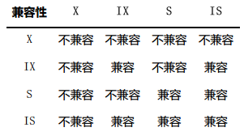

当时事务对某条记录加S锁，需要再表级别加一个IS锁

当时事务对某条记录加X锁，需要再表级别加一个IX锁

#### 间隙锁：gap

只是为了防止**幻读**，防止插入幻影记录，防止**某一段区间**内插入新纪录，以下就是(20, +∞) 

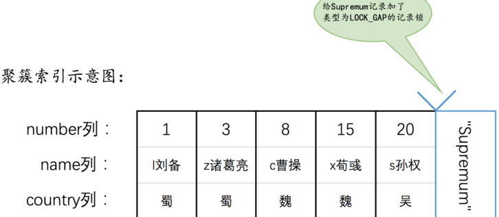

#### 临间锁 Next-Key Locks锁

既想锁住某条记录，又想阻止其他事务在该记录前边的 间隙 插入新记录


### 三大范式


 第一范式（1NF）：原子性。 字段不可再分,否则就不是关系数据库; 比如联系电话可以分为座机和手机

 第二范式（2NF）：有主键，非主键字段完全依赖主键，不能部分依赖主键；比如电话只依赖供销社，价格和重量只依赖商品，就应该分表

 第三范式（3NF）：非主键字段不能相互依赖。每列都与主键有直接关系，不存在传递依赖。职位以来老师，而不是主键课程ID，就应该分表


数据库设计有些反范式设计，增加冗余，减少join


### InnoDB的ACID

#### 原子性

undo log,失败后事务回滚


#### 隔离性

MVCC四种隔离级别 和 锁


#### 一致性

关系型数据库的一致性说的是操作过程张始终满足定义的约束、规则和完整性要求。比如账户余额不能是负数

raft的一致是保证各个节点的数据一致

如何保证一致性：

从数据库层面，数据库通过原子性、隔离性、持久性来保证一致性。也就是说ACID四大特性之中，C(一致性)是目的，A(原子性)、I(隔离性)、D(持久性)是手段，是为了保证一致性，数据库提供的手段。数据库必须要实现AID三大特性，才有可能实现一致性。例如，原子性无法保证，显然一致性也无法保证。
从应用层面，通过代码判断数据库数据是否有效，然后决定回滚还是提交数据

#### 持久性

redo log,宕机后redo log把内容回复到数据库，再根据undo log和bin log决定回滚还是提交数据


### log

#### undo log 原子

撤销回退到日志， 事务开始前MySQL记录当前数据到undolog日志，当事务回滚或者奔溃，就用它来回滚

1. 原子性
2. 提供MVCC的基础，当数据行被其他事务锁定的时候，可以用undo log分析出以前的数据版本，试下快照读


#### redo log 持久 隔离

事务提交了，数据修改了作为**脏页**只存**在Buffer Pool**中，flush链等待写入磁盘。如果此时机器故障了内存情况，就不能保证事务有效性（持久性的保证）。单纯的在事务提交前刷盘可以保证持久性，但是整页刷慢，随机IO慢。所以有redo log。redo log记录了修改而不是整页，也有缓存叫做RedoLogBuffer，设置三种状态0 1 2来设置RedoLogBuffer中redolog什么时候写到磁盘中。这样故障发生内存数据丢失后，InnoDB重放redo，恢复到崩溃前的状态。

**好处：** 1. redo log 占用的空间小 2. redo log 是**顺序写入**磁盘的（按顺序写入log）

##### innodb_flush_log_at_trx_commit

可以设置： 

0 延迟写： 不交，等待后台线程异步写，一般是1s刷一次； 可以加快事务处理速度，但是这样事务提交后如果后台没有刷新就挂了，可能会导致事务失效

1 实时写，实时刷： 事务提交时立即磁盘同步redo log，不会丢数据但是性能差

2 实时写，延迟刷： 写到**操作系统的缓冲区**，只要操作系统没挂就能保证事务的持久性

##### log buffer中redo log刷盘时机：

1. log buffer空间不足 
2. 事务提交： 可以不提交buffer pool页面，但是为了持久性不需要提交redo log
3. 后台线程每秒都刷
4. 开关服务器 6.checkpoint 


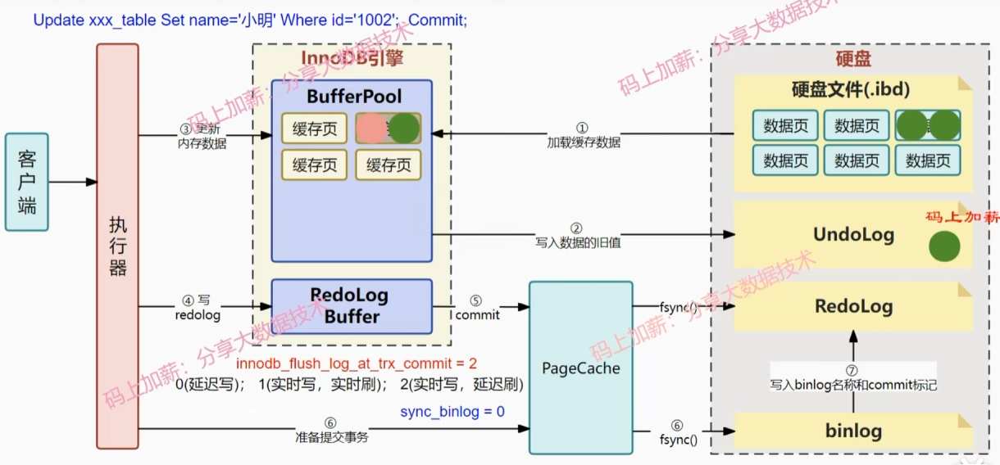


#### binlog 

binlog日志的作用：

1、master的binlog日志传给follower，完成主从复制

2、数据库恢复，那和redo日志有什么区别吗

- binlog是逻辑日志 **会记录表所有更改操作**，是具体的sql语句，包括更新删除数据，更改表结构等等，**主要用于人工恢复数据**，而 redo log 是物理日志，**记录了“某个数据页上做了什么修改”** 对于我们是不可见的，它是 InnoDB 用于保证crash-safe 能力的，也就是在事务提交后MySQL崩溃的话，可以保证事务的持久性，即事务提交后其更改是永久性的。一句话概括：binlog 是用作人工恢复数据，redolog 是 MySQL 自己使用，用于保证在数据库崩溃时的事务持久性。
- redo log 是 InnoDB 引擎特有的，binlog 是 MySQL 的 **Server 层实现的,所有引擎都可以使用**。
- redo log 是固定空间循环写（用完了覆盖之前的内容），binlog是可以一致追加的。


### 主从模式

需要提高读取**性能**、增强系统的**容错**能力和数据安全性的应用场景的时候会用到Mysql的主从模式，一般情况用单机就绪了。

其实就是分布式架构，**主写从读**，

#### **如何保证数据一致性？ 同步流程是什么**？

用binlog作为操作内容的日志复制给其他slave从节点。

涉及到到主节点一个线程和从节点有两个线程： 

1. 主  写SQL后会加binlog，然后binlog dump线程把binlog更新部分同步给从节点。

2. 从  一个I/0 thread收到主变化的bin log部分，有变化就保存到自己的Relay log 

3. 从  一个 SQL thread定时检查Relay log是否变化，变化那么就更新数据；

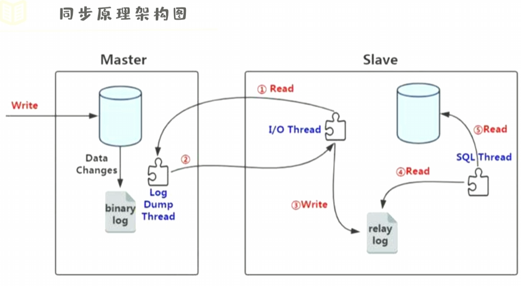

#### 同步延迟咋办

半同步复制是主从复制的一种扩展，它确保至少一个从节点确认已成功接收和写入主节点的二进制日志数据

网络优化、数据库性能优化、分库分表等 还有些参数调整记不过来。。。


### 索引

#### 常见索引结构：

 B+ B Hash。

1. Mysql中InnoDB和MyISAM都是B+； 2. Memory用的是Hash

#### 写一下B+树索引结构示例：

注意根节点是7，不然找不了

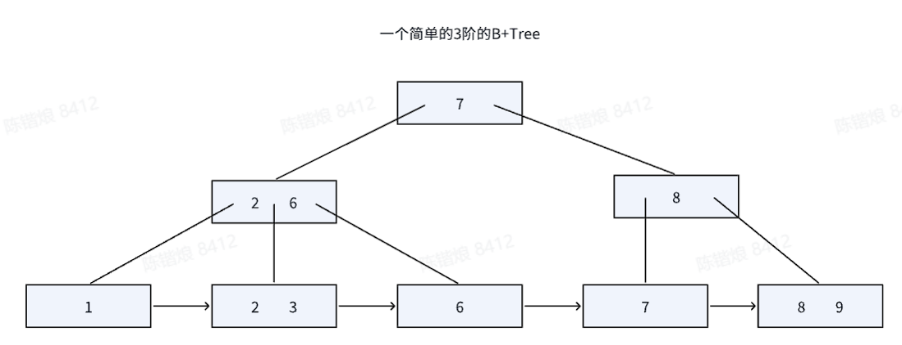

#### 聚簇索引和非聚簇索引：

**聚簇**：

索引结构和数据一起存放在叶子结点，不用回表，效率高， 
InnoDB在建表的时候会自动选择列作为聚簇索引(主键 其他nonull 自增键)

优缺点：

 查询速度快；排序和范围查找很快（顺序IO）

 依赖有序； 更新代价大

**非聚簇索引：** 分开存放，叶子结点是**数据**或者**主键值（二级索引）**

二级索引包括联合索引、前缀索引等都是非聚簇索引；MyISAM默认是非聚簇索引

优缺点：

 更新代价小，叶子节点小；
 可能需要回表，查询效率低；

#### 索引失效场景

1. 最左匹配原则：使用联合索引时，MySQL 会根据联合索引中的字段顺序，**从左到右依次到查询条件中去匹配**，如果查询条件中存在与联合索引中最左侧字段相匹配的字段，则就会使用该字段过滤一批数据，直至联合索引中全部字段匹配完成，**或者在执行过程中遇到范围查询（如** `>`、`<`）才会停止匹配。对 **`>=`**、`<=`、`BETWEEN`、`like 前缀匹配`的范围查询，并**不会**停止匹配。

> 比如，创建了一个 (a, b, c) 联合索引，如果查询条件是以下这几种，就可以利用联合索引：
>
> - where a=1；
> - where a=1 and b=2 and c=3；
> - where b=2 and a=1；因为有查询优化器，所以 a 字段在 **where 子句的顺序**并不重要。
>
> 但是，如果查询条件是以下这几种，因为不符合最左匹配原则，所以就无法匹配上联合索引，联合索引就会失效:
>
> - where b=2；
> - where c=3；
> - where b=2 and c=3；
>
> （覆盖索引除外）

上面这些查询条件之所以会失效，是因为(a, b, c) 联合索引，是先按 a 排序，在 a 相同的情况再按 b 排序，在 b 相同的情况再按 c 排序。所以，**b 和 c 是全局无序，局部相对有序的**，这样在没有遵循最左匹配原则的情况下，是无法利用到索引的。

但是，8.0之后有索引跳跃扫描，不一定遵循最左匹配原则


2. 模糊查找：查询条件中使用了like关键字，并且模糊匹配的字符串**以%开头**，也会导致索引失效。

   由于B+Tree的特性，以**%开头**的模糊匹配无法确定索引列的起始位置，所以无法利用索引进行快速查找。**%放后面**就可以利用前缀匹配


3. 索引列使用函数/运算：如果查询条件中对索引列进行了**函数调用或运算**，那么也会导致索引失效。这是因为函数或运算会改**变索引列的值**，使得原来的索引无法使用。在实际运用中，可以尝试更换写法或者创建函数索引

>MySQL 8.0.13 版本开始支持函数索引`Functional Index`，在此之前，只能使用表的字段或者字段前缀来创建索引，从 8.0.13 版本开始，可以**使用函数或者表达式的值来创建索引**，这些函数或者表达式的值并不直接存储在表中。
>
>创建函数索引的语法跟普通索引差别并不大，唯一需要注意的是函数索引对应的表达式需要用（）括起来。
>
>- 函数值
>
>```SQL
>alter table user add index idx_func((date(birth)));
>```
>
>- 多列组合表达式
>
>```SQL
>alter table user add index idx_func((col1 + col2));
>```
>
>- 组合索引
>
>```SQL
>alter table user add index idx_func(col1, (date(birth)));
>```
>
>函数索引还可以跟其他选项，如unique 和 asc、desc排序一起使用
>
>```SQL
>alter table user add unique index idx_func(col1, (date(col1)) desc);
>```
>
>MySQL 8.0 函数索引实际上是基于5.7版本引入的**虚拟列****`virtual generated columns`** 来实现的。在创建函数索引时，MySQL会自动在表上创建一个隐藏的虚拟列，然后在虚拟列上创建索引。


4. OR查询: 如果查询条件中使用了OR关键字，并且**OR两边的条件涉及到不同的索引列**，或者存在无索引的列，也会导致索引失效。

   因为MySQL无法同时使用多个索引来进行查询优化，这种情况下会选择全表


5. 类型隐式转换

   查询条件中的数据类型与索引字段的数据类型不一致，导致隐式数据类型转换，引起索引失效。

   例如，存在字段  ``batch_no` varchar(20)` 

   > **Case 1**
   >
   > explain select * from cpm_accounting_entries where batch_no = '20230412000003'
   >
   > 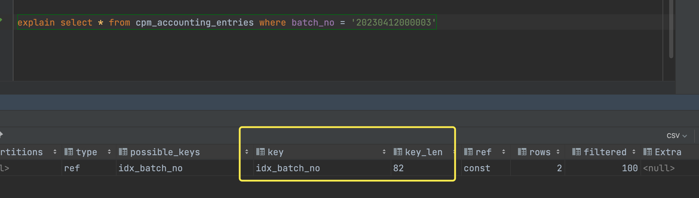
   >
   > **Case 2**
   >
   > explain select * from cpm_accounting_entries where batch_no = 20230412000003
   >
   > 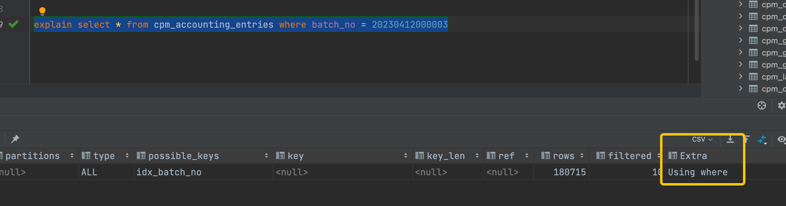
   >
   > 
   >
   > 


6. 不等于查询

   不等于(`!= `或者`<>`或者`not in`)导致索引失效。

   不等于索引失效的原因主要是数据分布不均匀，导致MySQL优化器无法正确选择索引，这种情况下，MySQL可能会选择使用全表扫描。

   >  已知存在索引 `KEY `idx_batch_no` (`batch_no`) , KEY `idx_status` (`status`)`
   >
   > **Case 1** explain select * from cpm_accounting_entries where status!='1';
   >
   > 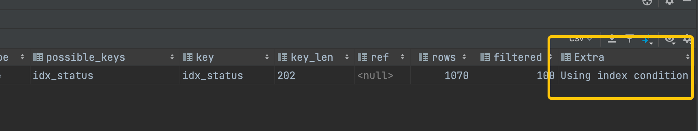
   >
   > **Case 2**
   >
   > explain select * from cpm_accounting_entries where batch_no!='20230412000003';
   >
   > 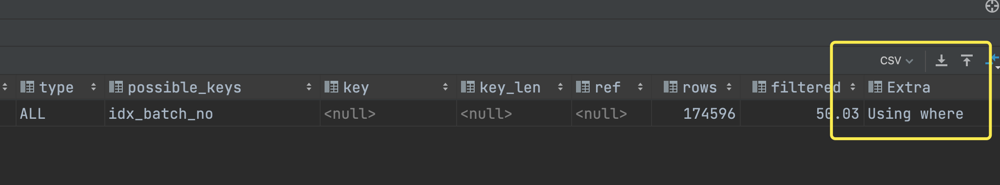

   


## 设计模式


工厂模式


单例模式


观察者模式


1. 单例模式（Singleton Pattern）：确保一个类只有一个实例，并提供全局访问点。
2. 工厂模式（Factory Pattern）：通过工厂类创建对象，隐藏对象的创建逻辑，提供统一的接口。
3. 抽象工厂模式（Abstract Factory Pattern）：提供一个创建一系列相关或相互依赖对象的接口，而无需指定具体类。这样就能对一个产品族，产生多个具体的实现
4. 建造者模式（Builder Pattern）：将一个复杂对象的构建过程与其表示分离，使得同样的构建过程可以创建不同的表示。 首先创建一个具体的建造者对象，然后将其传递给指挥者对象，由指挥者对象控制建造过程的执行。最后，通过调用建造者对象的 `getResult()` 方法，可以获取到创建的产品对象。
5. 原型模式（Prototype Pattern）：通过复制现有对象来创建新的对象，避免了对象的耦合关系。
6. 适配器模式（Adapter Pattern）：将一个类的接口转换为客户端所期望的另一个接口，解决不兼容接口之间的问题。
7. 装饰器模式（Decorator Pattern）：动态地给对象添加额外的职责，而无需修改原始类的代码。
8. 观察者模式（Observer Pattern）：定义了对象之间的一对多依赖关系，当一个对象的状态发生变化时，其所有依赖者都会自动收到通知并进行相应的处理。
9. 策略模式（Strategy Pattern）：定义一系列算法，将每个算法封装起来，并使它们可以互相替换，使得算法可以独立于使用它的客户端而变化。
10. 迭代器模式（Iterator Pattern）：提供一种顺序访问聚合对象中各个元素的方法，而无需暴露其内部表示。

## 场景题


### 1. 求两个大文件交集

内存有限考虑，可以用**外部排序算法**先对两个文件的数排序，然后归并求交，但是需要多轮磁盘IO，数据大的时候比较低效。比较高效的方法可以用**布隆过滤器**，设置**哈希函数**，第一个文件计算后置1，第二个文件查看数据是不是过滤器中就行。概率模型，因为可能哈希冲突所以可能不存在，但是能排除掉一定不存在的情况。好处是只需要两次遍历，而且内存较小（只存位，不用存原数据）


### 2.两个大文件，怎么去重

1. 读取第一个文件，并将其中的数字存储到一个哈希表中（或者使用布隆过滤器）。
2. 读取第二个文件，对于每个数字，检查其是否存在于哈希表中（或者使用布隆过滤器进行检测）。
3. 如果一个数字在哈希表中存在，表示该数字在第一个文件中出现过，因此可以跳过该数字。
4. 否则，表示该数字在第一个文件中没有出现过，可以将其保存到结果文件中或者进行其他处理。

外部排序

如果两个文件都无法同时加载到内存中，可以考虑使用外部排序算法来解决大文件去重的问题。下面是一种基于外部排序的方法：

1. 读取第一个文件，并将其中的数字按照规定的块大小划分成多个小块（每个小块可以装载到内存中）。
2. 对每个小块进行内部排序，可以使用快速排序、归并排序等排序算法。将排序后的小块写入临时文件中。
3. 重复步骤 1 和步骤 2，直到第一个文件的所有数字都被处理完毕，并得到多个有序的临时文件。
4. 读取第二个文件，并将其中的数字按照同样的规定的块大小划分成多个小块。
5. 对每个小块进行内部排序，将排序后的小块与第一个文件生成的临时文件进行合并排序。
6. 合并排序后，将没有重复的数字保存到最终结果文件中。

这种方法的核心思想是将大文件分割成多个小块，在内存中逐块进行排序，并将排序后的结果写入临时文件中。然后再利用合并排序的方式将不同小块的结果合并在一起。这样可以有效地处理超出内存限制的大文件。

需要注意的是，在合并排序的过程中，可以通过比较临时文件中的数字与第二个文件中的数字，判断是否存在重复数字。如果存在重复，可以直接跳过该数字，只保存不重复的数字。

外部排序是一种常用的处理大文件的方法，它需要多次磁盘IO操作，因此磁盘IO效率是一个关键的因素。具体的实现细节还需要根据具体的需求和环境进行调整。	


## 实习相关


### 编译器实习，语法分析那一层是在ASD上做的吗，写了一些ASD分析或者说转换的代码？ 


原来AST就是抽象语法树（Abstract Syntax Tree），语法树是在语法分析过程建的树，对之后的代码生成、优化、错误等都很重要。

然后说下用的工具是Flex 和 Bison ，其中 Flex 负责识别源代码中的词法单元，而 Bison 则负责构建抽象语法树。Flex 和 Bison 的结合使得编译器的词法分析和语法分析过程更加简化和自动化，提高了编译器开发的效率。

语法分析阶段主要是按照语言的规则，写语法规则结构。

代码生成阶段主要是用开源的LLVM


## 字节实习


### Open-Api

负责三方接入接口的开发和维护，包括

1. 通知（支付成功、退款成功、核销成功）发给三方的回调接口，

2. 三方核销后推送到平台的请求接口，

3. 三方请求获取详情订单接口

#### 加密方案：

##### 预先配置的情况

1. 三方提供token和加解密key，**用于第1种情况**三方接收到请求，验证消息和解密消息
2. 平台侧配置access key（标识用户信息）和 secret key（密码，用于验证用户）。相当于平台配置了用户的登录信息，**用于第2、3种情况**，平台鉴权三方用户

##### 加密算法相关：

1. 回调签名算法：用于**第1种情况**，

```
encrypt加密体=明文消息体（16位随机数+4位实际的消息体长度+消息体+租户ak）+加密密钥EncodeAESKey
tcc配置信息tenantConfig = 租户ak+url+token+加密密钥
```

Sha1算法（一种哈希算法）加密，验证数据完整性，防止数据被篡改。 

>  其实不建议用sha1，现在普遍采用SHA-256


请求采用HTTPS，本身TLS SSL加密，为什么还需要Sha1算法加密？


2. 请求签名加密： 用于第2、3种情况

HMAC算法：一个秘钥和一个小希作为输入，生成摘要作为输出，用于验证数据的完整性和身份验证

结合采用Sha256算法验证完整性


#### 推送稳定性保证

##### MQ削峰填谷

C端核销 支付等高QPS操作，在订单状态机流转后，发送MQ到同步的服务商，等待推送到三方服务

异步解耦 顺序性保证（同一订单的支付 退款 核销顺序性保证）


##### 延时队列提高通知成功率

三方系统可能会挂了，用延时队列，推送失败后隔五分钟时间推送请求

其实只能提高成功率，还是用运营端的触达反馈问题，来解决极端情况


### 本地生活Sass系统


## 补一些后端知识

熟悉中间件的使用和优化 消息队列 RPC 缓存组件

redis补一下

go可以学下 

几个面试问的设计模式写一下 观察者模式 

图形渲染了解的太少，可以学一下Games101


### 实习后打算补的

面经： 计网 系统 **redis** mysql es

语言相关： Go并发原语 C++面经

扩展面经： Nginx RocketMQ RabbitMQ相关

还没看的： zk、MongoDB

​	


## 面试题记录

1. explicit 用法
2. 三次握手过程讲一下
3. 知道的数据结构有哪些讲一下
4. 平时在学校做什么 - 看技术书籍和论文，看一些开源项目，感兴趣的话复现和优化实现。 做实验室课题
5. 分布式kv数据库收获了什么
6. shared_ptr线程安全吗 - 引用计数是线程安全的，但是指向的资源不保证
7. lamda表达式用的过程中注意事项 - 写一些回调比较有用
8. 堆排序
9. raft选主过程介绍一下
10. 手写一个String - 写个试试
11. 同步一般怎么实现？ 信号量 管程 条件变量 锁 原子操作
12. go 的make和new区别， go中有个什么rn没听过， go的协程介绍下 := 和= 区别
13. C++ static用法，各种情况
14. C++ const 用法各种情况
15. 手写LRU
16. 网络编程 TCP连接通信到断开过程
17. 平时单元测试怎么写的
18. 讲一下raft怎么保证一致性，出现机器宕机又恢复怎么保证数据一致性
19. 两个矩形求是否有交叉 - 投影到二维坐标轴上，x, y 都满足有重叠区域(这个方法也可以重叠算面积是否是大于0)
20. 堆和栈的区别 - 先说数据结构问题，然后说下C++内存分配的问题
21. select poll epoll区别
22. C++和JAVA区别
23. 为什么三次握手不是两次和四次
24. mysql宕机了怎么恢复
25. mysql用select语句数据库底层的整体流程说一遍，用insert语句数据库底层的整体流程说一遍
26. 算法题：4张0-10的牌能否凑到凑24点
27. 智能车项目介绍，具体做什么，遇到什么问题，怎么解决的，
28. Java的接口有什么用 - 不像C++，JAVA不能多继承，用抽象类只能继承一个父类，但是可以设置不同访问级别，一个类的接口可以多个实现。抽象类主要时对几个类的共同属性和行为侧重共性； 接口主要对几个类的共同行为，侧重服务。
29. C++ 4中类型转化
30. C++ sizeof(对象) sizeof(类)= 1, 一般32和64都sizeof(int) = 4 ,一般32是4(unsigned int)而64是8(unsigned long long) sizeof(size_t) = 8 ， sizeof(shared_ptr<任何类>) = 16， sizeof(unique_ptr<任何类>) = 8 ； 可能还要考虑内存对齐？
31. C++虚函数实现原理
32. 实现unique_ptr需要注意什么：1. 禁用拷贝构造函数和重载＝,从而独占对象 2. 自定义删除器 3. 一些其他的复制函数，需要用move转移 4. 构造函数要设置默认参数位nullptr
33. 用过什么三方库
34. 图形渲染了解多少 
35. vector底层原理，如何扩容。vector 扩容很麻烦，有什么操作减小开销？ 提前指定空间大小，移动构造，swap减小容量


### 字节广告二面

1. 问机械的为什么转码 学习路线 看什么课
2. 计算机相关最有成就的一件事是什么
3. web服务器对于短链接长连接怎么手里，并发io怎么处理，有什么底层架构可能实现上述说的这些
4. web服务器从资源和内存分配的角度讲，理论上能有多少并发量
5. go协程理论上能开多少个
6. C++智能指针，为什么要区分四种类型，这几种都线程安全吗？确定吗？不改了吗？
7. raft和分布式锁的联系
8. follower会影响客户端请求吗？ 两阶段提交介绍下
9. 算法题： 最小子数组，怎么优化到log(N)

反问技术栈： golang 消息队列 缓存 网络编程相关


### 旷视科技C++一面

1. 项目有涉及到性能优化吗 怎么优化？ 没有，主要是算法的是实现
2. C++重载和多态介绍下？ 多态分为静态和动态，函数重载overload是在编译时静态解析，动态override在运行时动态联编；重载主要是按函数参数类型和返回值区分，多态是虚函数和继承
3. 为什么C++支持函数重载？ 因为C++的函数编译后是【_Z+函数名长度+函数名+类型首字母1+类型首字母2…】，所以对参数类型有区分，返回值类型没有区分
4. 为什么要写出虚基类？ 一般用基类指针指向派生类对象，所以不定义基类虚析构函数，会调用基类析构函数，而不是正确的派生类析构函数，导致资源释放不完整
5. 引用和指针区别？介绍下概念，然后说指针一般用在需要修改指向对象，或者空值，引用一般用在不改访问的对象，而且不能指向空值。其他的不一样太多。。
   1. map和unordered_map区别？ 红黑树log(N),哈希一般是O(1);哈希要哈希函数和桶，空间复杂度高；用法考虑内存、排序、时间
6. 自定义类用于map键注意什么？map注意重载<运算; unordered_map注意自定义哈希函数，重载==运算


#### 旷视科技二面

1. 之前实习组多大？主要工作？
2. 做的这服务器项目，性能优化怎么考虑，从内存、IO多方面讲一下？
3. 编译器实习，语法分析那一层是在ASD上做的吗，写了一些ASD分析或者说转换的代码？ - 原来ASD就是抽象语法树（Abstract Syntax Tree），语法树是在语法分析过程建的树，对之后的代码生成、优化、错误等都很重要。然后说下用的工具是Flex 和 Bison ，其中 Flex 负责识别源代码中的词法单元，而 Bison 则负责构建抽象语法树。Flex 和 Bison 的结合使得编译器的词法分析和语法分析过程更加简化和自动化，提高了编译器开发的效率。
4. 有处理过什么严重的内存bug？ 内存泄漏、野指针、多次释放、内存越界、未初始化内存 （判断资源的生命周期，列个表）
5. 有接触过嵌入式的编译吗 比如说非x86的体系结构？ 没有。。
6. 会写cmake、MakeFile？ 写过，按照参考可以写，但是直接写比较够呛
7. 有学过体系结构的课程吗 《计算机体系结构:量化研究方法》 体系结构相关的两本书看过吗？ 只学过计组
8. shared_ptr实现写一下
9. 栈比堆快原因，底层为什么栈命中率高？ 
10. 动态链接重定位方式？ - 具体看看
11. 遇到过哪些死锁情况？用过哪些锁？ 


### 美团一面

1. 挑一个项目讲解，场景是什么，怎么实现的。
2. 6.824的kv存储在哪里，如果是分布式场景，有很大量的数据需要新增，少检索，该怎么设计存储，怎么持久化。 说了LRU log持久化 布隆过滤器
3. 继续问持久化方案，其他中间件 ES Mysql redis怎么存大量数据，怎么持久化的
4. 继续问怎么实现O（1）查找，一部分数据在磁盘里
5. 实习的收货，遇到的问题，核销推送失败的场景和解决方案设计
6. mysql 索引失效 最左原理 慢查询日志explain内容 为什么B+树不用B树 聚簇索引和非聚簇索引
7. 死锁原理 场景
8. 交流：简历项目不重要，更系统的整理解决方案，比如缓存哪些 怎么实现，多了解
9. 职业发展方向是啥


## 流程记录


旷视科技 过了。 元旦后入职比较合适，下周面一下字节。面完字节之后，看论文做毕设相关的。 目前打算是如果字节过了去字节，如果是没过，大概率过不了，就去旷视干三个月混一个高性能经历。 


不想去的原因是太底层，嵌入式硬件封装层，武汉好像不多这样的岗位。而且留在武汉有没有这个经历差别不是很大。


